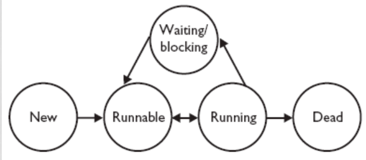
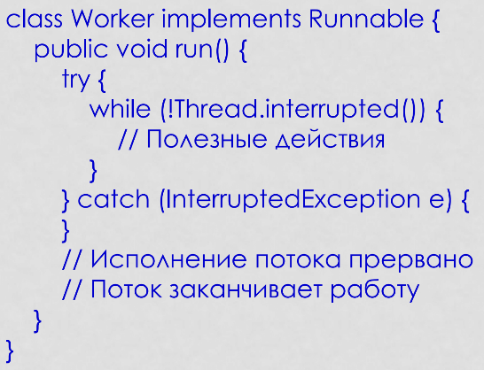
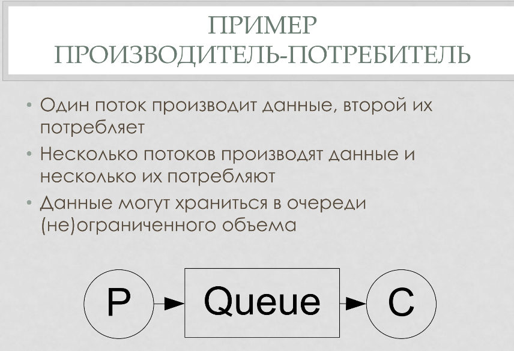
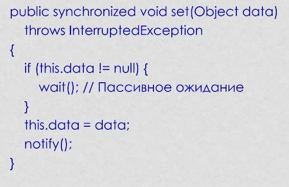

= Многопоточное программирование 

Поток -- состояние, стек вызовов + регистры + кеши + приоритеты (глобальные). Потоки имеют *общую память* (в отличии от многопроцессного, там более сложные взаимодействия).

Поток внутри JVM не должен быть потоком ОС (машина может его не поддерживать, например DOS). Но в "нормальных системах" мапится один к одному.

Как работает многопоточка? *Планировщик потоков* распределяет время ядер между всеми потоками, является частью ОС. В Java есть свой планировщик потоков и он может работать с ОС без ее планировщика.

Потоки в Java делят на два вида: пользовательские и демоны. Программа считается завершенной, когда завершены все пользовательские потоки. Демонов убивают насильно.

class Thread -- сущность, связанная с потоком внутри ОС.


interface runnable{
    void run()

}

описывает, что происходит при выполнении потока

```java
class Thread extends Runnable{
    //запускам поток
    //Если вызовем несколько раз -- поток все равно запуститься однажды
    start ()
    //просто выполняет логику в том же потоке! не стартует новый!!!!
    run()
    public Thread(Runnable)
}
```

Можно передать как аргумент конструктора ранабл. А можно определить метод run в Thread. Это плохо, т.к.

-Нельзя наследоваться от чего-то другого
-можно создать 1 runnable и передавать его как аргумент в несколько потоков

`System.out` синхронизирован! System.error -- нет

=== Свойства потока 
* name
* id  
* priority 
* daemon (флажок)

После запуска потока ничего менять нельзя, кроме приоритета. Но не гарантируется, что оно будет изменено во всех ОС.

== Состояния потока 



`new` -- созданный, но не запущенный через `run` 

`runnable` -- может быть запущен планировщиком: запущен метод `run`, ничего не ожидает.

`running` -- выполняется 

`blocking` -- ожидаем ввод . В верхний кружочек можно перейти только из процесса! (`running`). Из верхнего кружочка попасть в `running` можно только из `runnable`

`dead`(`Terminated`) -- завершилась логика метода `run`

waiting states:

* `blocked` -- 1. блокирование по ожиданию монитора/мьютекса, 2. блокировка ввода/вывода 
* `timed_waiting` (`sleep`, `join` и проч методы добровольного ожидания)
* `waiting` -- что-то другое
* `terminated` (`dead`)

== Взаимодействие 
=== sleep 
отправляет спать вызывающий поток, другой насильно нельзя!


`Thread.sleep(secs)` -- миллисекунды


`TimeUnit.DAYS.sleep(times)` -- есть enum для разных временных интервалов

Все слипы кидают `interruptedException` (проверяемое)

=== yield
`Thread.yield()` -- предлагает планировщику убрать текущий процесс из исполнения обратно в очередь

Спорный метод. Мб полезен, если поток чего-то ждет. Но загружать/выгружать поток дорого, так что мб лучше подождать

=== join 
Приостановление выполнения потока до завершения другого. Пример с интегралами.

=== interrupt
Рекомендовать другому потоку аккуратненько интераптнуться. 

Если он `running`, то ничего не происходит.

Если `sleep` или `join`, то эта команда завершается с выкидыванием `interruptedException`.

Примеры со сборщиком мусора или аварийный завершением работы.

`isInterrupted()` vs `interrupted()`

Пример: единственный случай, когда можно делать пустой `catch` 




== Синхронизация кода

=== По объекту
Мерзкий вариант sync("Test") -- работает, т.к. строки в java кешируются и из разных потоков можно блокироваться по одному объекту.

Можно внутри sync делать другой sync, то тогда возможны deadlock.

Ожидание нельзя прервать! sync не бросает interrupt {example-caption}

Как блокировать набор объектов? Никак

Взятие: команда sync, выход -- по ее закрывающей скобке. Любой выход снимает блокировку.

=== По методу

Метод экземпляра может быть объявлен синхронизованным

public synchronized int getValue() { ... }

Эквивалентно (почти)public int getValue() {synchronized(this) { ... }}

Но первый оптимизировать гораздо проще!

Не статический метод блокируется по this, а статический по описанию класса (`Example.class`). Можно вызывать рекурсивно! И поток в рамках своего выполнения может блокировать один и тот же объект сколько угодно раз.

Не честная блокировка!!! 

Когда объект разблокируется -- он отдается не тому, кто дольше всех ждал. А кто первый ждал его в очереди. Пример про туалет в Дубае.

`yield`, `sleep` и `join` сохраняют свою блокировку!! Лучше не оказываться в этой ситуации.

Если поток синхронизировать по obj, то кто-то все равно может несинхронизированно поменять obj

== Паттерн производитель-потребитель 


=== Реализация 1: активное ожидание 
Ждем в активном цикле. sync не на метод, а на цикл, чтобы кто-то мог прервать нас и забрать данные.

image::media/example_1.png[]

Это плохо, т.к. внутри активного ожидания `sync`. Когда кто-то занимает объект, то другие consumers собирают монатки (что долго) и идут в блок.

=== Монироты и условия  
`wait` -- поток засыпает, пока что-то не сделает `notify`. Отпускает блокировку. Но только ту, по которой происходит sync. `Wait` возможен только в блоке notify.
`notify` -- будет кого-то одного из ожидающихюх. Блокировку не освобождает!!!
`notifyAll` -- 



Этот пример плох 

* консумеры может разбудить другого консумера. Он уснет, не вызвав следующий notify и потребитель вообще не будет разбужен! Поэтому лучше делать `notifyAll`
* проверка на if уже была пройдена. Поэтому данные будут перетираться. Поэтому лучше делать `while(this.data != null){ wait(); }`

Есть поток, он был running и вызвался метод wait, который отправляет нас в кружочек `wait`, пока нас не разбудят. Т.к. метод был `sync`, то нам нужен метод, по которому мы синхронизировались. Поэтому из `waiting` мы переходим в `blocking`!!!!! Когда получем объект -- `runnable` и только потом в `running`.

foo1(){
    sync(01){
        o1.wait()
    }
}

foo2(){
    sync(01){ 
        ...
        o1.notify() 
        ...
    }
}

== Задания-работники
Попробуем делать wait и notify по разным объектам.

image::media/worker.png[]

Клиенты делают вейт по задаче! Кладет ее в очередь и нотифает 

А работник -- по очереди задач! 

Как делать блокировки? На все три блокировки по таске, на первые две -- по очереди. Таску нельзя брать после блокировки очереди, т.к. работник может успеть закончить обработку до того, как заказчик сделает wait и мы не проснемся.

У работника -- первые две строчки по очереди, а последняя -- по таске.

Зачем заказчику делегировать выполнение задачи? Чтобы ограничить количество реально выполняющихся потоков. Клиентов может быть сильно больше, чем вычислительный ядер, но реальные задачи выполняют только воркеры.

Почему это важно? У процессора x вычислительных ядер. Значит одновременно может выполняться х потоков. Если потоков болььше, то контекст меняется слишком часто. Поэтому количество воркеров часто ограничвивают x-1 количеством (еще один на клиента).


image::media/worker_code.png[]