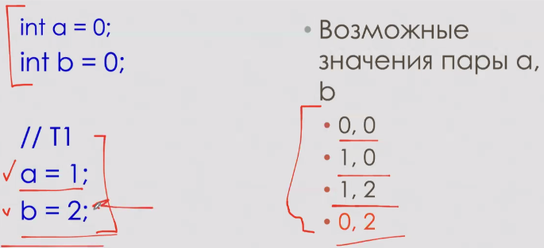
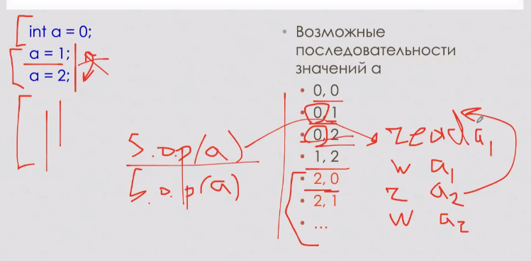
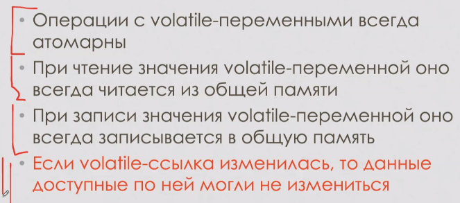
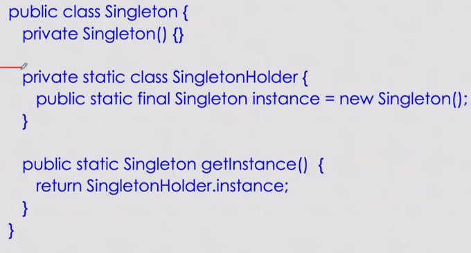

= Java memory model
Модель памяти -- гарантия от ЯП относительно многопоточных проблем: независимо от платформы и ОС на уровне языка гарантируется некоторый набор вещей.

В python *жесткая* модель памяти: всегда выполняется ровно один поток (остальные спят).

В *мягкой* модели памяти никаких гарантий нет, они почти вссе от процессора или ОС. Под разные платформы нужно писать разный код.

OoTa -- out of the air -- в C++ в некоторых ситуациях в случае когда T1 вида

```c++
int a;
int b = 42, c = 42;
a = 1;
a = 5;
```

T2

```c++
cout << a;
```

В java Т2 может вывести или 0 или 1 или 5. В c++ -- может вывести 42 (т.к. напрмиер при присвоении b и c ему выгодно сделать множественное присваивание и занести в а 42).

== Свойства 
* атомарность: 
** атомарная операция выполняется как единое целое (мы не можем извне увидеть промежуточное состояние). 
** операции над *всеми типами* кроме  long и double атомарные (кроме `x += 1` (тут 3 операции)): чтение, запись ссылки, все арифметические действия.
** пример: long не гарантирует атомарность: -1 -- это все f, в теории мы можем случайно увидеть полузаполненное значение. Почему так? Обратная совместимость, раньше на 32 битной архитектуре так было удобно. При этом на 16 битной машине int атомарный! (как это делается никто не знает, точнее зависит от `JVM`).

image::media/long.png[]

* видимость. У любого ядра есть кеш, доступ к которому быстрее. Когда вычисления заканчиваются -- сбрасываем значения из кеша в ОП. Присваивание в примере происходит в кеше. 

 

Гарантировать порядок сброса тяжело, но она гарантируется в нескольких случаях 

image::media/visible_rules.png[]


* упорядоченность 



как получить (2,1)? код второго потока скорее вссего скомпилируется в красный код. переставить что-то в левом коде нельзя, а поставить два read пордряд можно и даже эффективно по чтению (из одного места). Переставить read'ы в начало вполне вероятно.

так происходит из-за работы менеджера оперативной памяти 

image::media/manager_op.png[]

менеджер смотрит в заголовке, а затем в ОП. У заголовка есть хвост, который не проверяется (из-за эвристик). Если в этом хвостике оказалось "21" (как в примере ниже), то выведет 2.

== volatile 


видимость корректна, так как она гарантируется для sync 


=== долгий sync

image::media/singlton_sync.png[]

=== двойной неработающий sync

image::media/singlton_sync2.png[]

почему не работает? 

здесь 3 операции helper = new Helper 

1. аллокация 
2. constructor 
3. helper = ..

компилятору ничто не мешает сначала выделить память, затем присвоить и только потом вызвать конструктор. так мы выбросим неинициализированный объект!


если сделаем поля volatile, то выделение памяти,вызов коонструктора и присваивание будут атомарные.

=== вложенный класс 


тут это гарантирует jvm

=== enum тоже дает гарантии

== java.lang 
все блокировки только  `sync`!!!, который:

-работает только в области видимости (нельзя взять в одном методе и освободить в другом)

-никак нельзя прервать заблокированный поток в synchronized!

-нечестный: в первую очередь достается кому попало, а не тому, кто дольше всех ждет

-нельзя указывать, кого разбудить

-нельзя сделать `try sync` в течении какого-то времени

-занятая блокировка гарантировано нас выкидывает с процессора


== java.util.concurrent
Многопоточная надстройка

Как на основе локов и кондишнв реализовать паттерн производитель/потребитель


=== Interface Lock

image::media/lock_conc.png[]

Condition -- для wait (await) и notify (signal)

[cols="1, 1, 1,1"]
|===

|- 
|java.lang 
|java.util.concurrent interface
|implementation

|Блокировка
|synchronized -- возвращает управление при выходе из критическрй секции прерывании/выходе из блока. Все нечестные 
|lock -- unlock  нужно обязательно делать после выхода из секции (обычно в finally), ReadWriteLock

|ReentrantLock -- можно брать / отдавать несколько раз. В т.ч. в рекурсивных функциях. Может быть честный.

ReentrantReadWriteLock: просим блокировку на запись: дожидаемся, пока читатели дочитают и начинаем писать (больше ни у кого доступа нет). Читатели получают доступ, когда нет ни одного писателя. Писатели пишут последовательно.

|
|wait
|await 

|===

* Почему await крутится в цикле? 
 
 Потому что могут быть внезапные пробуждения, потому что ОС так захотела.
