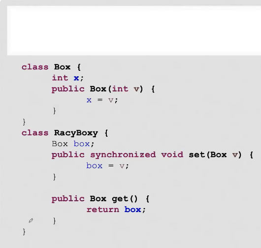
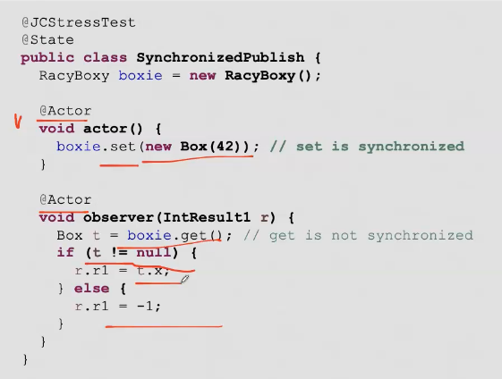

= Полу-синхронизация
Концепция: synchromized можно писать только у set  

Создание объекта это три команды

что можно увидеть? 

-1 

0 

42

0 можно увидеть не на всех архитектурах. x86 гарантирует TSO на уровне процессора. А ARM нет.

1. Аллокация  памяти 
2. Вызов конструктора на ссылке 
3. Запись ссылки в переменную (это можно вернуть до вызове конструктора и по ссылке будет лежать 0)