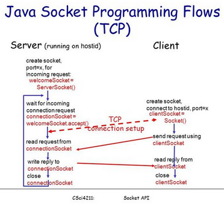
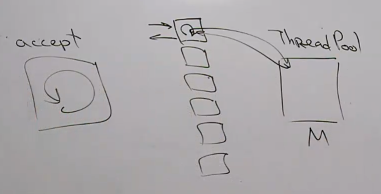

= Сокеты 
06 декабря 2023

Изнутри джава можно достучаться только до уровня транспортного или приложения. До физического или сетевого добраться нельзя.

java-машина не умеет добираться до сетевого уровня. Можно только если использовать библиотеки.

*Сокет* -- низкоуровневый API для пересылки байтов по сети

* Поддерживаются протоколы TCP и UDP
* Поддерживается адресация IPv4 и IPv6 

== UDP 
=== Клиент
Код клиента -- инициирует соединение. Потом ждет ответ. Получает порт автоматически от ОС

```java
//у сокета нет параметра! мог быть порт. клиенту его дает ОС
try ( DatagramSocket s = new DatagramSocket ())
{
    DatagramPacket p = new DatagramPacket (
        //buf -- массив байт
        buf, 
        //если больше MTU -- штош
        buf.length, 
        remoteAddress);
    //блокирующая команда!!
    //поток в состоянии blocking IO
    //может не отправить, если буфер соответствующего ПОРТА забит
    s.send (p);
}
```

почему с try with resources? 

1. Портов ограниченное количество, их нужно закрывать 
2. Количество сокетов тоже ограничено, тоже нужно закрывать
Размер сообщения ограничен MTU, поэтому больше 1-1.5 кб лучше не отправлять. При том, что максимлаьный размер 65 кБайт

=== Сервер
сервер: ждет сообщения, отправляет запрос. Занимает определенный порт (задаем как конструктор) -- серверу мы выделяем порт

```java
//указываем порт вручную!!!
try(DatagramSocket s = new DatagramSocket (port)){
    //размер пакета. если фактический больше -- он обрежется
    byte [] buf = new byte [1024];
    DatagramPacket p = new DatagramPacket (
        buf, buf.length);
    //блокирующая команда!!
    //поток в состоянии blocking IO
    s.receive (p);
}
```

`send`, `receive` -- это блокирующий метод. Т.е. выполненеие потока приростонавливается поток в состоянии blocking IO

Почему может не выполнится `send`? Если забит буфер отправки. Буфер связан с конкретным портом на отправку. У каждого порта есть буфер на прием и отправку в рамках ОС. `send` и `receive` копируют это данные.

Если пришел пакет больше буфера -- он либо отбрасывается, либо мы читаем кусками из буфера сокета. Это зависит от ОС, поэтому рассчитывать на второе не стоит.

== TCP

* Сервер создает «серверный сокет», слушающий конкретный порт. Все желающие клиенты стучаться туда.
* Сервер вызывает метод `accept()`. Данный метод ожидает до тех пор пока клиент не подключится
* Клиент создает «клиентский сокет» и задает IP адрес и порт сервера.
* Конструктор сокета в процессе работы пытается установить соединение. Где-то здесь происходит tcp handshake.
* На стороне сервера метод `accept()` ждет клинета, делает handshake, создает новый порт. Возвращает ссылку на `Socket`, по которому сервер может общаться с подключившимся клиентом.



=== Клиент 
```java
Socket socket = new Socket (serverAddress, connectionPort);

//После соединения можно пользоваться сокетом как ioStream. 
OutputStream os = socket.getOutputStream();

//копирует данные в буфер, ассоциированный с портом
//когда их накопиться достаточно много -- их обернуть с tcp 
//пакет и отправят в сеть
os.write(requestBytes);
//насильно отправляет содержимое буфера в сеть
os.flush();

InputStream is = socket.getInputStream();
is.read(responseBytes);
```
`write` копирует данные в буфер, ассоциированный с портом. Когда их накапливается какое-то количество -- они оборачиваются в пакеты и отправляются .

`os.flush` -- заставляет данные отправится сразу явно, не ожидая нужного количества сообщений 
Конструктор сокета может быть со всякими разными параметрами. 

* Локальный адрес. Зачем нужно его задавать? 
** У пк несколько сетевых устройств, каждый из них имеет свой адрес. Задавая локальный адрес мы жестко фиксируем через какое сетевое устройство отправляем свои данные.
** Для нагруженный систем: у одного сетевого интерфейса может быть много ip, и мы явно задаем с какого шлем данные.

=== Сервер 
* порт, по которому случаю подключение
* порты, по которым нужно общаться с клиентом

```java
ServerSocket server = new ServerSocket(connectionSocket);

//accept -- блокирующая, ждет клиента 
//делает handshake
//создает новый порт
Socket socket = server.accept();

InputStream is = socket.getInputStream();
is.read(requestBytes);

OutputStream os = socket.getOutputStream();
os.write(responseBytes);
os.flush();
```

Создаем сервер-сокет. Его задача -- принимать подлкючение и больше ничего не делать.

`accept` -- блокирующая команда, которая ждет пока подключется клиент. Пока я обрабатываю клиента, я не принимаю новых клиентов. Их запросы попадают в буфер пока и копятся , пока их не прочитают. Можно настроить backlog -- размер очереди для подключающихся клиентов. Тогда конструктор сокета клиента выкинет исключение.

делает хенд-шейк, выделяет порт и создает сокет как у клиента.

==== Если клиентов несколько?

* Решение 1: Засунуть код с accept в бесконечный while. Проблемы: В конце while закрываем соединение. В теории подойдет, если соединение с клиентом одноразовое(http) и быстрое.

```java
while (true) {
    accept a connection;
    deal with the client;
}
```

* Решение 2: Для обработки каждого клиента выделять свой поток. Проблема: дорого создавать потоки, потоков очень много. 

```java
while (true) {
    accept a connection;
    create a thread to deal with the client;
}
```

* Решение 3: ThreadPool.  Проблема: клиенты ждут пока воркеры закончат обрабатывать старых клиентов. А там может быть ожидание ответа. 

```java
while (true) {
    accept connection;
    create task which will deal with the client;
}
```

* Решение 4: Решение -- кешированный threadPool. Если пришел клиент, а все воркеры заняты -- выделяем ему новый поток.

=== Плохая архитектура клиент-серверного приложения

По потоку на клиент. Он принимает сообщение от клиента (blocking IO), читает его, создает объект задачи и кладет в threadPool (объекты которого по-честному решает задачи). Потоки клиента ждут решения, отправляют в сеть и ждут нового запроса от клиента. Умирает, когда клиент разорвал соединени.

Эти ребята не делают активные действия, они только ждут. 

Количество активных потоков почти всегда равно размеру пула. КОНСТАНТА! Не зависит от количества клиентов. Клиентские потоки почти всегда спят. И по факту работающих потоков на машине не так много, и их количество можно сделать оптимальным для системы (по количеству доступных вычислительных ядре). ThreadPool может долго обрабатывать запросы, но вся система работает эффективно.



На стороне сервера

image::media/2023-12-19-18-04-01.png[]

* ждем клиента 
* получаем от него данные (из одного буфера ОС копируем в другой буфер в рамках нашей программы)
* извлекаем данные (ORM). Формируем задачу для threadPool.
* выполняем задачу потоком из threadPool 
* преобразуем данные в набор байт
* отправляет их

Поток клиента делает все, кроме обработки запроса.


Недостатки:

`-` нельзя обрабатывать несколько несвязанных друг с другом запросов от одного клиента. Например, когда генерируем картинку по портам. 

=== Решение 2. Классическая блокирующая архитектура клиент-серверного соединение.

Лучшая из известных блокирующих архитектур.

На каждого клиента заведем по два потока: 
* один принимает запросы и формирует задачи, 
* второй отправляет клиенту ответы.

Отправляющий поток это обычно singleThreadExecutor -- на случай, если клиент сгенерировал 50 запросов. Пул туда кидает задачи "отправь клиенту результат".При получении это не нужно, т.к. все равно сидим в блокинге.

Количество потоков увеличили в два раза, но количество активно живущих все равно маленькое. 

Два потока на клиент связаны с одним сокетом клиента. Нужно ли синхронизироваться на ввод и вывод отдельно? Зависит от ЯП, в java не нужно -- там сокет на ввод и вывод это разные сущности.

==== Почему не отправлять решение сразу из theradPool исполнения задач? 

`--` придется брать блокировки на клиент, если мы одновременно отправляем ему несколько результатов

`--` ждем на операциях `io`

==== Когда это работает плохо 
* Когда задачи приходят быстрее, чем threadPool успевает их выполнять. Оценим, когда она перестает справляться.

* `T` -- среднее время исполнения задачи, 
* `N` -- среднее количество клиентов, 
* `H` -- промежуток отправления задач от *одного* клиента.

`H\N` -- среднее время между поступлением задач на сервер. Каждые `T\M` мы исполняем задачу в рамках ThreadPool.

Если что-то там больше чего-то, то threadPool справляется.

* Куча клиентов шлет маленькие данные. Потоки часто переключаются.

=== Решение 3. Неблокирующий ввод/вывод
Не блокирующий -- прочитали если есть. Если нет -- и не нужно.

=== Решение 4. Асинхронный ввод/вывод
Асинхронный -- делает рид и говорит "когда данные прочитаются -- выполни такую-то функцию". При этом чтение может быть как блокирующее, так и неблокирующее. 
