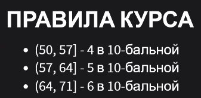
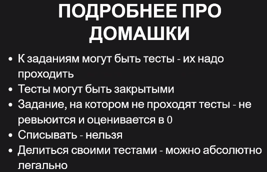
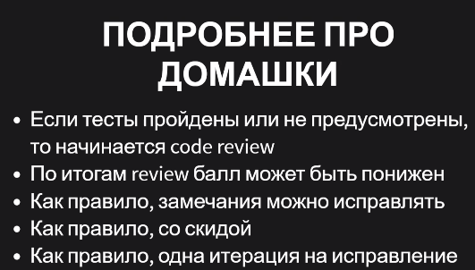
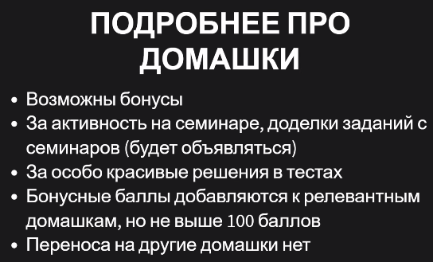
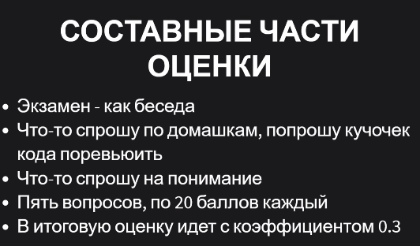
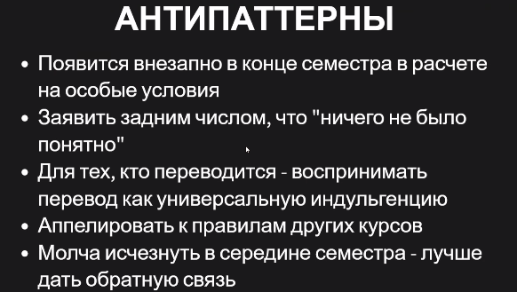
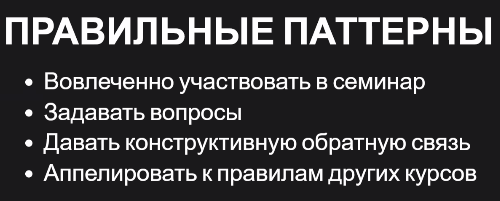
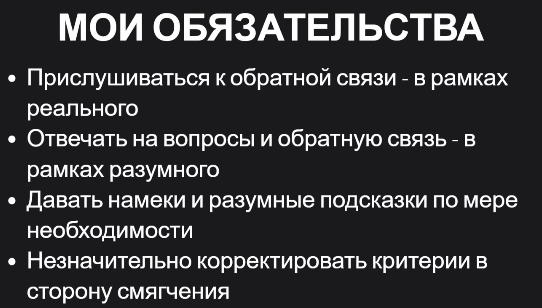

# Альтернативные языка для JVM
1. Scala (преподают в ВШЭб поэтому мы не будем)
2. Kotlin (9/15)
3. Groovy (2-3/15)
4. Clojure (2-3/15)

## Пререквизиты 
* ООП, ФП
* почему immutable - это хорошо
* опыт Java

# Правила курса 
Перевод баллов в оценку

Откуда брать баллы

 Домашки важнее всего

## Домашки 
* 3-5 на Kotlin
* 1 на Groovy
* 1 на Clojure

* Нормальные студенты сдают на 8-9 баллов. Рассчитывать на 10 не стоит.
* Есть 5 дней-кредитов на дедлайны.
* Откидываем самую худшую домашку.
* На исправление дается примерно 2 недели. Но все зависит от ситуации (может написать в комментарии к ревью).

*скидка: например, за ошибку сняли 10 баллов. Вы исправили. Получили обратно 5 баллов.

## Stepik

## Экзамен
Нужно сдать не меньше, чем на 3 балла.
Покажет код, спросит как его изменить / что в нем плохого

Автоматы 

## Антипаттерны
Что лучше не делать на этом курсе

## Паттерны 
Давайте фидбак!!!!!

(последний пункт - копипаста!)

## Обязанности
