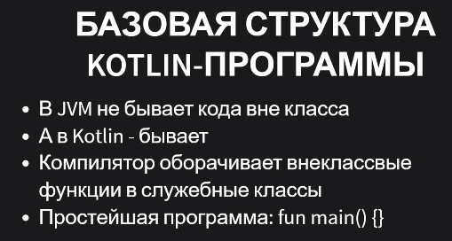
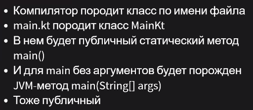
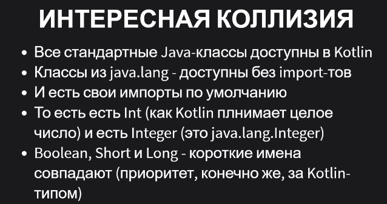
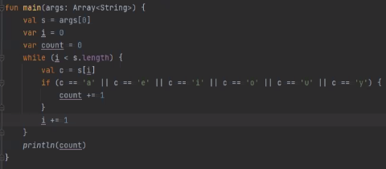
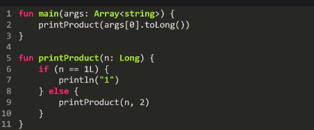

* Java - язык
* Java VM - платформа для исполнения 
* ??
* Jython и JRuby сдулись, т.к. тяжело переносить нативные библиотеки.

Какие живы:
* Scala -- статический ФП
* Clojure -- динамический ФП
* Groovy -- типа питончик
* Kotlin -- по-немножку от разных парадигм. Лаконично и чтобы было удобно.



# Базовая структура Kotlin-программы
* в  JVM не бывает кода вне класса
* в Kotlin бывает. Компилятор оборачивает внеклассные функции в служебные классы 

```kotlin
fun main() {
    println("Hi")
}
```

Компилятор котлина обернет это в класс по имени файла. Например, `main.kt` -> `MainKt`
В нем будет статический метод main с добавленными аргументами (по соглашению JVM), хотя изначально main был без аргументов.




# Особые классы


Int и java.lang.Integer -- это разные классы. Перечисленные на слайдах типы компилятор пытается сохранить примитивными.

## Array 
Декорация под массив Java. Можно обращаться и по интерфейсу массива `args[0]` и по интерфейсу коллекции `args.get(0)`. Компилятор скомпилирует это как обращение к массиву. 

С коллекциями наоборот, можно написать `list[i]`, что скомпилирует в `list.get(i)`.

Т.е.котлин подгоняет массив к парадигме коллекций. И хочется всегда использовать квадратные скобки. Для своих классов можно определять свою семантику `get` и `set` для скобок

## Property (Свойства)
Аналог метода без параметра. Или поля с гетерами и сетерами, которые сгенерируются автоматически.

## Extension 
Можно добавлять проперти в произвольный класс, даже если его исходников у нас нет.

## String
Тоже класс-декорация 
* имеет поле-проперти `length`

## Imports 



Все стандартные Java-классы доступны в Kotlin

```kt
//передаем объект
fun f1(v : Integer){}

//передаем примитиынй тип
fun f2(v : Int){}

//КОЛЛИЗИЯ!!!!
//явно указываем, когда работаем c легаси кодом
fun f3(v : java.lang.Short){}

//примитивное
fun f4(v : Short){}
```
## Строковая интерполяция 


## Типизация
* Статическая
* Типы выводятся автоматически при компиляции 
* Можно указывать явно `val s : String = args[0]`
* `val` - константа (`final var` в `Java`), т.е. обязательно присваивать.
* `var` - изменяемая. Лучше сократить их количество. Можно не присваивать, но тогда при объявлении указываем тип явно.


# Пример 1: количество гласных



## Улучшение 1
* убрали var's почти все
* нет круглых скобок!!!
* for -> foreach над строкой. метод с одним параметром-лямбдой. Превращается в цикл по итератору (что-то там sequence)

```kt
s.forEach {c ->
    if(c == 'a'){
        cout +=1
    }
}
```
## Улучшение 2
* убрали var (совсем)
* filter
* +красиво, идеоматично
* -проходим цикл по perSequence и порождаем строку через StringBuilder и берем длину от этого объекта. Лучше использовать ленивые конвейеры, но на них большой оверхед. Поэтому их лучше использовать, если функция вызывается редко, но на больших строках.
## Улучшение 3

* -создаем хешсет в каждом вызове метода.
* +красиво, идеоматично, читабельно

# Пример 2



* в Kotlin есть исключения, но они все runtime. Чтобы не писать так много кода-обработки как в Java


# File 
Задекорирован расширениями
```kt
fun main(srgs: Array<String>){
    File("output.txt").writeText("some text")
}
```
Если использовать методы Kotlin для работы с файлами, то (скорее всего) они корректно закроют файл сами.

```kt
//найти вс каталоге рекурсивно все файлы с заданным суффиксом
//и заданным паттерном
import java.io.File

fun grepFile(fullName: String, pattern: String) {
    File(fullName).forEachLine { line ->
        if (pattern in line) {
            println(line)
        }
    }
}

fun find(start: String, suffix: String, pattern: String) {
    File(start).walk().forEach {
        if (it.isFile && it.name.endsWith(suffix))
            grepFile(it.name, pattern)
        else find(it.name, suffix, pattern)
    }

}

fun main(args: Array<String>) {
    val startDir = args[0]
    val suffix = args[1]
    val pattern = args[2]
    find(startDir, suffix, pattern)
}
```

## Диапазоны
```kt
val range = 1..5                // диапазон [1, 2, 3, 4, 5]
val range2 =  5 downTo 1        // 5 4 3 2 1
val range1 = 1..10 step 2       // 1 3 5 7 9
val range2 = 1 until 9 step 2   // 1 3 5 7
```

С помощью цикла for можно перебирать диапазон:
```kt
val range1 = 5 downTo 1 
for(c in range1) print(c)   // 54321
println()
```