1. Строки
2. Основы определения функций
3. Введение в классы

== Строки ==
=== Строковые литералы ===

```kotlin
fun main(){
    val s = "usually string"
    val s2 = """
    long string
    '\' - it's just a symbol
    """.trimIndent()
    //trinIntend вырезает минимальный отступ по пробелам

    //еще есть trimMargin  -- строку маркируем "|", вырезает все до нее
    //можно задать любой строковый параметр как разделитель
}
```
* Для любого `CharSequence` есть итерация по квадратным скобкам.
* `a in b ~ b.contains(a)`. Бинарная операция. Отрицание `a !in b`.
* Расширения. Идея - унифицировать строку как коллекцию из набора символов. 

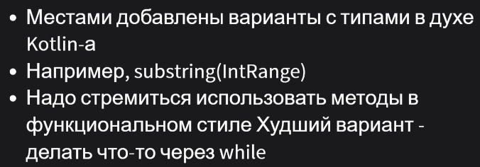

image::media/03.png[]

image::media/04.png[]

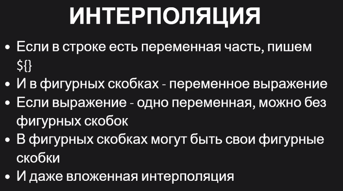

Интерполяция строк — это процесс вычисления значения строкового литерала, включающего одно или несколько выражений интерполяции . Интерполяцию строк можно рассматривать как удобный и понятный синтаксис для конкатенации строк, совмещенный с возможностями форматирования значений выражений.

image::media/06.png[]

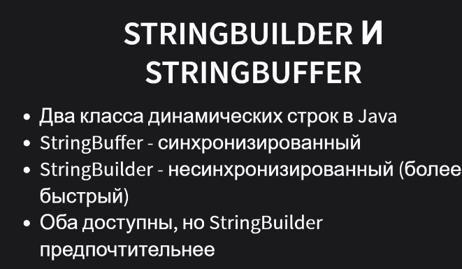

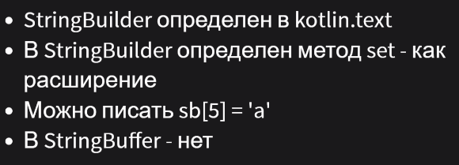

== Функции == 
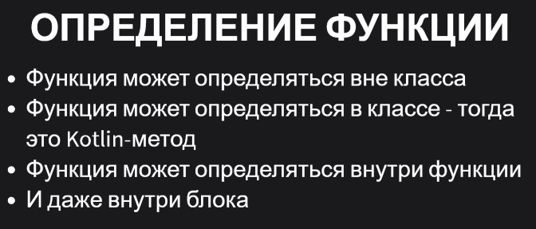

* функция внутри функции скопилируется в какой-нибудь приватный метод. К ней можно обращатьяс вот так `::foo()`
* короткая функция - без локальный переменных и вычислений `fun x() = 3`. Если нет типа, то он будет выведен. При рекурсии не выводит.
* в публичных методах вывод типа нежелателен (не контролируется публичный интерфейс, дольше работает инкрементальная сборка, труднее работать с методами, которые основаны на рефлексии)
* длинные функции (не вернуть ничего == ret unit == return void (в байткоде))

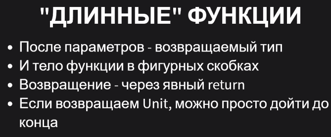

== Анонимные функции 
* анонимные функции == лямбда-функции

image::media/12.png[]

image::media/13.png[]

* if без else не является выражением -> возвращаемый тип `unit`

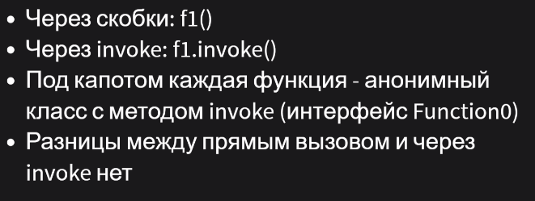

Коварный случай: функций возвращает лямбду без параметров

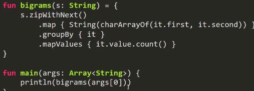

правильно вот так

image::media/16.png[]

Дополнительный прикол: если бы мы не выводили тип, а указывали явно - эта ошибка поймалась бы статически

А все потому, что такие фигурные скобки имеют совсем другую семантику, чем например скобки ифа

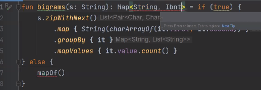

== Анонимные с одним параметром

image::media/18.png[]

image::media/19.png[]

многопараметровые

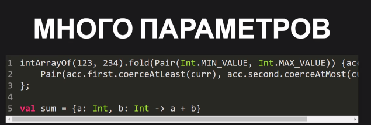

== Классы ==
image::media/21.png[]

будет приватное final поле value. Обращение  к нему породит метод get_value.

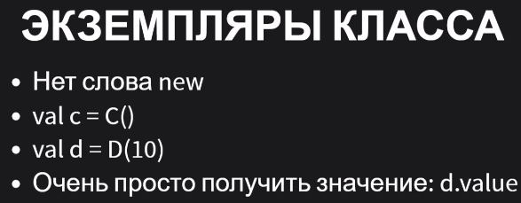

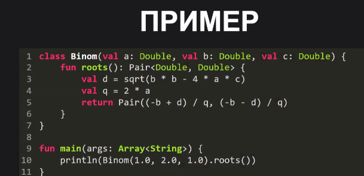

лучше так: если что-то однозначно определяется полями другого класса без какой-то прикольной логики, то лучше делать property.

image::media/24.png[]

еще пример: после val пишем init 

image::media/25.png[]

== Practice ==
image::media/26.png[]

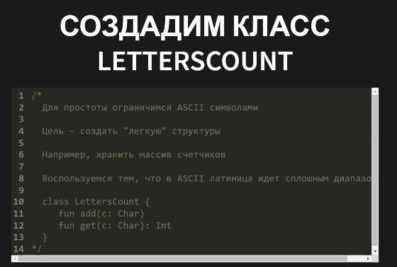