= Управляющие конструкции 

* вместо `elif` `when` 
* вместо тернарного оператора: `fun abs(v: Int) = if (v >= 0) v else -v`
* тип `Any` ?
* тип `Unit` ?
* `if` и короткие функции

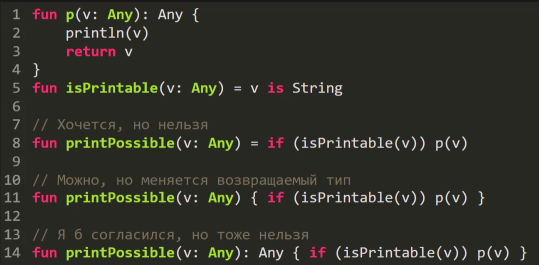

тип меняется, т.к. в if выводится тип Any, а в else -- Unit

image::media/if_2.png[]

Решение: 

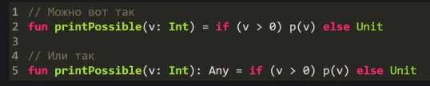

* каррирование 

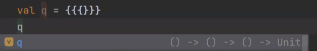

* блок не умеет возвращать значение. можно создать лямбду и объект, а потом вызвать его. В продакшн коде такое не нужно 

image::media/block.png[]

== when ==

* приоритет у кейсов выше -- выше. Стоит ставить в начало те ветки, которые исполняются чаще.

image::media/when.png[]

image::media/when_details.png[]

* `break` в `when` относится не к нему, а к внешней структуре. Например, к фору 

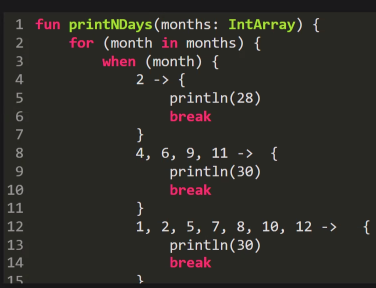

Пример: допустимые операции (in, is). Нельзя `>=` :(((

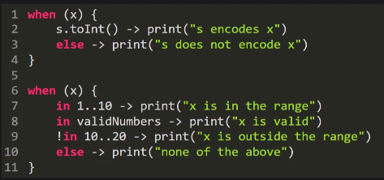

Пример: во втором примере смарткаст. В случае error у response может не быть поля body. Смарткаст вместо динамического `instanceof`!!! Смарткаст -- это инструмент, который позволяет обращаться к полям типа после проверки без явного приведения!!! 
```kt
if(x is Srtring){
    x.length...
    }
```

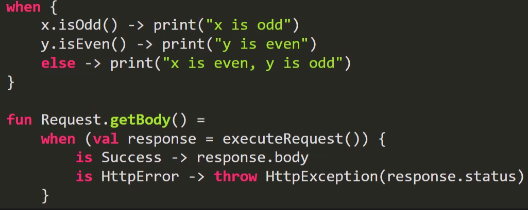

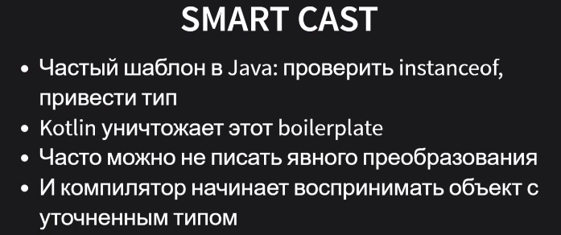

smartcast работает не всегда 

image::media/smart_cast_constraints.png[] 

* get нельзя, т.к. не понятно, чего он вернет

== Классы ==

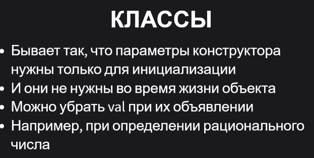

getters 

image::media/getters.png[]

image::media/get2.png[]

image::media/rec.png[]

== Дата классы ==

image::media/data_classes.png[]

image::media/data_classes2.png[]

Во время компиляции компилятор порождает реализацию новых методов (гетеров, сетеров, конструкторов (?))

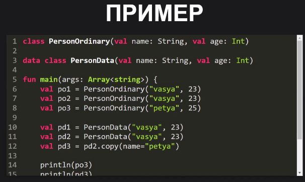
 

== Статика == 

Есть 3 формы статических сущностей.

В файле

image::media/static_file.png[]

В классе (~`static final`)

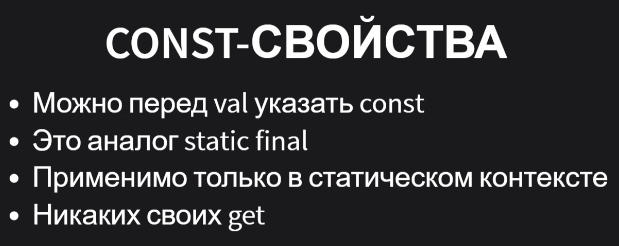

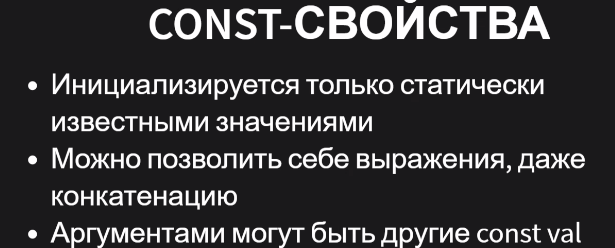

все это считается компилятором 

image::media/static_class_example1.png[]

В проекте 

image::media/static_pkg.png[]

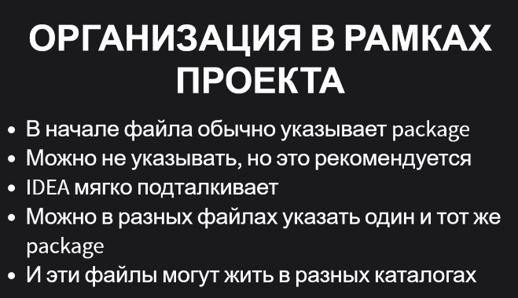


== ДЗ 1: Биномиальная куча ==
* хороша при реализации концепции `unmutable` -- хорошо паралелится 

image::media/heap1.png[]

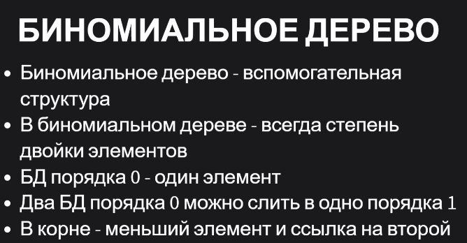

image::media/heap3.png[]

image::media/heap4.png[]

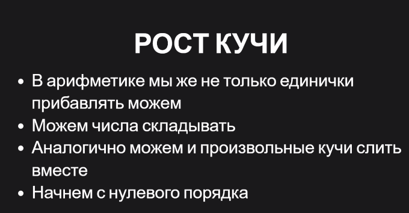

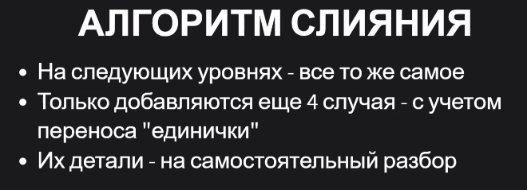

image::media/heap7.png[]

image::media/heap8.png[]

аналогия с двоичной арифметикой заканчивается 

image::media/heap9.png[] 

image::media/heap10.png[]

image::media/heap11.png[]

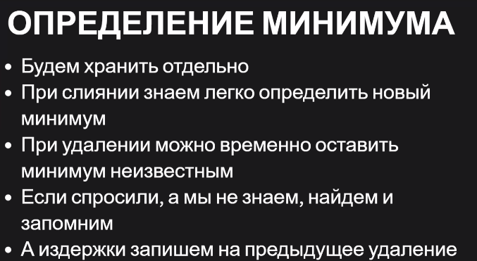

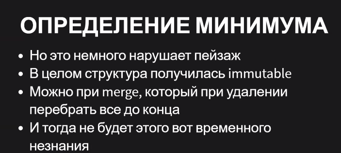