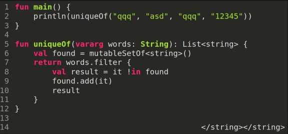
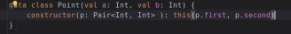
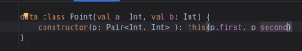

== Параметры 
* Зачем нужны именованные параметры? 

 чтобы случайно не перепутать аргументы одного типа. 

* Как это решается в java?

 Паттерном builder, но это не работает для обычных методов (только для конструкторов)

* Есть ли значения по умолчанию? 

 Да. Писать как в Java -- дурной тон.

* Что такое vararg? 

 Множественные ппараметры: определение произврльного количетства праамтеров одного типа (`generics`, `binomoalHeap("a", "b")`)



* Сколько varargs может быть в объявлении? Почему? 

 Только 1, тяжело передавать эту информация в jvm 

* Можно ли указывать аргументы после varargs? Почему?

 Да, но только именованные. Vararg жадно поглощает все параметры, кроме именованных.

* Можно ли втавлять в vararg что-то кромме единичных штук? 

 Да и несколько раз, но только от массива (val, *arrayOf(...), *arrayOf(...)) -- это все один vararg

== Конструкторы 

* Что такое вторичный конструктор?



* Чем он отличается от Java? Почему?
 
 В secondary constructor должен обязательно вызываться primary. По специфиикации JVM гарантия на final проверяется после блока конструктора.



* А можно ли сделать приватный первичный конструктор? 

image::media/private_const.png[]

* А можно ли без конструктоура? 
 
 Да, через factory method (метод компаньона)

* Любой ли оператор можно сделать? 
 
 обычных ограниченное число, произвольные -- через infix методы. 

```kotlin
infix fun Int.over(a: Int) = Rational(this, other)
```
* В чем недостаток infix методов? 

 приоритет ниже сложения

* Зачем тогда ключевое слово operator?

 Совместимость с jvm и библиотеками

* Как сделать объект вызываемымй? 

 Переопределить метод invoke

== похакаем 

image::media/hack.png[]

* Что инициализирует init? 

 не статику,  а объект класса.

* Можно ли наследоваться от object синглтона? 

 нельзя 

image::media/singlton.png[]