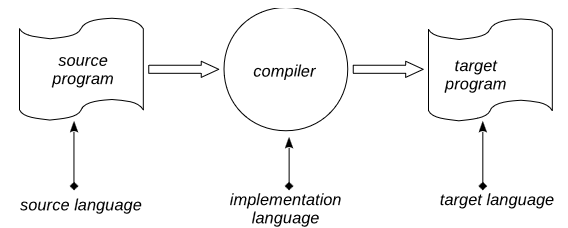
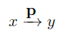
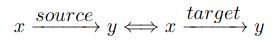
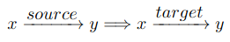
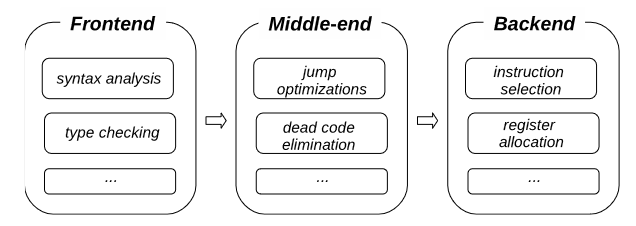
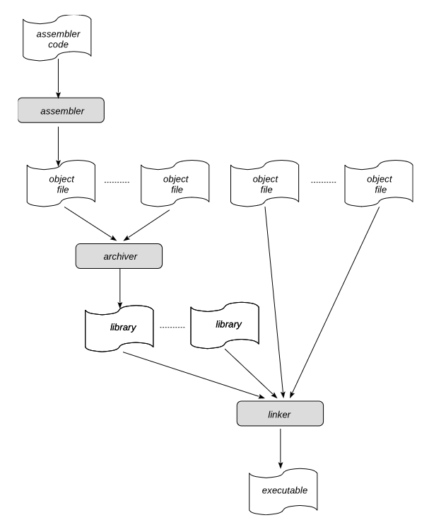

*Translation* is a syntactic transformation of programs in one language into (equivalent) programs into another

image::media/languages.png[]

== Enviroments ==

*runtime support library* -- a library that contains an implementation of certain programming language constructs which are
more beneficent to implement as a library then to built in a compiler itself, for
example, memory managements and synchronization primitives, etc

*standard library contains* an initial implementation of useful data structures and functions in terms of the
source programming language, for example, input-output functions, standard
data types, collection implementations, etc.

compilation (compilator wrork on) & target (generates program for) environment. for example, out λaMa compiler works under Linux on x86 processor,
and generates programs which work under Linux on x86.

cross-compiler -- compilation and target enviroment are different

=== bootstrapping (раскрутка)

development of embedded systems when the target  platform is not enough
performant/well-equipped to support the execution of a compiler

If some compiler for the language of interest already exists, but works on
some other platform, then it is possible for implement a cross-compiler which
works on that platform but generates code for the platform of interest. Then this
compiler can be compiled by itself — this is the conventional way, for example,
to port GCC compilers to other platforms.

== Complete vs Partial Correctness

let picture up -- the fact that p on input x terminates with the output y (as we know, there
may be two other outcomes: p crashes on input x or p loops forever on input
x).

Let us have a compiler, let source be some source program, and let target be a target program after the compilation.

A compiler is *completely correct* if for arbitrary source-target pair and arbitrary input-output pairs x and y (same results on same input).

Compiler has *partial correctness* property if for arbitrary input-output values x and y, and for arbitrary source and target programs source and target. The target can deliver some output values for inputs on which the source program is not defined. Compilers are allowed to *extend the domains* of programs they compile

== Compiler Architecture

Compiler consist of a number of *passes*, each of which takes as input and returns as a result a certain intermediate representation, IR, (not necessarily the same) of a program being compiled.

* frontend of a compiler collects a number of analyzing passes: syntax analysis, type inference/checking, name resolution, etc.
* middle-end comprise of various machine independent optimising passes such as jump optimizations, dead code elimination, loop invariant code motion, common subexpression elimination, etc.
* backend of a compiler contains code generation passes: instruction
selection, register allocation, instruction scheduling, low-level optimizations.

== Toolchain 

Compiled code as a rule, cannot be directly run on hardware. It still contains certain abstractions (symbolic names).

*Separate compilation* combine programs from a number of precompiled
modules. 

As a rule, the source code of used in application libraries is not compiled alongside with the application itself, but *linked* at post-compilation time, reducing the time required for build. 

To make it possible, compilers produce not ready-to-run binary code, but so-called *object files* which, besides machine code, contain
supplementary *metadata* to make linking possible. 

• *assembler* which reads assembler programs and outputs object files;
• *archiver/librarian* which combines multiple object files into one archive/library file;
• *linker* which combines multiple object and library files into one executable.

Unix-like systems the coventional toolchain consists of separate programs:

* cpp (C preprocessor)
* cc (C compiler)
* as (assembler)
* ld (linker) 
* ar (archiver)

GCC compiler implements cpp and cc and invokes others to complete the compilation process depending on what options were specified by users. The top-level program gcc itself is just a driver which controls the execution of other tools of the toolchain.

== The λaMa Compiler
image::media/lama_structure.png[]

