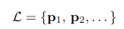

:stem: latexmath
= Компиляция и интерпретация 
Смешанные вычисления. Проекции Футамуры-Ершова. Техника раскрутки (bootstrapping). Принципы организации компилятора. Просмотры, промежуточное представление.

stem:[[ \cdot\]] -- семантика 

L - язык программирования. Счетное множество программ.

D - семантический домен 

Тотальное отображение [⋅]_L : L -> D

stem:[p_L] -- код программы на языке L

stem:[[p_L\]x], где

stem:[[p_L\]_L] -- семантика программы,  stem:[[p_L\]_L \in D]

x -- входные данные

== Интерпретатор ==
stem:[P_M^L] -- интерпретатор языка L, написанный на языке M. Программа, вход: программа на языке L