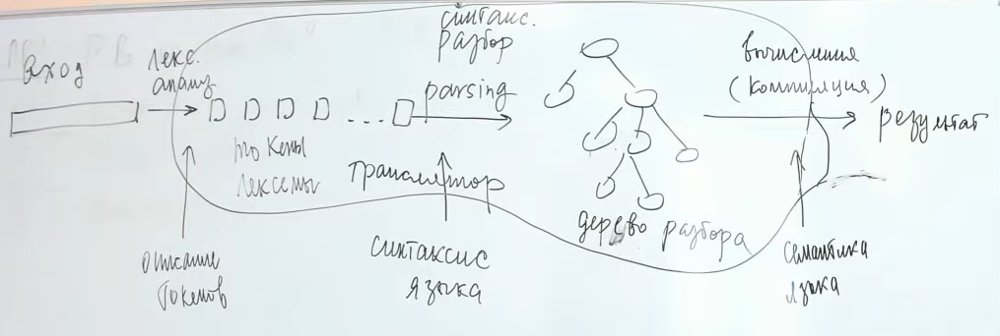
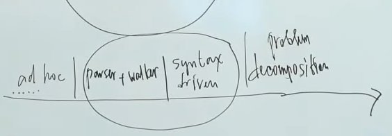

== Язык программирования, языковой процессор ==

Языки программирования можно разделить на языки высокого уровня и машинные (ассемблер).

Код программы - исходный модуль.

Компилятор:  код высокого уровня -> машинный код. М.б. для машин другого типа, ежели компилятор.

Интерпретатор: код программы -> его выполнение на текущем ПК. Веь исполняемый код переносим путем переписывания ВМ.

#Языковый процессор# — это программа, получающая на вход
цепочку x  языка L1 и преобразующая ее в цепочку y  другого языка L2 по  закону: y = F (x).

== Виды трансляторов ==
В зависимости от функции отображения F выделяют виды трансляторов.

1. Ассемблеры - трансляторы "один в один", т.е. каждая команда L1 соответствует одной команде L2.

2. Макроассемблеpы — трансляторы, работающие по принцину ”один в несколько”, когда тpанслиpуемые языки допускают использование макpокоманд, не имеющих пpямых аналогов в машинном эквиваленте или дpугом pезультиpующем пpедставлении.

3. Компилятоpы — это тpансляторы, pаботающие по пpинципу "несколько в несколько”. 

4. Генеpатоpы — это тpанслятоpы, позволяющие выполнять генерацию программы. Современным типом таких трансляторов являются графовые компиляторы , которые транслируют не исходный код программы, а модель задачи, представленную в виде графа.

Виды компиляторов:

1. Интерпретаторы - исполняют либо исходный код, либо код транслированный в промежуточный код.

2. Кросс–компиляторы — компиляторы, работающие на одной платформе и генерирующие код для другой платформы.

3. Параллельные компиляторы — создание кода, выполняющегося на параллельной архитектуре с многоядерными процессорами.

4. Динамические компиляторы — компиляторы, которые вызываются во время выполнения программы в промежуточном коде для ее трансляции в машинный код. Они JIT, все остальные AOT (Ahead-of-time)

5. Конверторы транслируют программу с одного языка высокого уровня на другой. 

== Лексика ==
Лексика - это правила построения лексических единиц языка (лексем), т.е. слов, из которых строятся фразы языка. Для языков пpогpаммиpования обычно выделяют следующие типы лексем:

• ключевые слова,
• идентификатоpы,
• константы,
• знаки операций,
• специальные знаки.

Обрабатывается #сканером# : текст -> лексемы.

== Синтаксис ==
Синтаксис — это правила построения цепочек языка из лексем. Описывается KC–грамматикой, терминальными символами которой являются лексемы.

Грамматический разбор -- синтаксический анализ -- лексемы -> дерево грамматического разбора + семантический контроль (с помощью семантических подпрограмм).

Дерево разбора -- структура транслируемой программы. Должна отображать порядок операций (в т.ч.приоритет).

структура КС–грамматики должна удовлетворять ограничениям, ко-
торые накладывает на структуру грамматики метод разбора.

1. Восходящий разбор в укорачивающих грамматиках, как правило, сложнее по сравнению с разбором в неукорачивающих грамматиках, так как необходимо найти такой фрагмент входной цепочки,
где можно вставить пустую цепочку ε.
2. При восходящем разборе возникают сложности, если для различных нетерминалов имеются правила с одинаковыми правыми частями, т.к. необходимо решить дополнительную проблему выбора правильного
нетерминала из тех, для которых существует указанное правило
3. При нисходящем разборе непреодолимые сложности возникают при анализе леворекурсивных КС–грамматик.

На грамматику влияют:

• правила приоритетов операций;
• правила выполнения операций одного приоритета;
• типы операндов выражений;
• правила записи унарных и бинарных операций, а также особенности выполнения этих операций.

== Методы синтаксического анализа ==

=== Общие ===
Работают на всех КС-грамматиках.

- - Долго (недетерминирвоанный алгоритм -> полный перебор)
- - Методы возвратны - нужно отменять действия.

=== Специальные ===

Работают на ограниченном круге грамматик. КС-языки эквивалентны недетерминированным автоматам с магазинной памятью =>   универсальные методы анализа представляют собой
детерминированные модели недетерминированных магазинных методов. 

Функционально выделяют два вида:
* выполняющие восходящий pазбоp (методы пpедшествования, LR(k) и др.)
* выполняющие нисходящий pазбоp (метод рекурсивного спуска, LL(K) и др.

== Оптимизации ==
* Машинно-независимые (уровень AST).
* Машинно зависимые (уровень машинный команд).

== Процесс компиляции ==
1. лексический анализ
2. синтаксический анализ
3. семантическая обработка
4. оптимизация
5. генерация кода

##Синтаксически управляемая трансляция## -- на этапе парсинга задаем семантику. Позволяет избежать дублирование семантики и синтаксиса.

С усложнением грамматики меняется подход к реализации транслятора.

== Вопросы ==
1. Перечислите контекстные условия языков программирования.
2. Перечислите типы трансляторов. Что положено в основу их классификации?
3. Зачем используется сканер?
4. В чем заключается задача, решаемая на фазе лексического анализа?
5. Как строится КС–грамматика, описывающая выражения, сконструированные на основе приоритетов операций?
6. Как определяется синтаксис составного оператора в различных языках программирования?
7. Чем определяется семантика языка программирования?
8. Дайте определение языкового процессора.
9. С помощью каких составных элементов компилятора проверяются контекстные условия?
10. Перечислите типы синтаксических анализаторов.
11. Почему при трансляции языков программирования высокого уровня работа выполняется по принципу "несколько в несколько"?
12. Какой языковый процессор называется генератором?
13. Какая программа называется компилятором? Чем компилятор отличается от макрогенератора?
14. Постройте структурную схему однопроходного компилятора.
15. Постройте структурную схему многопроходного компилятора. Чем многопроходной компилятор отличается от однопроходного компилятора?
16. Что называется интерпретатором? Приведите примеры известных Вам интерпретаторов.
17. Запишите отображения, которые реализуются в процессе однопроходной и многопроходной трансляции.
18. Какую роль выполняют семантические подпрограммы компилятора?
19. Что называется прямым компилятором? Приведите пример алгоритмов прямой компиляции.
20. В чем состоит задача синтаксического анализа и какой блок компилятора решает эту задачу?