== Определения ==
Стратегия разбора -- восходящая/нисходящая -- способ построения синтаксических деревьев.

Восходящий (bottom-up)

Нисходящий (top-down). Гораздо проще в реализации.

Левый/правый вывод (для нисходящего) или разбор (для восходящего) -- порядок применения правил.

Левый восходящий разбор == правый вывод. Когда мы строим снизу вверх справа, то мы точно знаем, что правее все точно разобрано.

Программа читается слева направо, и интерпретироваться должна также. Отсюда:

* нисходящий синтаксический анализатор должен выполнять левый разбор (Left), соответствующий левому выводу (Left); 
* восходящий синтаксический анализатор должен выполнять левый разбор (Left), соответствующий правому выводу (Right).

== LL(k) грамматика ==

Грамматика G называется LL(k)–грамматикой для некоторого фиксированного k, если для любых двух ее правил A → x и A → y из существования двух левых выводов

S ⇒* wAz ⇒ wxz ⇒ wq,

S ⇒ wAz ⇒ wyz ⇒ wp,

для которых firstk (q) = firstk (p), следует x = y.

Т.е.  грамматика G будет LL(k)–грамматикой, если для произвольной данной цепочки wAz и первых k символов, выводящихся из Az, существует не более одного правила, которое можно применить к нетерминалу A, чтобы получить правильное дерево разбора.

=== Почему КС != LL(1) ===

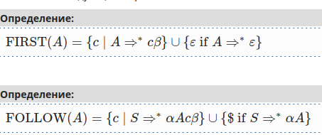

Теорема о LL(1)

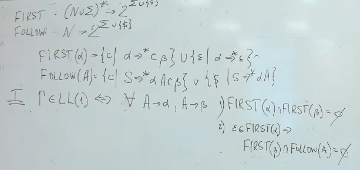

Доказательство
1. Если грамматика не LL(1), то условия не выполняются

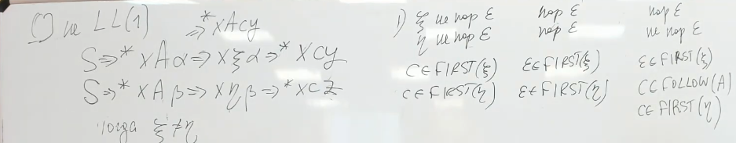

2. Если LL(1), то все ок

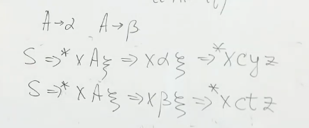

FIRSTk(A)={w ∣ A ⇒*wβ, |w| ⩽ k} ∪ {ε if A⇒∗ε}

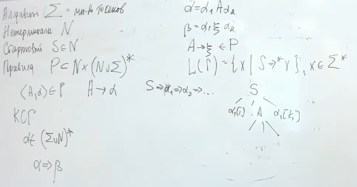 

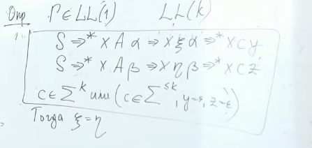

ll(0)-грамматики ~ линейные программы ~ методы архивации

ll(1) - могут запускать рекурсивный спуск

=== Поиск first ===
поиск first

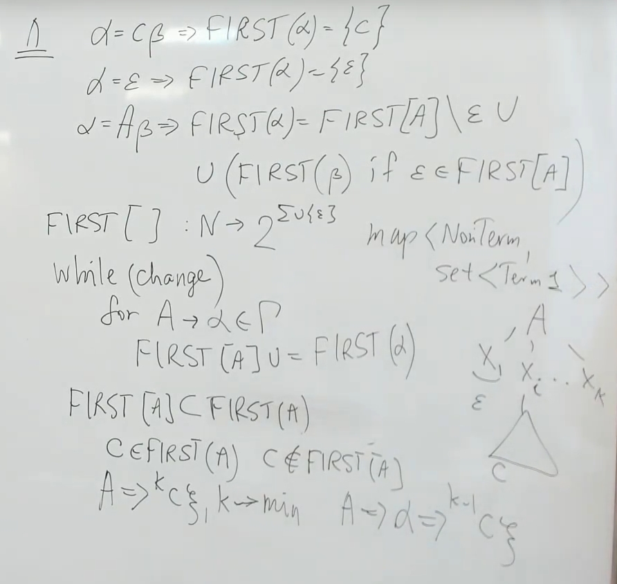

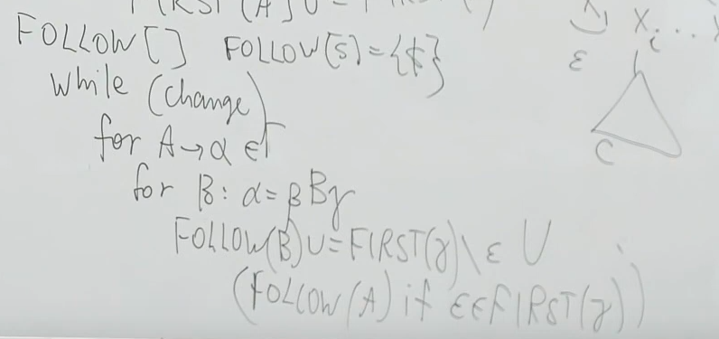
ничего лишего не добавит, а то что добавит -- корректно

=== Когда грамматика не LL(1) ===
1 и 2 можно устранить с сохранением семантики

==== 1. Левая рекурсия ====
1. Если в грамматике есть  левая рекурсия, то LL(1) быть не может.
(если из А можно вывести что-то кроме eps)

Левая рекурсия: A -> +Aa

Непосредственная левая рекурсия: A -> b

Устранение левой рекурсии (может помочь сделать LL1, а может и нет)

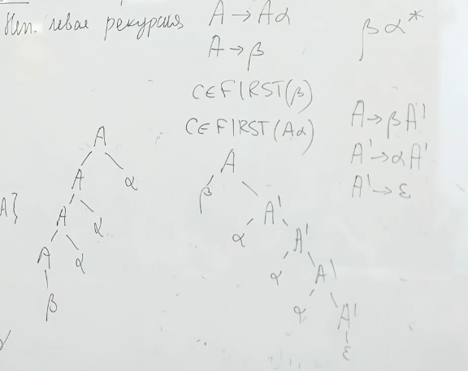

==== 2. Правое ветвление ====

A -> ab  
 
A -> ag

Решение: отложить принятие решения

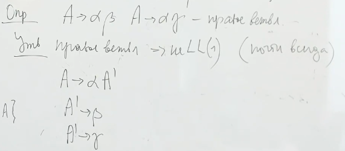

==== 3. Неоднозначность грамматики ====
Ничего не поделать.

== Рекурсивный спуск ==
Возвращает дерево разбора

Инварианты метода

* контекст 
* token -- указатель на текущий токен. До запуска rec_ll указывает на первый терминал из А, после запуска -- на первый токен после А.
* nextToken()
* ensure(t) -- проверить что во входная строка указывает на токен t (матчинг). Если ошибка -- выдаем ее. Если корректно -- сдвигаем указатель.

Грамматика

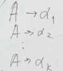

Основной метод (по нетерминалу возвращает его поддерево разбора). В каждом case разбор правой части одной из продукциий

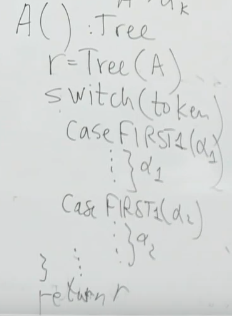

Вспомогательная функция:

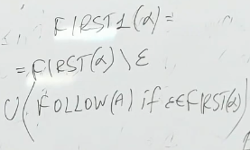

Разбор одной из продукций (правой части)

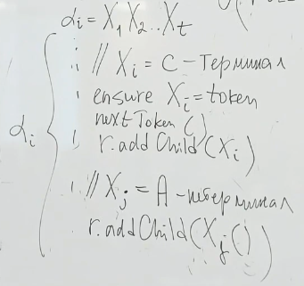

Передача данных:

* Вверх - возвращаемое значение функции обработчик нетерминала
* Вниз - аргументы функции
== Нерекурсивный LL ==
Переведем этот код в менее многословный 

Управляющая таблица 
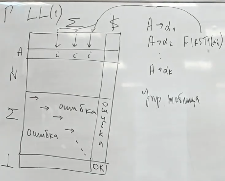

Имеет стек, в котором хранится недоразобранная строка 

Если на вершине стека терминал и он совпадает с token -- снимаем терминал с вершины стека, переходим к следующему токену.

Если нетерминал A -- смотрим следующий символ t в строке и получаем номер правила, A -> Xb : first(X) = t 

Если E -> eps -> запишем в таблицу follow(E)

Пример управляющей таблицы

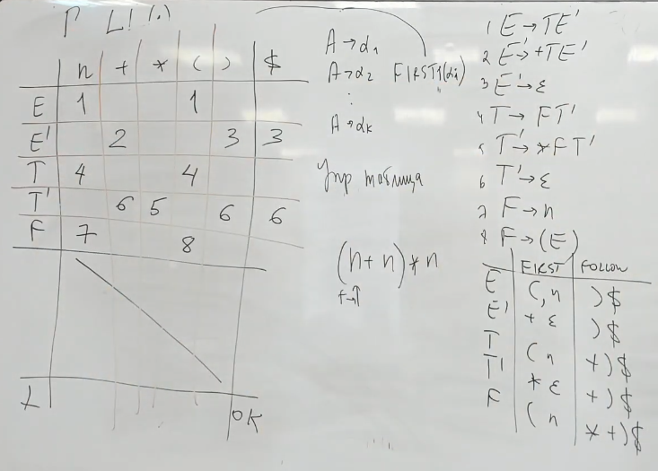

1. В стек кладем стартовый нетерминал. 
2. Когда снимаем вершину со стека по праилу -- кладем правую часть правила, начиная с коонца (чтобы извлекать в корректном порядке)

Передача данных:

* Вверх - 
* Вниз - 