= Арибутно-транслирующие грамматики =

* E терминалы 
* N нетерминалы 
* P правила
* S стартовый символ
* A атрибуты 
* AS присваивание атрибутов
* T транслирующие символы

== Атрибуты A ==
Аналогичны полям класса. Теперь терминалы и нетерминалы - классы, их вхождение в АСТ -- экземпляры.

Если F -> n это число

То n имеет атрибут val : int

Атрибуты бывают 2х видов
1. S Синтезируемые -- возвращаемые значения функций (путешествует вверх). Зависит от атрибутов соответсвующего нетерминала и его детей или от себя. Атрибут терминала -- если получаетя из токена.
2. I Наследуемые -- передаваемые значения (путешествует вниз). Его значеиние зависит от братьев или родителя.

== Присваивание атрибутов AS ==
Пусть у каждого нетерминалы есть трибут val 

Тогда для правила E -> T  выполняется E.val = T.val

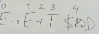

E -> E + T $ADD

У сложения 3 атрибута: op1 (от брата, наследуемый), op2 (наследуемый), res (вычисляет сам, синтезируемый)

res = op1 + op 2

Правила вычисление атрибутов:

$ADD.op1 = E1.val

$ADD.op2 = T.val

E0.val = $ADD.res

Присваивается в тот момент, когда правая часть выражения была вычислена.

Для неименованых используют такую нотацию 

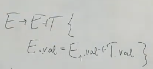

== Транслирующие символы ==
Код внутри грамматики, который модно исполнять

Специальный нетерминал с 1 правилом -- раскрываться в eps

Исполняется, когда символ транслируется (снимаем со стека, вызываем функцию разбора или происходит свертка (в восходящих))

=== именованый ===
Обычно именуем с доллара

E -> T 

E -> E + T $ADD 

=== неименованый ===
E -> T 

E -> E + T {...} 

== S-атрибутная грамматика == 
* Вне транслирующий символов происходит только присваивание  атрибутов
* Внутри ТС происходит обращение только к атрибутом этого ТС  

т.е. нет никаких не локальный операций 

=== S-атрибутная === 

E → E + T $ADD

$ADD {op1, op2, res; res = op1 + op2}

Все данные передаются как параметры

=== Не S-атрибутная ===

E -> E + T {E.val = E1.val + T.val} -- тут обращаемся к нелокальным для ТС данным

== L-атрибутная грамматика == 
* Наследуемый атрибуты зависят только от атрибутов родителя и левых братьев

Рассматривать будем только L-атрибутные грамматики

== Рекурсивный спуск ==
Наследуемые атрибуты -- аргументы

Синтезируемые -- возвращаемое значение. Вычисляем их, из аргументов или атрибутов, синтезируемых левыми братьями, складываем в объект класса, возвращаем.

Синтаксически управляемая трансляция -- СУТ -- преобразование текста в последовательность команд, через добавление таких команд в правила грамматики.Простой способ связать синтаксис с семантикой.

== Левая рекурсия == 
Преобразование атрибутов при устранении левой рекурсии.

Синий маркер -- путешествие синтезируемого значения.

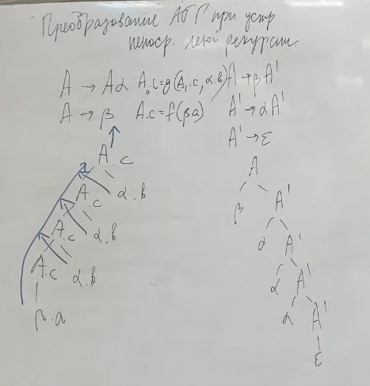

Вычисление атрибутов -- это какая-то функция от правой части правила. М.б. нечистая 

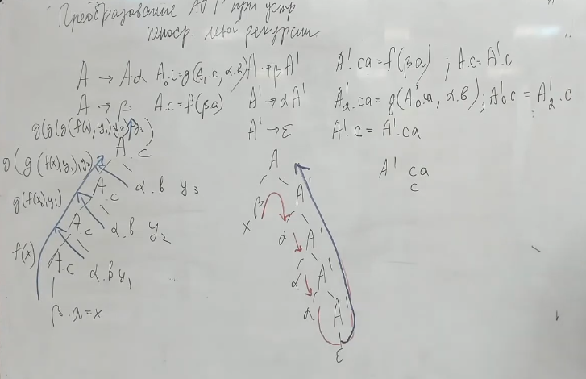

Для каждого синтезируемого атрибута создаем наследуемый, который пойдет вниз. Он будет накапливать информауия, которая накапливалась бы при подъеме вверх.

Для наследуемого: левый братьев нет -> зависит только от родителя. Если результат зависит от глубины реурсии, то перестроить ее не получится. Если просто присваивается -- то его значение не меняется. Можем взять от первого входа в рекурсию.

без устранения левой рекурсии 

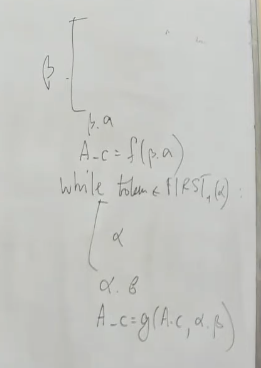

== Нерекурсивный нисходящий парсер ==
Правая часть еще не известна, а нетерминал А уже со стека снимаем. В стеке хранить синтезируемые атрибуты бессмысленно. Поэтому 

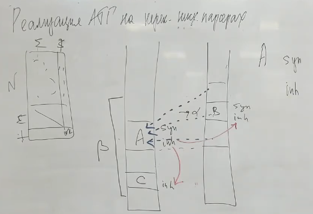

Правило: если атрибут синтезируется, значит он кому-то нужен. Будем ханить список того, куда нужно отрпавить синтезируемый атрибут 

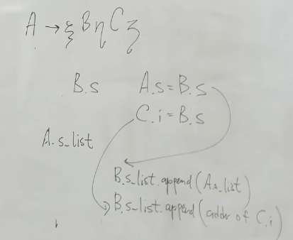

Наследуемые вычисляются по ходу (пишем их в правых братьев, которые ниже по стеку или при раскрытии -- как аргумент в потомков). Для этого храним массив ссылок, куда направить результат при снятии нетерминала со стека.

== Пример: рекурсивный ==
Исходная грамматика

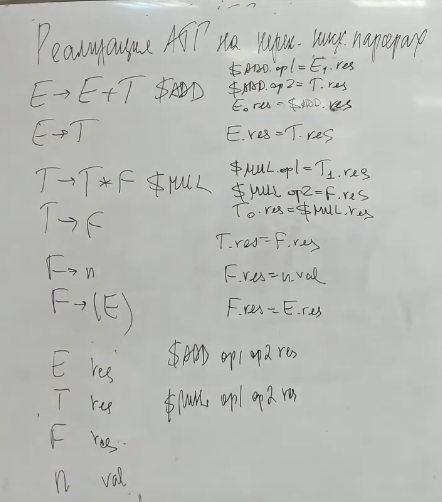

Устраняем левую рекурсию

то же для Т. F не меняется 

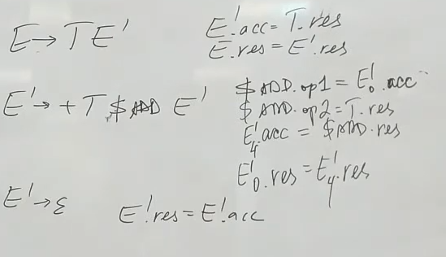

Преобразуем правила присваивания аттрибутов 

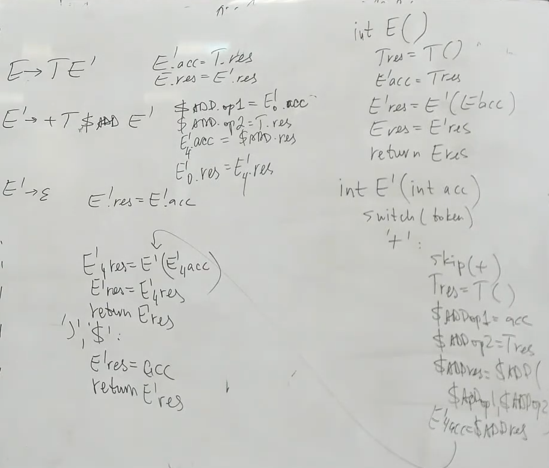

== Пример: нерекурсивный ==
image::media/s4_11.png[] 
там ошибка выше 

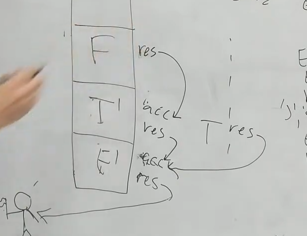

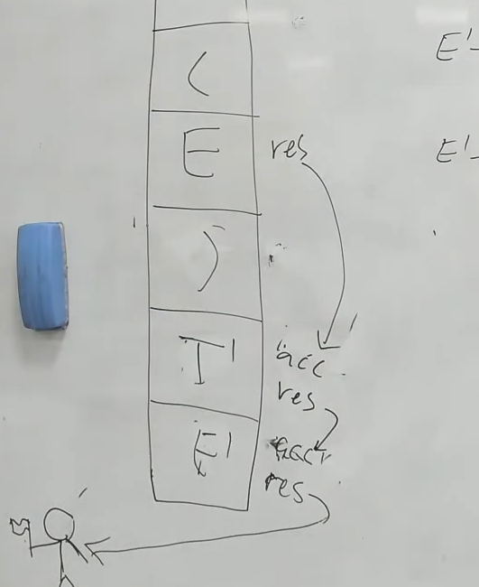

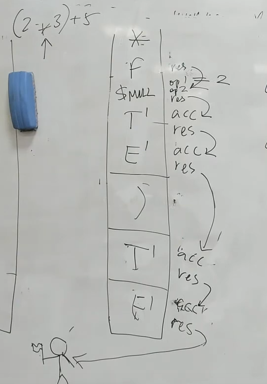