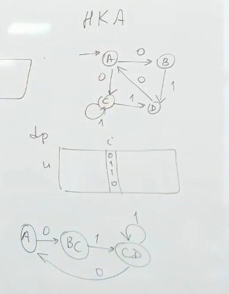
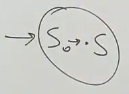
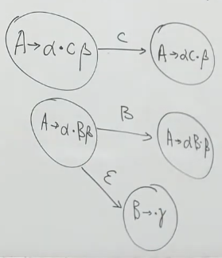
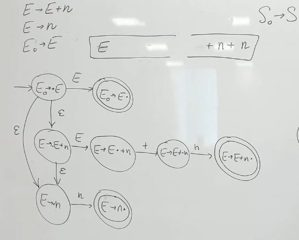
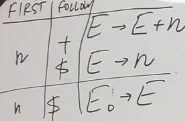

:stem: latexmath
= Восходящий синтаксический анализ =

* не боится левой рекурсии 
* информация о листьях дерева извесна заранее, как и стартовый нетерминал 
Есть 2 стека:

1. Стек разбора
2. Стек ввода

Есть 2 операции:

1. Перенос (shift): переносим первый элемент из стека ввода в стек разбора
2. Свертка (reduce): объявляем суффикс разбора правой частью какого-то правила, сворачиваем его и кладем в стек разбора левую часть. 

Чтобы говорить об успешном разборе, вводят фиктивный стартовый символ.

(Почему?) Если строка выводима в грамматике, то существует последовательность недетерминированных операция для ее свертки.

Можно построить недетерминированный автомат.

И детерминировать его.

== Детерминизация. Алгоритм Томпсона ==

НКА --- по одному и тому же ребру мб несколько переходов

Задача: проверить, может ли после i шагов автомат быть в состоянии u. Можно через ДП: получим матрицу из 0 и 1, где для каждого состояния определим может ли быть в нем автомат через i шагов.

Автоматы на картинке эквивалентны, но нижний детерминированный.

В худшем случае, если автомат имел n состояний, то детерминированный 2^n (количество подмножеств)

== Детерминизация + эпсилон замыкание ==

=== Эпсилон ===
Эпсилон переходы -- переходим по ребру, но не съедаем символ в исходной строке.

Можно сделать эпсиллон-замыкание и избавиться от таких переходов.

=== Алгоритм === 
Делаем е-переходы только после каких-то. Тогда стартовые состояния - S + все состояния, куда можно попасть из  S по эпсилон переходу

== LR-анализ ==
Методы по возрастанию мощности (каие классы грамматик можно разобрать)

* LR(0)
* SLR
* LARL 
* LR(1)

Постоим НКА, затем его детерминизируем. Он будет искать основу (handle) --суффикс рабочего стека, который можно свернуть и не попасть в тупик.

Если в стеке разбора лежит ab, а в стеке ввода `y` и существует вывод:

S =>* aBy => aby =>* xy 

то b -- основа для свертки B -> b

LR(k) -- автомат, k - сколько символов y мы включаем в состояние автомата.

Остальное различие в методах -- как на базе автомата мы выбираем решение.

LR0 автомат -- SLR, LR0 разбор

LR1 автомат -- LR1 ->(reduce) -> LALR

== LR(0) автомат ==
Недерминированный!

=== Состояние ===
LR(0)-состояние ~ LR(0)-item 

пара из правила вывода и ситуации (число, после какого символа в правой части мы находимся)

Всего ситуаций:

stem:[|\{LR(0)-item\}| = \sum_0^{rules}(len(right\_part_i)) + |rules| = \sum_0^{rules}(len(right\_part_i) + 1)] 

Стартовое состояние 

Терминальное -- любое, где точка в конце продукции
=== Алфавит ===
stem:[A = \Sigma \lor N] -- переход мб по терминалу или по нетермналу

=== Переходы ===

Алгоритм: идем по автомату и символам исходной строки. Если попалди в нетерминальное состояние выполняем перенос. Когда попадаем в терминальное состояние -- делаем свертку.

Если попали сразу в два терминальных состояний -- получаем конфликт свертка-свертка. 

Конфликт свертка-переход

Получаем конфликт. Не знаем, сворачивать или переносить :(
    
== SLR (simple LR)

В стеке смотрим на следующий символ в стеке ввода A(символ предпросмотра, look ahead). 

Сворачиваем, если stem:[A \in first(E)] (мы в вершине E -> ...)

Пусть дерево разбора существует. Тогда в автомате существует путь, соответствущий ему.

== SLR работает не всегда (не всегда по next можно сделать вывод по следующему символу)

  
== LR(1) ==
экспоненциальное число состояний (правило + позиция + ожидаемый символ)

смотрим по first правого нетерминала X или следующего от родительского нетерминала (если правый переходит в епсилон)

== LALR - анализ ==
look ahead LR

возьмем предпросмотр из LR(1) автомата, а состояния из LR(0) автомата

LR(0)-core(A) 

A \in LR(1)-items (это множество ситуаций LR(1), если у них отбросить ожидаемые символы)

образуют класс эквивалентности 

состояние автомата характеризуется его LR(0) ядром. Если оно есть -- переходим в него и добавляем еще ожидаемых символов

1. Строим LR(1) автомат и объединяем похожие состояния 

+ состояний столько же, сколько в LR(0) автоматы

+ не бывает конфликтоы вида перенос-свертка, если их не было в LR(1) автомате (новые символы предпросмотра -- просто объединение их из LR(1)

- могут появиться новые конфликты вида свертка-свертка (крест-накрест). 

- отсроченные лекции об ошибках

image::media/errors.png[]