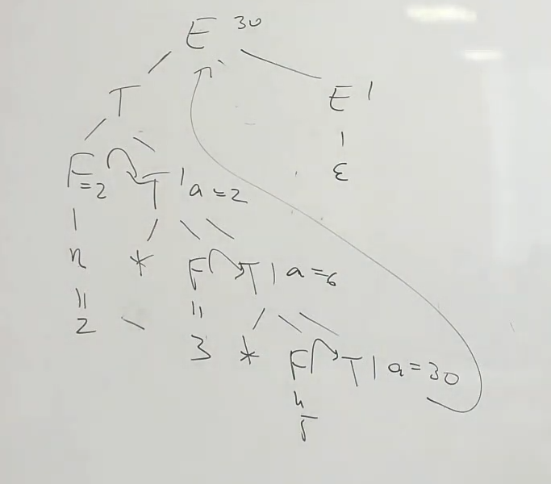
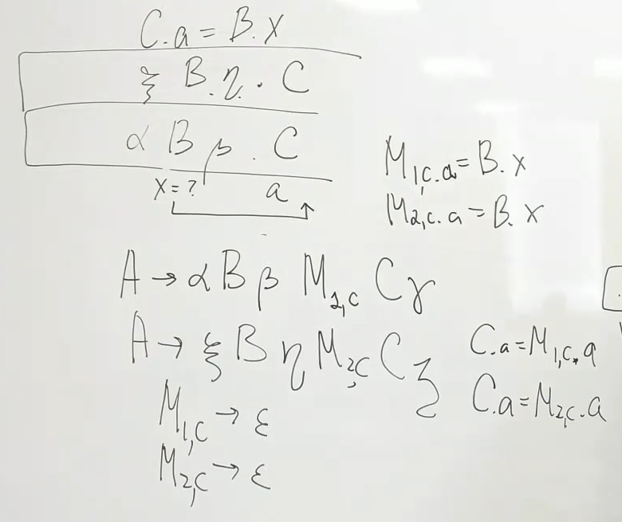
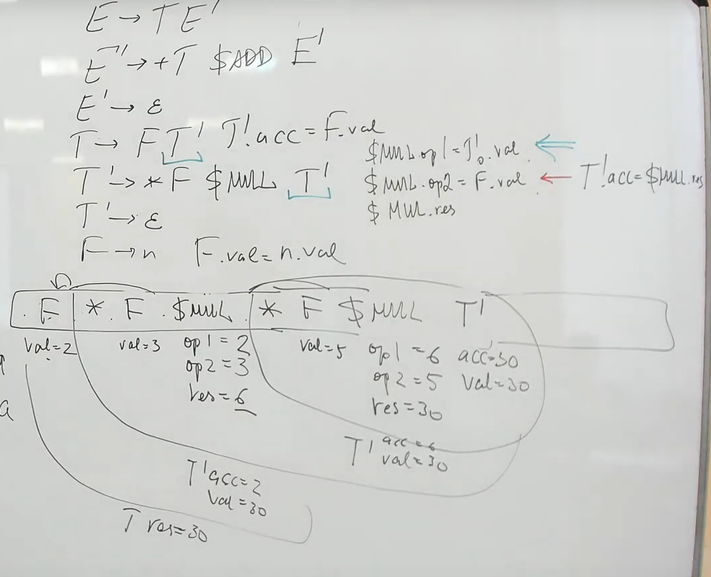
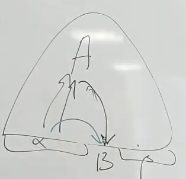
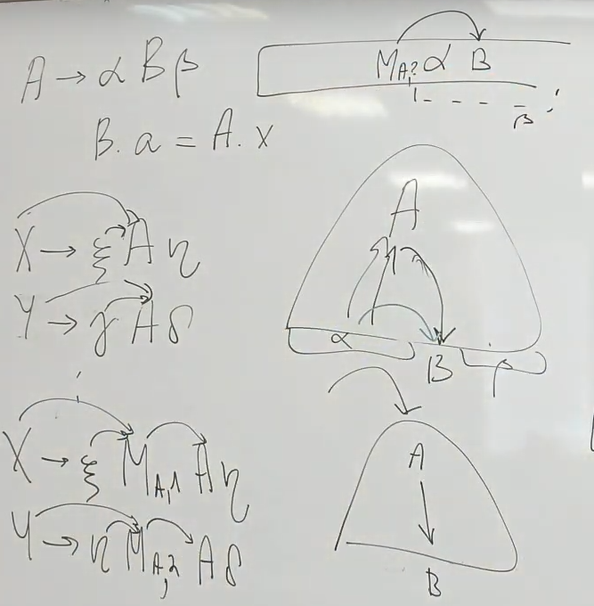

= АТГ при восходящем разборе =

== Синтезируемые ==
* зависят от детей 
* просто извлекаем при свертке 

== Наследуемые ==

Чаще всего появляются при устранении левой рекурсии.

=== От братьев ===

Пусть С наследует атрибут от В

A -> BdC

значит А еще не свернуто и в стеке лежит В. Можно было бы считать смещение до него. 

Но если 

* правил с С в правой частях несколько

A -> BdCi

D -> BkCj

*  b, k разной длинны

==== Вариант 1 ====

Посмотреть состояние автомата. 

Но если префиксы одинаковые, а взять нужно разное в зависимости от того, что идет правее от С, то грамматика не является LR(1) с точки зрения АТГ.

==== Вариант 2

Введем маркер для каждого уникального вхождения С в правую часть. Берем атрибут у него.

После этого грамматика может потерять свойства LR(0) или LR(1) грамматики (конфликт свертка-свертка из-за маркеров)

=== От родителя
Интуиция: кладем в стек и ТС. Берем по смещению значения у ТС, который пойдет в родителя.

Пусть есть правило 

A -> aBb 

И B берет атрибут у своего родителя: B.a = A.x

Атрибут А откуда-то берется (от родителя/ от братьев B. Врядли оно синтезируемое, т.к. получается какая-то циклическая зависимость)

Если от братьев, то можно сразу адресовать это в B 

Если от предков предка 

* Посмотрим в какие правые части входит А:

X -> aAb 

Y -> cAd

* Добавим маркер для разных вхождений родителя.

X -> aM1Ab 

Y -> cM2Ad

Теперь перед сверткой А в стеке точно будет лежать один из маркеров перед А. Наше В будет брать значение из него.

По состояниям в стеке можно посмотреть, в какой правой части находиться В. А в состояниях ниже по стеку -- в какой правой части наш родитель. Но так глубоко закапываться не очень хорошо, поэтому мы используем маркеры.