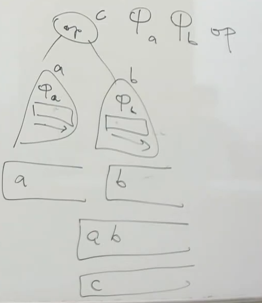
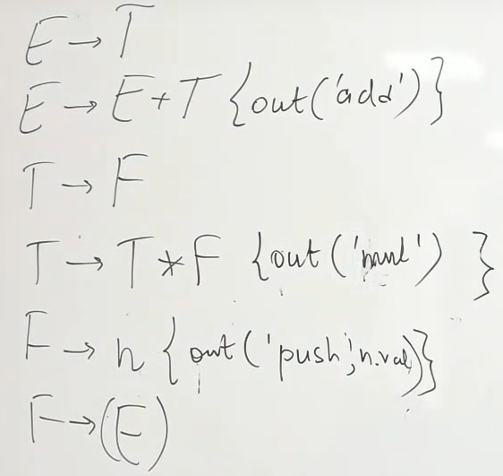
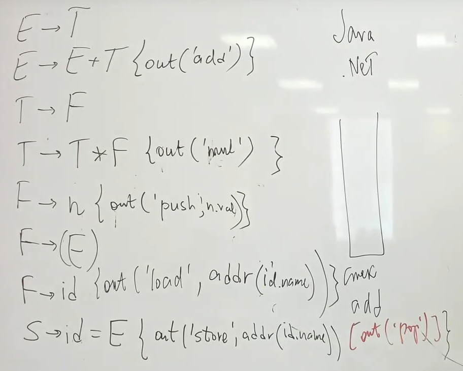
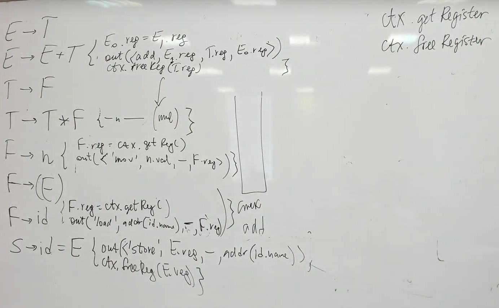

= Элементы компиляции 

* Компиляция выражений 
* Компиляция управляющих конструкций 
* Компиляция подпрограмм

Ключевая идея -- превращения кода на высоком уровне на низкоуровневый.

== Низкоуровневые вычислители 

=== 1. Стековая машина 

Java, .Net

+ С точки зрения теории вычислений все что угодно вычисляется на стеке

== Трансляция ==

Любое арифметическое выражение можно записать в обратной польской записи (постфиксная)

2 * 3 + 5 -> 2 3 * 5

2 + 3 * 5 -> 2 3 5 *+

+ не нужны скобки 

+ представляют последовательность действий на стеке 

Для любого арифметического выражение существует польская запись.

По индукции: 

n -> n   

Пусть есть два поддерева, которые уже записаны в польской записи 

Алгоритм трансляции выражения в польскую запись

image::media/polska_algo_expr.png[]

Алгоритм, печатающий программу для вычисления выражения на стеке 

Алгоритм, работающий с переменными 

=== 2. Регистровая машина ===

Имеет ALU и фиксированное множество регистров  (общего назначения или специализированные)

+ легко реализовать в железе 

+ легко программировать вычисления на asm 

Когда регистров не хватает, эмулирует стек :)

- свои инструкции для каждой архитектуры: x86, intel, amd... поэтому используют промежуточный код для абстрактной регистровой машины. Они обычно делятся на `триады` и `тетрады`.

Ключевые слова проверяются через универсальное хеширование без коллизий. 

*Триада*: <операция, операнд1 (он же результат), операнд2>

*Тетрада*: <операция, операнд1, операнд2, результат>

Код для компилятора такой же, как для ВМ. Только добавим операции для работы с регистрами (в данном случае -- тетрады)

