= Трансляция управляющих конструкций 

инструкция в ассемблерном коде -- задается кодом операции `opcode`.

Есть регистр, который указываем на текущую инструкцию

* безусловный переход -- переход на метку
* условный переход -- переход на метку при выполнении условия (значения регистра флагов: zero, greater, less для последней операции)

== Условный переход

Если есть регистр флагов 

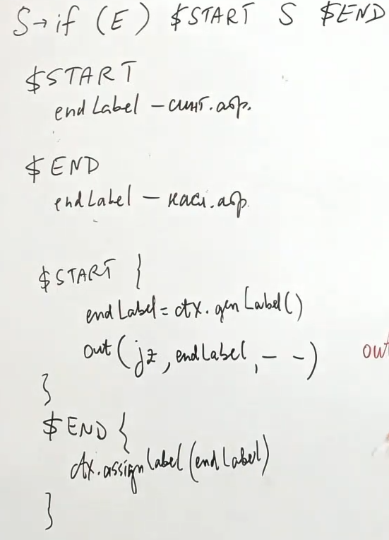

Если нет регистра флагов 

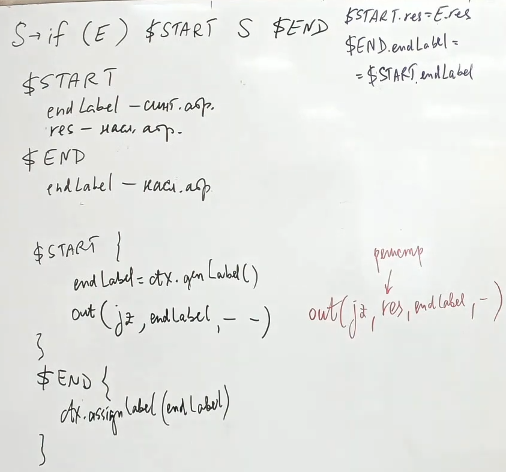

== Проблема else

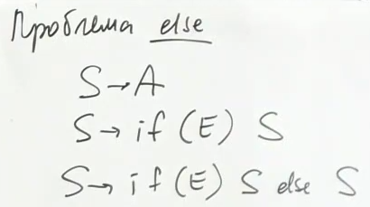

Это не LL(1). Избавимся от него. Но это не поможет, если посчитать first   

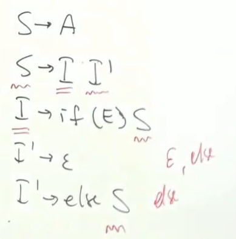

Успростим 

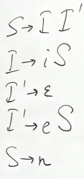

Грамматика не однозначна! Поэтому она ни LL, ни LR 

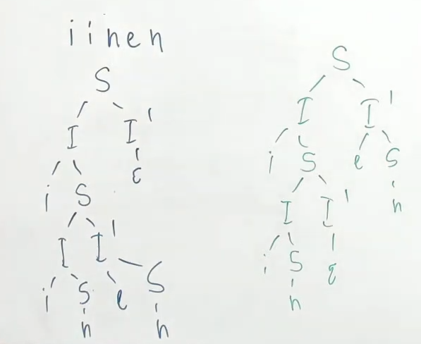

С этим помогут фигурные скобочки! Но зачем закручивать гайки, если можно переписать грамматику. 

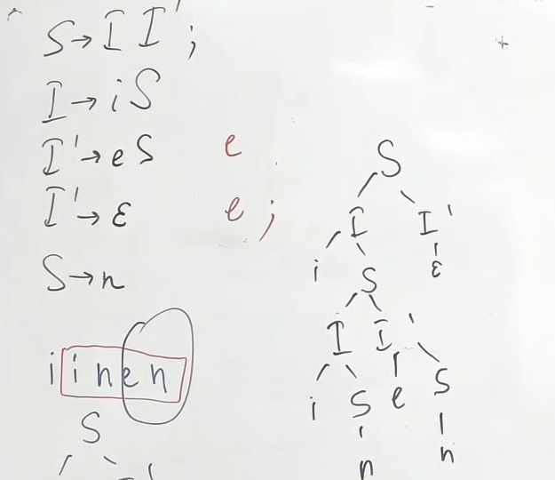

Здесь приоритет вывода всегда самому вложенному else 

== Трансляция else 
Код транслятора

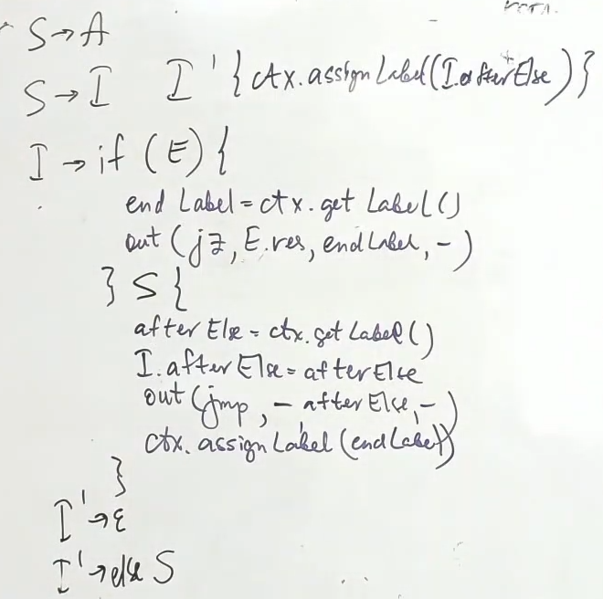

Грамматика оттранслируется в следующий код

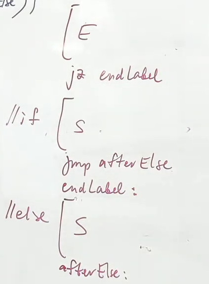

== Трансляция while 
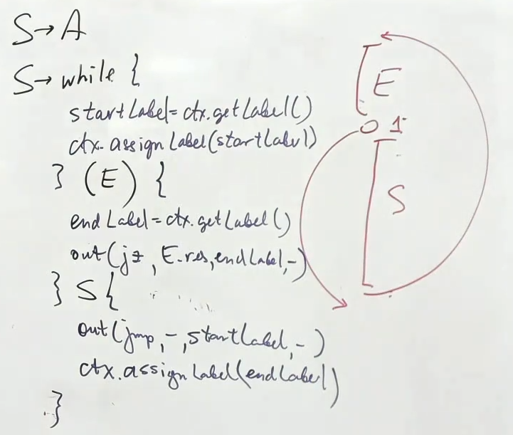

== Трансляция for 
image::media/trans_for.png[] 

== Трансляция функций 
* аргументы кладем в стек (порядок не важен, главное чтобы был согласован в рамках компилятора)

CAL - call argument list 

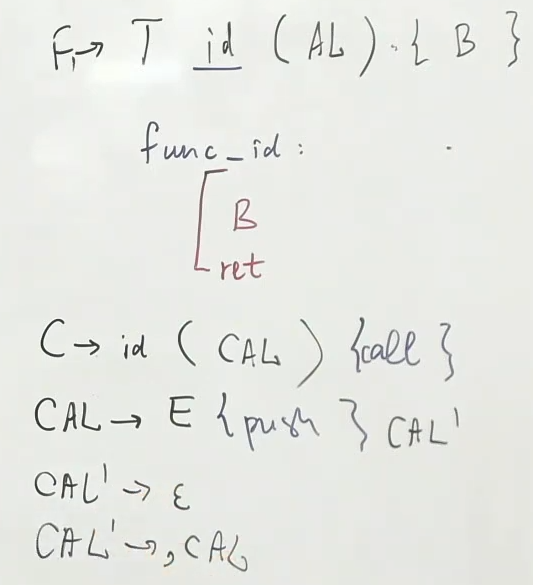