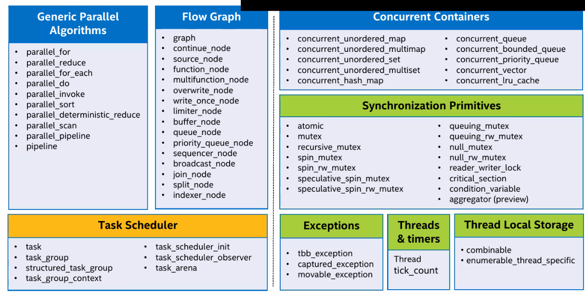
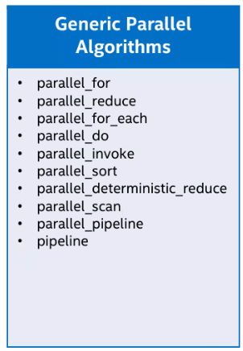
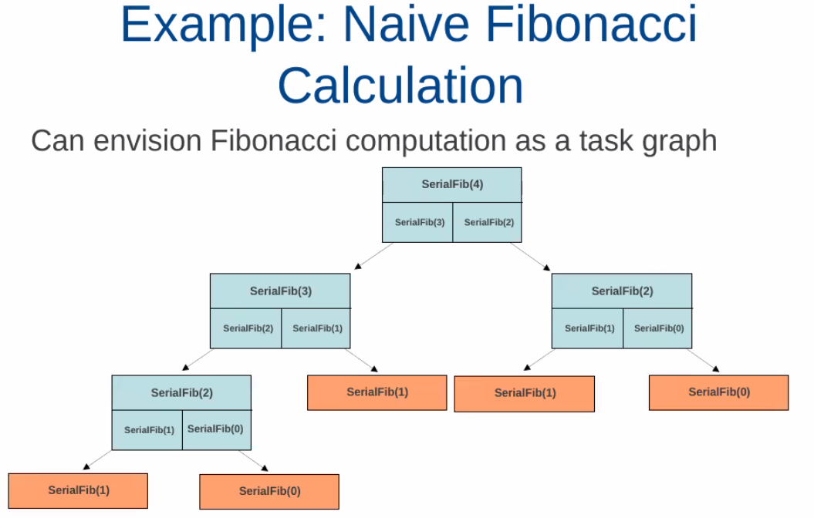
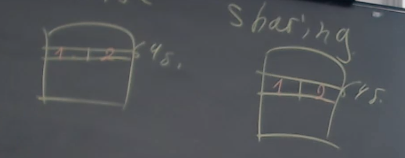
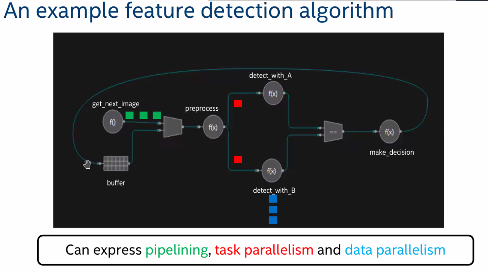
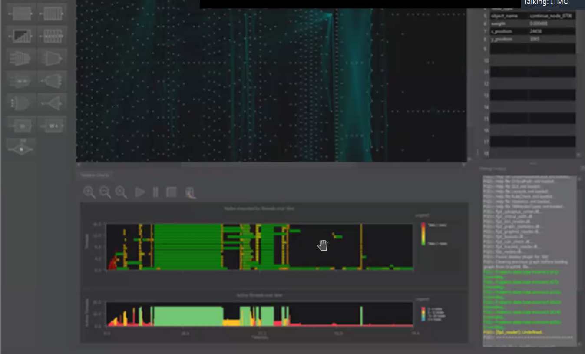

= tbb  
Открытая библиотека. Качество кода и стабильность кардинально выше, чем у OpenCV (библиотека обработки изображений).

В отличии от omp это библиотека общего назначения для провеффиональных разработчиков для высокопроизводительных, эффективных и нетривиальных архитектурных решений.

* есть только для c++

== Состав

Иногда ее называют STL параллельного программирования.

=== примитивы синхронизации
Сделана до стандарта std::11 -> задублированы примитивы синхронизации (часть deprecated)

image::media/sync.png[]

=== параллельные алгоритмы 

уровня шаблонов программирования

нет возможности создать больше одного пула потоков на весь процесс. он скрыт. уровень абстракции выше, чем у omp -- здесь он на уровне задач, а не на уровне потока.

Думаем в терминах -- у меня есть задача, я отдаю ее на исполнение и получаю результат. А как она будет исполняться -- скрыто планировщиком tbb (чем-то похож на fork-join pool в java)

У каждого потока своя независимая очередь задач, которая реализуется в виде дека. Набор очередей задач балансируются внутри потока. 
Любое действие в tbb всегда преобразуется к базовому классу tbb:task.

Балансировки могут быть реализованы разными алгоритмами: 

* *work stealing* -- поток сделал свои задачи -- украл часть задач из конца дека другого. 
** Почему кладем у несколько у одного потока, а не по одному у разных? Когда появляется очередь задач -- она скорее всего расписана из рекурсивных запросов. Есть мы возьмем последовательный кусок -- высока вероятность, что эти задачи будут обращаться в близкую область памяти и будет меньше промахов кеша.  

Любой код тасок должен быть потокобезопасным!!

=== Пример 

blocked_ranged:

* разбивает массив на диапазон
* может быть двух и трехмерным -- это мб полезно для обработки 3D сцен

image::media/parallel_for.png[]

==== Абстракции уровня деревьев задач 

spawn -- отправить на исполнение 

spawn_and_wait_for_all(a) -- ожиданием исполнение задачи, а не потока!!!! Технически логический поток продолжает выполнение других задач!Поток постоянно выполняет задачи и ждет другие, НИКОГДА НЕ СТОИТ НА WAIT!!

fj_pool + completable_feature 

image::media/fib_code.png[]

[.pluses]
* Если мы занимаемся не сортировкой, а поиском -- то когда найдем можем взять и отменить все задачи от родителя.

==== parallel pipeline 
настраиваем пайплайн обработки данных, каждый элемент пайпа обрабатывается в разных потоках. Если пайп определяет, что какой-то участок перегружен -- создаются копии логики в отдельных потоках. 

Предназначен для того, чтобы "горизонтально и вертикально масштабировать"

==== parallel_do

Подходит для вечной обработки событий (игры, например). Пока обрабатывает генерирует новые фичи.

=== Аллокаторы памяти 
Какие проблемы мб быть с аллокаторами с точки зрения производительности? 

==== *False sharing* 
Пример непрофессионального разработчика 

Пусть у нас есть двухядерная машина и массив v<32 byte struct>

Распаралеллим их. Пусть первый обрабатывает все нечетные, а второй -- все четные элементы. 

У нас два ядра -- у каждого свой кеш, обычно по 64 байта. Тогда у первого будет 1 и 2 элемент, и у второго тоже.

По логике мы не пересекаемся по данным. Но физически у нас дублируются данные в линейках кеша, поэтому их нужно часто синхронизировать. И реально оно мб будет работать медленнее, чем на одном ядре.

ШАРИМ одну и ту же линейку кеша  

FALSE потому что логически ничего не шарим 

==== *cache_aligned_allocator*
Что делать? Если возьмем  cache_aligned_allocator -- который сделает так, чтобы объект занимал кратное размеру кеша объем памяти. В нашем примере вместо второго объекта будут нули.

image::media/mem_alloc.png[]

==== *scalable allocator* 

у аллокатора фиксированный стандарт. если он внутри синхронизирован -- это может убить даже лок фри, пока мы будем ждать выделение памяти конкретному объекту.

аллокатор смотрим -- если поток попросил память первый раз -- создаем ему свой участок и выделяем там памяти побольше, чем нужно. Если поток пришел повторно -- он выделяет память в своем месте. Поэтому этот алгоритм выделения может работать для разных потоков одновременно. 

Есть предельный случай -- для глобального аллокатора (когда вызываем функцию new). Это функция где-то близко к `glib_c`. Поэтому мы можем реализовать `LD_PRELOAD` для new (так, чтобы поток мог параллельно выделять память).

Уже есть реализация таких аллокаторов, при чем их можно подключать не перекомпилируя приложения.Может приводить к росту производительности в десятки процентов (мб 30).

== Flow graph
Позволяет строить логическое представление программы 

image::media/flow_1.png[]

Пример графа: написанный нами код -- функции в кружочке 

Пример: граф 

image::media/flow_ex1.png[]

Если не будет узла, который бесконечно продуцирует данные -- мы закончим выполнение. Иначе зациклимся.

Зачем нужен? 

Мы делаем не просто пайпалн, а делаем все описание задачи, которое отдаем на исполнеение. Это позволяет делать глобальную балансировку нагрузки.

Еще в нем предусмотрены всякие фишки 

* пусть в одном из узлов нужно обрабатывать изображение -- смотреть последовательные кадры. Если узел перед ним распаралелен, то кадры будут не по порядку. Поэтому данные можно анотировать (номером по порядку). Перед входом в узел можно отсортировать эти данные.
* такие графы можно запускать и профилировать

== Куда развиваются 
* каждые полгода появляется новый тип узла графа 
** асинхронные 
** `opencl_node` -- гетерогенные вычисление -- синоним `offload` (миграционные вычисления).
* чтобы использовать мощные абстрактные вычисления нужны мощные абстрактные задачи (игровые движки)

[.minuses]
* отпугивает своей мощью программистов

[.pluses]
* хороша, когда нужно построить pipeline приложения с нетривиальной обработкой нагрузки.
* стабильная, отлаженная.

`opm` и `tbb` находятся на разных уровнях абстракции с точки зрения мышления. Но использовать их стоит только в подходящих случаях. 