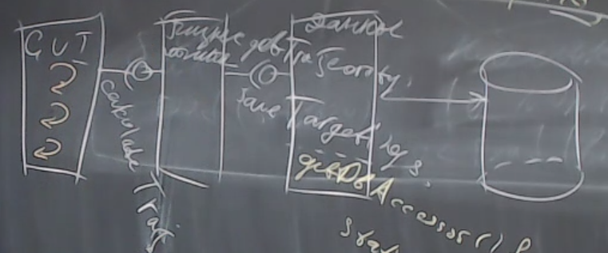
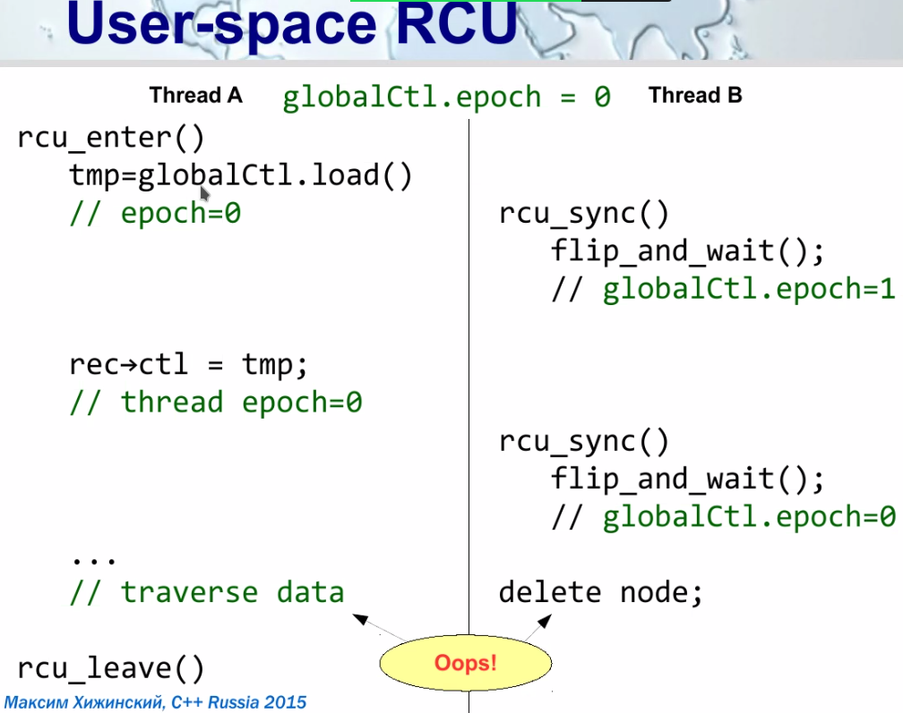

= SMR -- safe memory reclamation -- безопасное освобождение памяти

Метафора: 

* Пишем на нативном ЯП без сборщика мусора
* Первая часть -- в ядре ОС. Разрабатываем само ядро ОС.
* Работаем с любой структурой данных, в которой нам нужно обеспечивать максимально комфортную работу только для читателей.

== RCU -- read copy update -- один из механизмов SMR, алгоритм синхронизации 

На экзамене не хотят, чтобы мы рассказывали описание с википедии.

Ось обсцисс -- время 

Прямоугольник -- выполнение метода

r -- потоки ОС в кернел спейсе. Работают в сисколлах которые затрагивают что-то в ОС


добавление для нас не очень опасно: просто добавляем 

удаление опасно. remove (логическое удаление) -- мы перекидываем атомарно и новые потоки идут по этой ветке 

нам интересно когда можно сделать delete, чтобы освободить память. это может быть опасно: мб где-то висит спящий поток с этим элементом и когда он проснется, то упадет.

image::media/2023-12-08-19-12-14.png[]

`grace_period` -- время, от логического удаления объекта до момента уверенности, что ни один читатель не начнет его читать снова.  

Пусть поток читатель при чтении ставит rcu_read_lock, при завершении rcu_read_unlock. 

Писатель при начале работы берет `synchronize_rcu`

Писатель все время только 1. Или мы их вешаем на 1 мьютекс.

=== CONFIG_PREEMPT is not set
Спроектируем метод `synchronize_rcu` в предположении, что ОС собрана без остановленного флага `CONFIG_PREEMPT` -- это значит, что планировщик ядра не прервет сискол и обязательно даст нам доработать.

*Решение* 

хотим зафиксировать переключение контекста хотя бы раз на каждом ядре (не на потоке!)

```cpp
synchronize_rcu(){
    for(core : cores){
        //исполним на ядре пустой код
        //вообще вроде после `execute_on_core` весь код ниже
        //исполняется на другом ядре
        execute_on_core(core, () -> {});
    }
}
```

Мы побывали на каждом ядре, а значит планировщик предыдущий поток убрал и он закончился. И все дочиталось.

Получили потокобезопасные чтение и запись. При том, что пользователь для этого не делает нИчЕгО.

`--` не работает, если вынимать процессор на горячую

если из сервера вынимают один из процессоров, то читателей в полупрочитанном состоянии переносят на другие ядра. но мы могли их уже пройти в цикле!!! И мы их уже не обработаем.

=== epoch base synchronization 
класс алгоритмов, к которому относится rcu 

структуре данных ассоциируется эпоха (просто число). иногда его называют gp -- grape period. его может изменять только писатель. Читатели запомниают эпоху, на которой они начали читать и в конце инкриминируют локально. 


== User-space RCU 
image::media/2023-12-08-20-28-57.png[]

image::media/2023-12-08-20-31-53.png[]

Строим ее под мьютексами, поэтому atomic не нужны.

`globalCtl` -- глобальная эпоха. состоит из уровня вложенности (рекурсивные синхронайзы) и однобитовый счетчик эпохи

Чаще всего примитивы синхронизации захватываем комплиментарно -- и у читателей, и у писателей.

читатель имеет текущую эпоху и ссылку на такую же структуру данных у другого потока. Мы добавляем запись читателя в общий список

== TLS 
`TLS` -- **thread local storage** -- в нем хранится конкретный экземпляр `rcu_thread_data`. Это просто оперативная память. Выделяется при старте потока и имеет фиксированный размер. Фактически это кусочек стека, но выделенный и отличается архитектурно.

Зачем тогда нужен `tls`? Туда можно объявить переменные через `thread_local`. 

Когда мы объявляем `tls` переменную. Когда к ней начнет обращаться какой-то поток, то переменная будет иметь вид `map[id_thread, value]` -- т.е. у каждого потока будет изменяться свое значение `tls` переменной. Все tls переменные корректно удаляются и разрушаются когда завершится поток.

=== Самый известный tls 
`errno` -- **error number** -- это `tls` переменная. Мы ее запрашивает у кого-то и она возвращает разное значение в зависимости от вызываемого потока. Каждый поток считывает из нее своё значение.

=== Пример на с++ когда можно было бы удачно переписать код 
Архитекрута извне монолитна

Внутри архитектура слоистая  



* слой БД (почти все потокобезопасные)
* слой доступа к данным 
** чаще всего обращается к БД через DbAccessor
```cpp
getDbAccessor(){
    static DBA dba(...);
    return dba;
}
```

* слой бизнес логики 
* слой GUI (гуйня, отвечает только за гуйню)

Проблема: завели многопоточку на уровне гуйни, а DbAccessor не потокобезопасный. Что делать? 

=== Вариант 1 
протягивать многопоточку через все слои. Создать для каждого потока свой dbAccessor. 
протягивать удаление всех структур данных для закрытия dbAccesssor 

=== Вариант 2 
```cpp
getDbAccessor(){
    tls static DBA dba(...);
    return dba;
}
```
Работает. Когда к dbAccessor приходят клиенты из нового потока -- ему выделяется его поток.

Удалится, когда завершится поток.

Обеспечили развязку потоконебезопаснных объектов на несколько потоков с автоматическим их разрушением при завершении потока.

Фактически это синглтон в рамках треда


== Что делает читатель 
image::media/2023-12-08-21-17-50.png[]

При входе: сохраняет локально глобальную эпоху 

При выходе: инкрементирует его локально

При чтении эпоха всегда растет на 1. НО ЧТОБЫ ЕГО ИНКРЕМЕНТИРОВАТЬ писатель ждет, пока все читатели увеличат свою эпоху.

Если читатель не собирается читать данные, то ему нужно разрегистрироваться от этой структуры данных.

`--` если читатели читают не активно, то мы никогда не дождемся нужного обновления эпох. Это ограничение данной системы 

Когда сохраняем глобалььную эпоху у читателя в локальную эпоху -- мы это делаем не атомарно. Мы сначала считываем значение глобального счетчика во временную переменную. А потом записываем из нее.

Во время между этими операциями может случиться все что угодно. Мы можем прочитать предыдущую эпоху, а записать когда она станет следующей.

То есть мы еще не успели обновить локальную переменную.

Детектируем псевдопереход между эпохами



Есть библиотека `user_space_rcu`