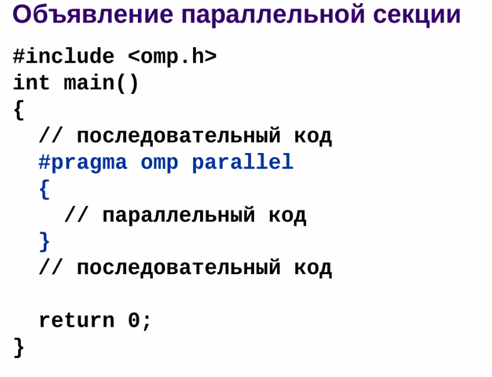
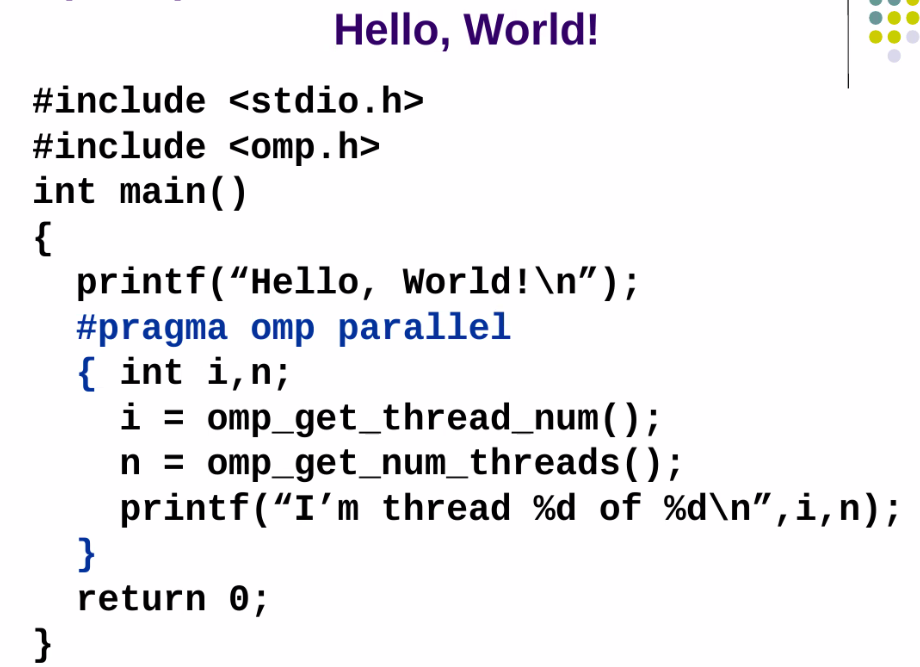
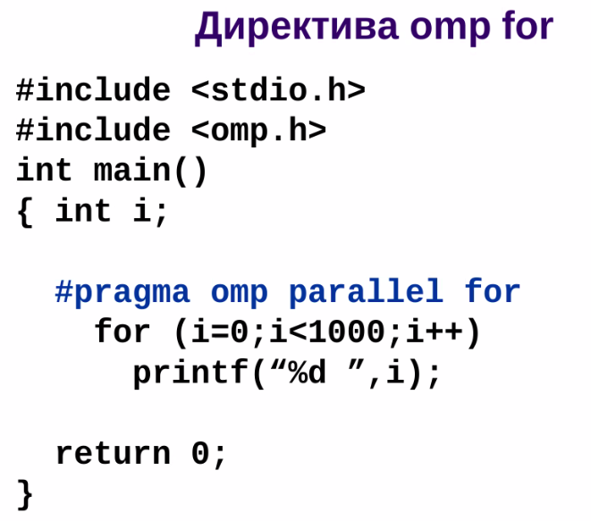
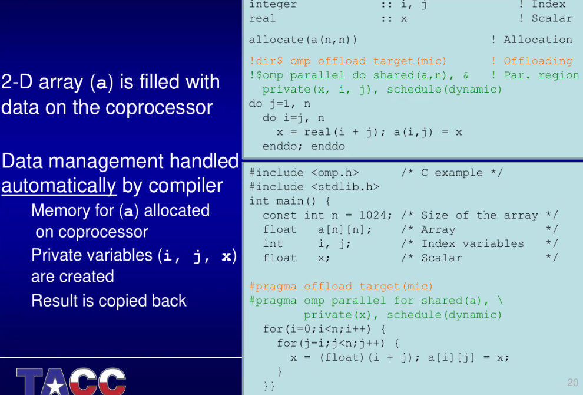
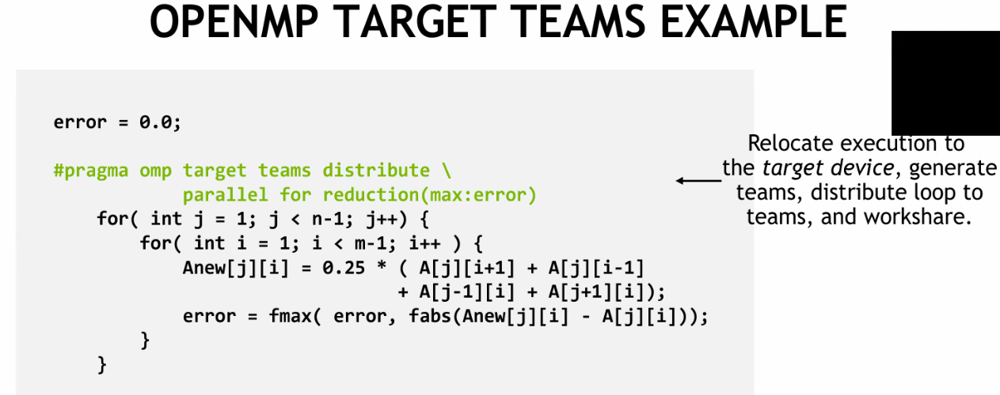

= Open multi processing 
что за технология. зачем нужна. какие ограничения.

Первый стандарт, который повысил уровень абстракции от чистого многопоточного программирования (от создания потоков напрямую). Intel разработали достаточно общий стандарт. 

Технологически является большим шагом в индустрии, хотя концептуально ничего нового не вносит. Создан как расширение для `c++` и `fortran`. 

image::media/open_mp.png[]

Иначально предполагался как стандарт, который позволит специалистам в предметной области оптимизировать параллельность программы. Даже если они не профессиональные разработчики.

image::media/2024-01-24-19-08-21.png[]

== с++
Реализовано через директивы препроцессора (pragma, include, ifndef, pragma pack)

=== pragma pack 
Размер структуры {char, int} будет равен сумме дополненной до ближайшего целого вправо из-за выравнивания. Иногда в протоколах четко расписаны все биты и байты. pack отключает выравнивание, поэтому можно накладывать эти структуры на битовый поток.

Предметная область: сетевое программирваоние, сети с ограниченной пропускной способностью. Но protobuf такие проблемы тоже умеет решать.

=== реализация
* opm -- зарезервированное слово, реализовано в компиляторе. 

Это директива -- будет сгенерирован код. Код в скобках -- будет вынесен в отдельную функцию и распараллелен. Где сбока закрывается -- будет выоплнне join. До вызова функции будет запущен код, который запускает потоки (обычно столько, сколько ядер в системе) и т.д.

Потоки знают, какие они по номеру. Это можно учитывать в логике функций.

Пример

 

=== Обычные примитивы синхронизации 
Тоже работают. Стандарт не вносит ничего нового, кроме генерации кода.

*master*

Код гарантированно начнет исполнение только в одном потоке, у остальных даже не будет этого кода. 

image::media/master.png[]

*critical*
как mutex

... 

Есть те же примитивы, но сихронизованные вызовом функций 

image::media/sync.png[]

=== Ключевые слова после omp  

==== For 
подсказываем компилятору, что хотим распаралеллить цикл `for`.

 Потокобезопасный ли он? Да, т.к. `printf` потокобезопансый. `cout` нет!!!!

Индекс цикла копируется в каждый поток (каждому выделяется какой-то свой интервал индексов). Так копируются все переменные до первой точки с запятой. 

Если метод увеличения счетчика -- сложный -- все упадет!! break и прочее не сработают тоже!! 

==== Области видимости

image::media/private.png[]

*private* -- значит, что переменная будет у каждого потока своя независимая. 

*shared* -- из любого потока можно иметь доступ к этой перемнной (не потокобезопасно!!)

image::media/shared.png[]

*reduction* 

image::media/reduction.png[] 

s -- внешняя переменная. Сначала распараллелится цикл, у каждого цикла будет своя приватная s. Содержимое фора вынесется в отдельную функцию. Создаться столько потоков, сколько ядер. В каждом потоке будет считаться локальная сумма. 

Потом сгенерируется код, где методом редукции (здесь -- сумма) будет собрана конечная сумма в глобальном s.

== Sections 

Правда ли, что код будет работать если не реализлван omp -- так же, как без него? Нет, все упадет если у системы одно ядро. Пусть одна секция prodcucer, а вторая -- consumer. В секции поток не переключится, пока не закончит ее выполнение полностью. Поэтому producer, запущеннный первым никогда не закончится.

image::media/sections.png[] 

картинка посередине -- sections. Если первый поток 

Как исправить? Явно попросить  исполнять в двух потоках. Если больше 2, то оно и так запуститься в нескольких потоках.

== Актуальность 

Миграция вычислений -- есть куча устройств, на которых можно выполнять разные вычисления. Процессоры общего назначения, графические карты, платы расширения (PSI) с десятками процессоров общего назначения + куча штук для специализированных вычислений.

Чтобы не учить api каждого устройства придумали миграцию вычислений (offload).

Сгенериурет специализированный код, если устройства поддерживает специальные возможности для вычислений.

Сделали либу для nvidia. Без единой строчки на cuda! teams -- это видеокарта.

[pluses]
* Полезна, интересна
* Кода гораздо меньше, чем на чистой cuda

[minuses]
* Пока экспериментальна