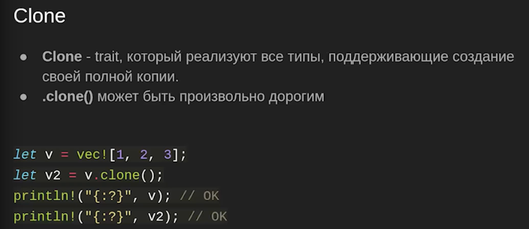
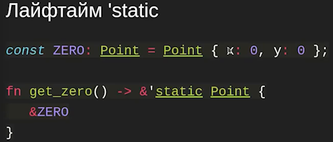
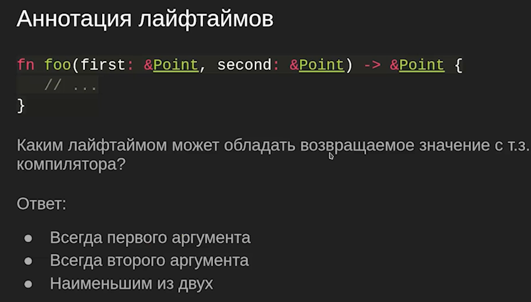
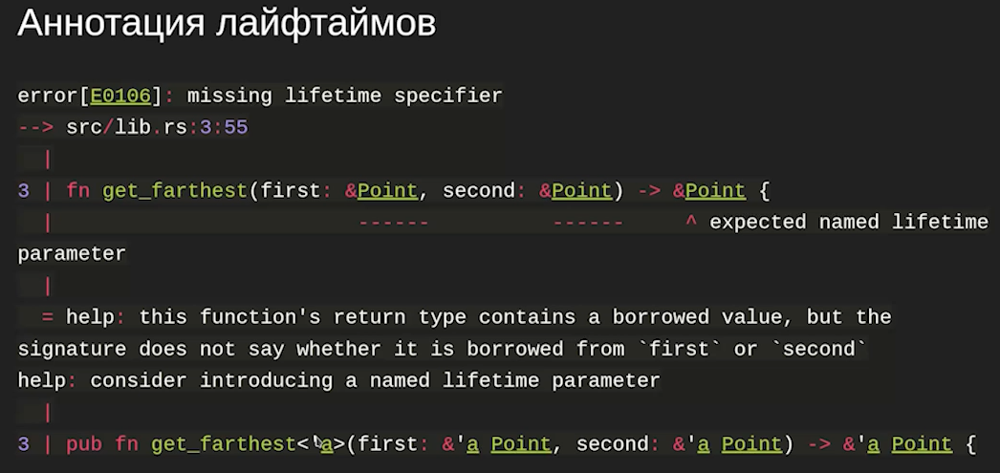
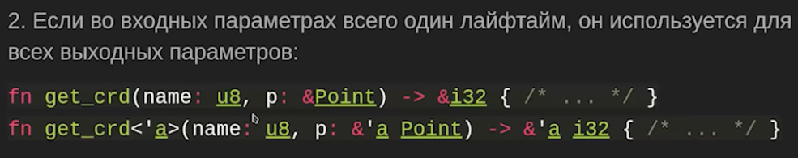
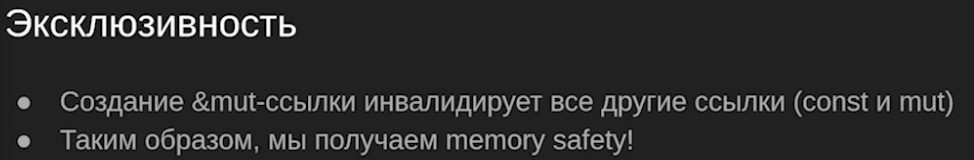
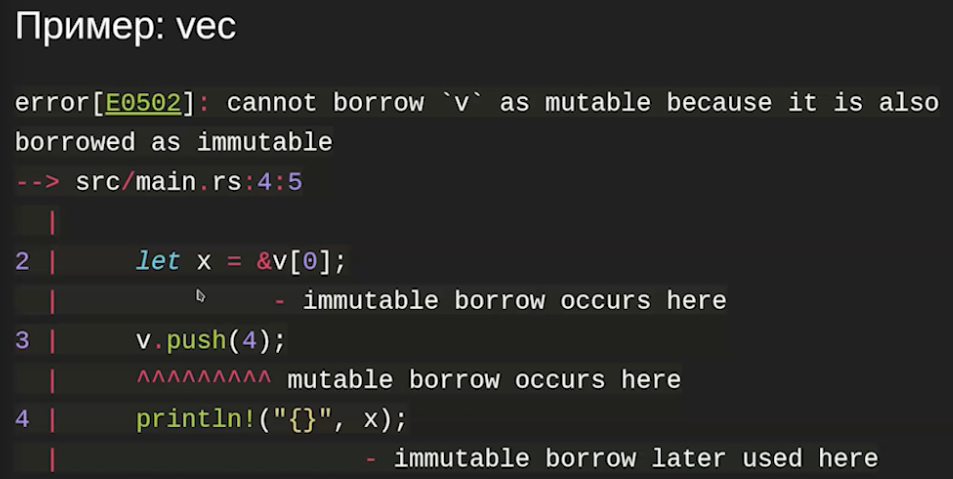
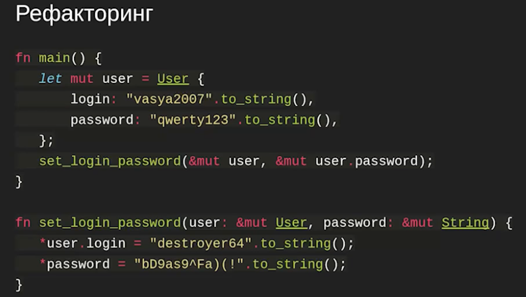
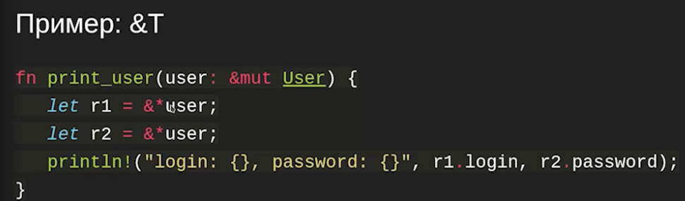

= Lifetimes, ownership & ... =

== Ownership & move ==

Вектор - указатель на область памяти в куче (указатель на данные) + капасити + размер. Он владеет этой памятью (зовет деструкторы)

В с++

image::media/02_exmpl.png[]

В скопе функции sum создаться копия вектора. Деструктор позовется для копии в этом методе.

image::media/02_rust.png[]

В таком синтаксисе в раст владение передается в функции sum. Там он и будет убит.

В чем различие?

* move in rust -- это mem cpy (копируются все ссылки и размеры)
* d c++ вызываем констурктор копирования 
* в с++ можно использовать обхект после того, как его помували. мб ворнинг. он может быть в валидном, но не специфицрованном состоянии (в зависимости от версии)
* в rust это ошибка
image::media/2023-09-23.png[]

* in rust любое присваивание -- это мув. ДАННЫЕ не преемещаем. Перемещаем ссылки на них. Поэтому move -- простая операция ,а clone -- сложная

=== Clone ===

+ если clone нет, то точно нет никаких неявных мощных копирвований

*clone-тип -- тип, у которого определен метод clone

image::media/02_clone_2.png[]

try-clone: при копировании файла нужно убедиться, что мы копируем и файловый дескриптор. Система может это не сделать (если кончится место, например).

Почему у вектора нет try-clone? там ведь тоже может кончится память. есть такая модификация у либы alloc. В rust линукса так, например. В user-space (пользовательское приложение) обработку out-of-memory почти невозможно, поэтому решили в обычную реализацию этого не добавлять. Обработать невозможность создания файловых дескрипторов без создания файловых дескрипторов легче.

=== Copy ===

image::media/02_copy.png[]

copy может реализовать любой тип, у которого нет деструктоура.

Примеры copy-типов

image::media/02_copy_2.png[]

Массивы копи-типов лучше сразу выделять на куче, т.к. они могут случайно грохнуть стек.

`copy` ~~ memcopy (встроенная фича в язык, копирует битики). по умолчанию копируются. и мувать ее нельзя!

`clone` ~~ во время копирования может вызывать произвольно сложный код. если нет copy, то по умолчанию объект передается.

=== Частичный drop ===
image::media/02_drop1.png[]

image::media/02_drop.png[]

Как после частичного дропа структуры додропывается структура? Компилятор на стеке держит флаг для каждой структуры, дропнута ли она. И в зависимости от него обрабатывает.

Если у foo есть нетривиальный деструктор, то частично дропать не copy типа нельзя.

=== Итог ===
image::media/02_own_summ.png[]

+ clone -- тяжелое копирование, copy -- легкое 

== Const references ==
image::media/2023-09-24.png[]

Если мы передает константную ссылку куда-нибудь, это не инвалидирует объект.

Отличие от C++ в том, что ссылку нужно брать явно.

У ссылки есть рантайм, у указателя нет. Время жизни ссылки связан с временен жизни объекта.

=== Инвалидация ссылок ==
* объект переехал -- ссылка на него инвалидируется (ошибка компиляции)

=== Связь между ссылкой и объектом === 
image::media/02_link.png[]

Нельзя вернуть ссылку на локальные переменные. Можно вернуть ссылку на поле объекта, который пришел на вход метода по ссылке

На примере ниже время жизни ссылки на x связано с временем жизни point

image::media/02_link_1.png[]

=== Лайфтайм static ===

статический лайфтайм валиден во время всей жизни программы

Возвращается пересечение двух лайфтаймов.

<'a> = "Слёзка a" 

Статик время жизни валиден всегда. По параметру -- не вечен.

=== Независимые лайфтаймы ===
image::media/02_link5.png[]

Lifetime elision -- правила, когда мб не указан лайфтайм

image::media/02_link06.png[]

image::media/02_08.png[]

Скопилируется ли код?

image::media/02_09.png[]

нет 

1. мувнули foo -> second инвалидна
2. drop_first не работает, только если first не copy тип (нельзя возвращать полудропнутые объекты из скопа в скоп. Компилятор всегда предполагает, что полученные и возвращаемые значение оба инициализированны и валидны)

=== Const references: Итог ===
image::media/02_10.png[]

== Mutable references ==
image::media/02_11.png[]

неконстантными ссылками можно поломать константными

image::media/02_12.png[]

неконстнатная ссылка инвалидирует все другие (const и mut)

зачем так?

image::media/02_15.png[]

image::media/02_16.png[]

если вектора одинаковые, то оно не скомпилируется, т.к. у нас две mutable ссылки на одни и тот жен объект

for x in &vector{}

intToIter поглащает вектор, когда вызываетсся дестурктор итератора -- все выкидывается наружу и из вектора

это не работает, т.к. у нас две мутабле ссылки на пассвордд

== Алиасинг ==
image::media/02_18.png[]

== Вопросы ==
1. является ли copy-типом &T (константная ссылка)? (да)
2. mut &T? (нет, но пример ниже компилируется)

image::media/02_19.png[]

Почему? reborrowing

image::media/02_20.png[]

это инвалидирует исходную мутабельную ссылку

если есть объект и мутабельная ссылка на него и мы меняем объект, то ссылка инвалидируется :(

== const reborrowing (порождение из ссылки другие ссылки)==

*user для копи типа вернет копию юзера

для не копи типа &* -- это одна операция. она порождает немутабельную (константную) ссылку 

порождение мутабле ссылок 

image::media/02_22.png[]

неявный реборовинг 

image::media/02_23.png[]

можем в бар продолжать пользоваться ссылкой!

=== borrowing итог == 
image::media/02_24.png[]