= Слайсы 

== Слайсы &[T]

ссылка на непрерывно лежащий участок памяти, содержащий *неизвестное* количество элементов типа T (известно только в runtime)

В отличии от массива &[T;5] мы не знаем, сколько элементов в слайсе будет в compile time

Сами данные могут лежать на куче, стеке, сегменты данных и т.д.

=== Откуда берутся 
1. Из массива. Передает range индексов (они могут быть неизвестны в compile time)
2. `Vector` умеет дереференс к слайсу. Просто приведение одного к другому. Можно не указывать первый и(или) второй индекс ренджа. Можно писать `vec as slice`. Но вообще может скастовать неявно.
3. Из другого слайса. Можно взять подслайс.

Слайс байт (ссылка на массив байт, которая кастится к слайсу). Строковый литерал `b"abcda"` вернет ссылку на бинарный массив известного в `compile time` размера. Лежит в сегменте данных программы (статическая). 

image::media/slice.png[] 

=== Размер 
равен двум размерам указателя (толстый указатель), так как он хранит и место в памяти, и размер массива

image::media/slice_size.png[]

[T] нельзя передавать как аргумент функции или класть на стек (так как у нее нет размера)

=== borrow checking
Slice -- просто константная ссылка

image::media/borrow.png[]

=== mutable slice 
Можно взять от mut вектора

Но если взять два слайса от одного вектора

image::media/mut_slice.png[]

То легко получить ошибку!!!

image::media/mut_slice_err.png[]

Есть безопасный способ сделать это (вернет два непересекающихся)

image::media/slice_intersec.png[]

=== Строковый слайс 

Всегда проверяет, что данные корректные `utf-8` символы!

image::media/str.png[]

image::media/str_source.png[]

лучше не брать по индексу, т.к. индексация побайтовая и мы можем разбить utf-8 символ посередине. Если нужно бираное представление, то лучше скастовать к слайсу сайт 

Константная ссылка -- всегда copy тип!

В строковом файле элемент -- это символ, а в строковом байте -- байт, т.е. символ задается несколькими байтами. Это не массив чаров, т.к. в этом случае пришлось бы на каждый элемент выдавать 4 байта, в это очень много памяти. 

=== Итог 
image::media/sum_slice.png[]

== Enum 
image::media/union.png[]

Нужно вручную звать дестурктор,вместо этого используют variant 

image::media/enum.png[]

image::media/enums.png[]

Варианты enum могут быть разными. Например, Car имеет какие-то строковые данные. Остальные технически - цифры. При этом все варианты имеют один тип transport.

Представление Option в памяти, если бы он был enum 

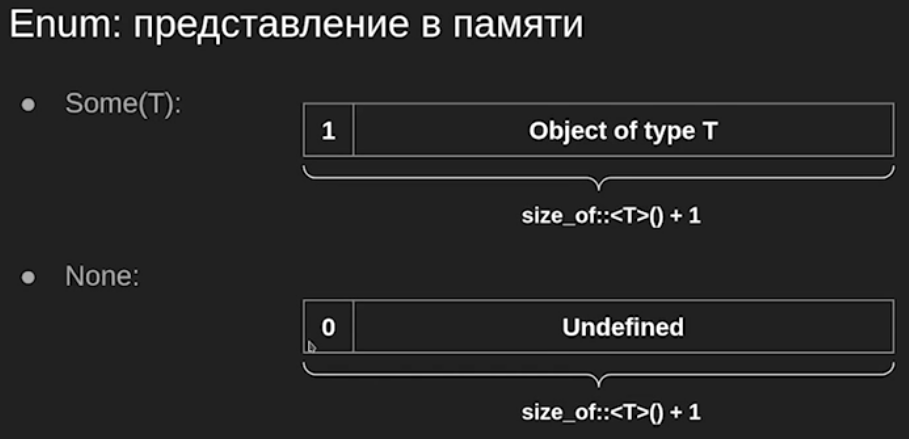 

На самом деле, выделяется чуть больше памяти с учетом выравнивания.

Но в rust enum в отличии от variant С++ является конструкцией языка, поэтому возможны некоторые модификации. Например, бул имеет 1 байт. Но имеет только 2 значения. И они могут быть либо 0 либо 1. Если значение другое -- то UB, т.к. rust может использовать эти байты в других целях.

Размер ссылки 8. Ссылка не может быть нулевой, она должна на что-то указывать. (Указатель может быть, но там уже особенности памяти)

image::media/enum_size.png[]

Вопрос: какой размер Option(Foo)

Ссылка r не может быть нулевой, поэтому для дискриминанта Option будет использован он. Компилятор вообще выбирает поля, невалидные значения которых можно использовать.

Размер r = 2 * 8, т.к. это толстый указатель. i занимает 4 байта. Итого 20 байт. Дополнительно структура будет выровнена по 8: ее optional займет 24 байта. 

image::media/option_slice_size.png[]

Point is a tuple-like structure, rectangle -- struct-like

image::media/structures.png[]

Дискриминант - тег того, что лежит внутри enum

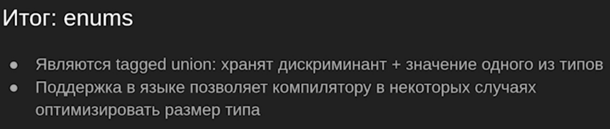

== Pattern matching 
Нужно всегда перечислять все варианты!

image::media/match.png[]

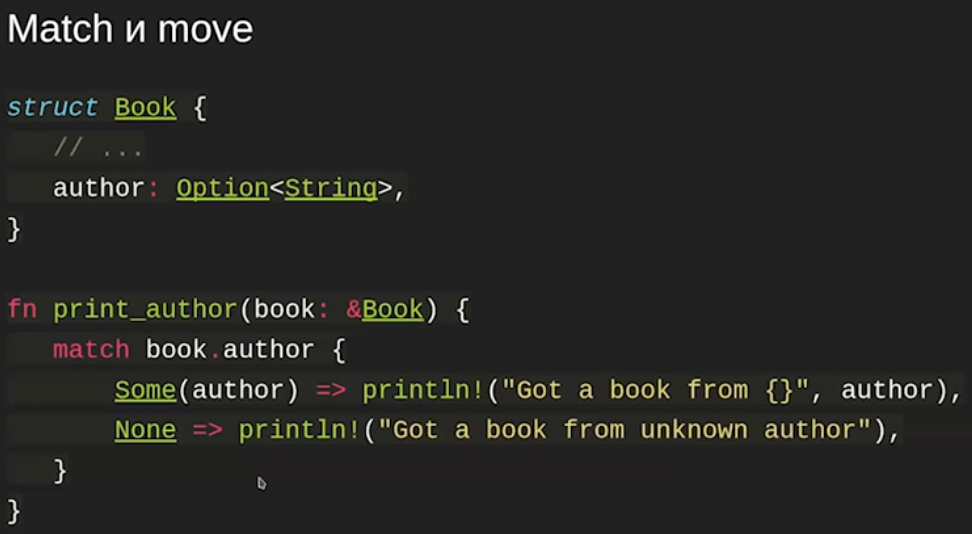

ссылка константная, но когда мы берем поле через точку то оно по умолчанию мувается 

image::media/move_err.png[]

Решение 1

image::media/resolve.png[]

Тут не Option<String>, а ссылка на него

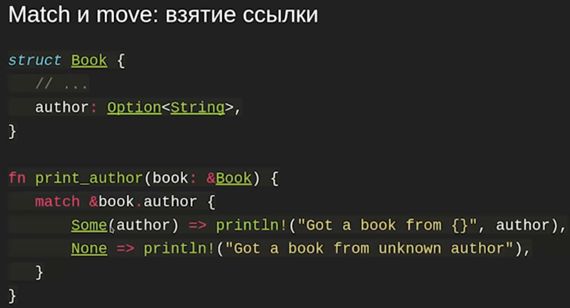

image::media/match3.png[]

Нижний пример не скомпилируется: &book.author -- бросает в match ссылку. А в вариантах оно является чатстью разбора match, поэтому результат эквивалентен тому, что мы просто удалим все амперсанды.

match на целых цифрах 

image::media/match_digits.png[]

image::media/match_str.png[]

String мы матчить не можем (это какой-то не встроенный тип? или в стандартной библиотеке, но не встроен?), но можем строковый слайс (as_str вернет слайс (?))

as_derefs

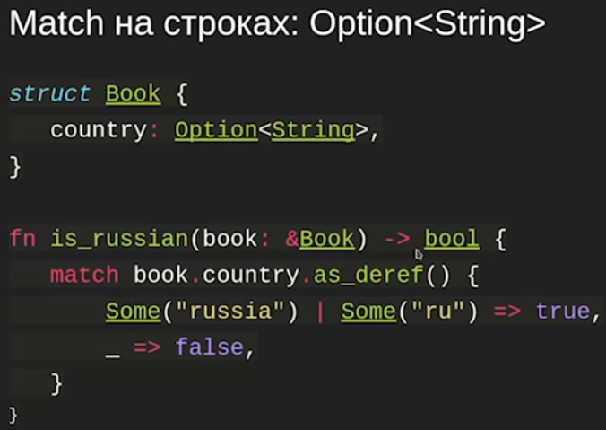

match guards

image::media/guards.png[]

Но мы делаем to_lowercase дважды, что неприятно. Есть решение! 

image::media/matches.png[]

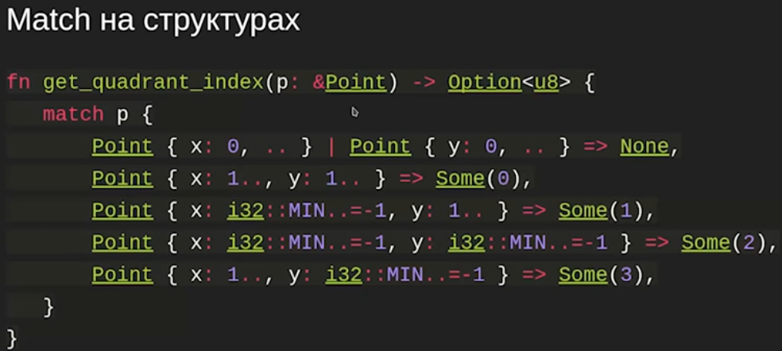

Тут есть всякий еще синтаксис (на окончание -- что-то с собачкой?)

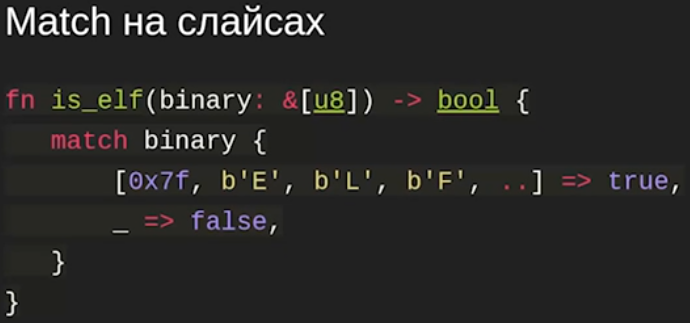

Отвергаемость паттернов (refutability)

Неотвергаемые паттерны

image::media/refutability.png[]

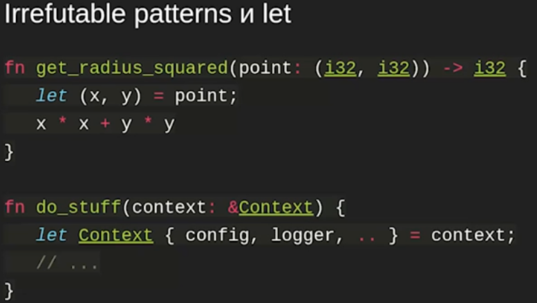

Какого типа config, logger ? Это ссылки,т.к. context передан как ссылка. И это испортит context дальше.

image::media/params.png[]

image::media/for.png[]

image::media/if_let.png[]

image::media/while_let.png[]

image::media/let_else.png[]

тип ! -- это специальный тип, который показывает, что из процедуры мы никогда корректно не возвращаемся.

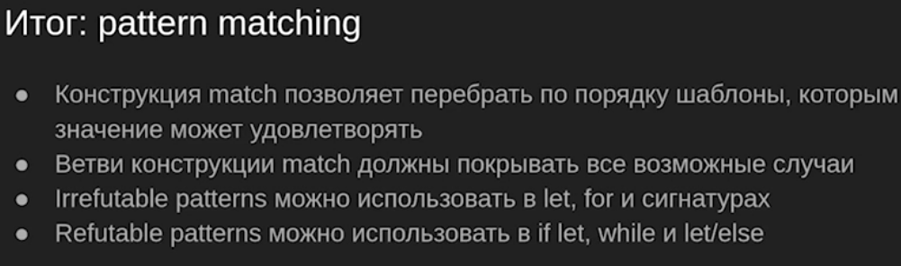

== Traits & Dynamic dispatch
Есть наследование поведения (`trait`), нет наследования данных (делаем композицию)

Вариант 1: полиморфизм через `enum`:

+ничего не выделяем на куче, все лежит здесь 

+знаем все типы

-boilerplate 

-должны знать все типы, реализующие интерфейс, нельзя добавлять пользовательские расширения 

image::media/rule.png[]

=== Trait: НАСЛЕДОВАНИЕ ПОВЕДЕНИЯ

image::media/trait.png[]

=== Dynamic dispatch

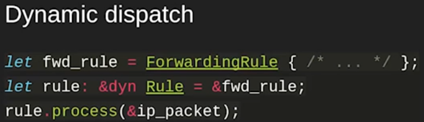

`&dyn Rule` -- просто какая-то имплементация `Rule`, `trait-object`.

Это нужно, чтобы мы различали толстый и тонкий указатели, т.к. трейты имеют еще и ссылку на таблицу виртуальных функций. Виртуальная таблица не зашивается в объект как в C++!

image::media/dyn_why.png[]

Объект `Rule` мы не можем создать! 

image::media/rule1.png[]

не заработает, т.к. непонятно, где `rule` лежат

`Box` -- типа умный указатель. Владеющий указатель над данными, которые лежат на куче и мб динамический тип (т.е. мы не знаем, какой точно тип, но реализует `Trait`). Т.е. при выходе из Scope `Box` убивает свой объект!!!!!

`Box<dyn Rule>` всегда имеет ссылку на деструктор в таблице виртуальных функций, поэтому тут dyn без &

Создаст честный `ForwardingRule`, положит `Box<dyn Rule>` ссылку на него и ссылку на его таблицу виртуальных функций. Поэтому Box -- толстый указатель. 

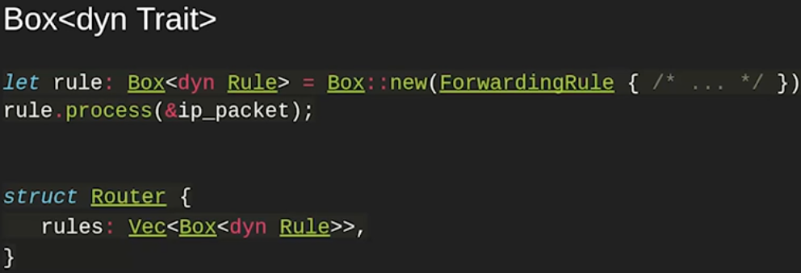

Чем trait от interface отличается? Посмотрим позже.

В `trait` нет данных, только функции.

