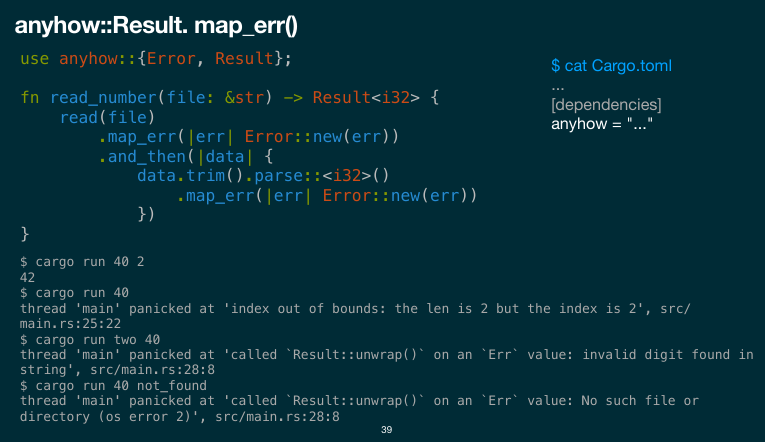
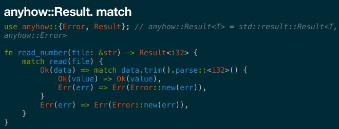

= Обработка ошибок в Rust 

Что подразумеваем под ошибками?

* Ожидаемые крайние случаи. Нет искомого файла, неверный формат ввода, разрыв
соединения, неуспешный HTTP-ответ, ...
*  Ошибки кода. Нарушение инвариантов, UB, неверная логика работы.

Зачем обрабатывать?

* Потому что ошибочные ситуации обязательно возникнут.
* Чтобы предоставить информацию для анализа проблем.
* Чтобы не усугубить ситуацию.

Что мы хотим и можем делать при ошибке?

* Передать информацию об ошибке нашему пользователю.
* Поменять control flow, как правило для раннего выхода.

Жестко не зафиксировано как обрабатывать каждый вид ошибок. Все зависит от намерений.

В Rust ошибки либо исправимые (recoverable), либо
нет.

Исправимые (алгебраические типы):

```rust
pub enum Result<T, E> {
Ok(T),
Err(E),
}
```

Неисправимые: `panic!`, останавливает тред

```
$ cargo run 40
thread 'main' panicked at 'index out of bounds: the len is 2 but the index is 2', src/main.rs:17:57
```

== Стили обработки ошибок

=== Коды ошибок.
* многословно, сложно реализовывать
* простая идея
* errno 
* иногда код ошибки подмешивают в тип (sential)
* разбор ошибок на if'ах

=== Исключения.
Проброс вверх по стеку без необходимости каждого по пути их обрабатывать.

* проще писать код
* лучше производительность для happy way 
* иерархичность исключений


* места возникновения функций неявные -> сложно о них думать 
* явный вызов деструктора для всех объектов вверх по стеку.
* двойное исключение -- сразу смерть программы
* исключения не специфицированы -> не знаем заранее, какие типы исключений могут вылететь и как их обрабатывать.
* исключения дорогие по производительности (ок, если они редкие)

=== Алгебраические типы.

* гарантия обработки всех результатов

* всегда распаковываем -- небольшой оверхед 
* явно пробрасываем ошибки

== Как хорошо обрабатывать ошибки 

* мало кода
* в случае ошибки -- богатый контекст и явный проброс (в Rust -- со знаком вопросика)
* смотреть на весь стек ошибок


unwrap и expect извлекают Result, иначе паникуют

unwrap_err -- рассчитывает на ошибку и паникует, если пришел result
 
unwrap_or_else -- lazy exaluation -- передаем туда замыкание, которое лениво вычисляется только если произошла ошибка

backtrace собирается, но вывадится тлько если установлен соответсвующий флаг при сборке  (1 или full)

image::media/backtrace.png[]


== Anyhow:: Result 
позволяет высокоуровнего работать с backtrace 




Чтобы использовать ? возможно придется реализовать конвертацию (from, into) для типа ошибки.

Чтобы использовать его в main поменяем сигнатуру `fn main() -> Result<()> {`



 Это синтаксический сахар, который эквивалентен match:
• В случае успеха распаковывает Result.
• В случае ошибки выполняет ранний выход из функции.
• Приводит тип ошибки к типу, который должна вернуть
функция. То есть фактически делает .into(). Для этого нужна
соответствующая имплементация трейта std::convert::From.
match result {
Ok(data) => data,
Err(err) => return Err(err.into()),
}
• В старом коде для той же цели использовался макрос try!().

=== Обработка ошибок разного типа
 Преобразование одного типа в другой:

pub fn map_err<F, O>(self, op: O) -> Result<T, F>
where
O: FnOnce(E) -> F;

В stable есть крейт https://docs.rs/anyhow/, поддерживающий цепочки
ошибок с контекстами. Это более высокоуровневая информация, чем
бектрейсы.

=== anyhow! 
создает inplace ошибку с заданным format. удобен, чтобы быстро создать где-то ошибочку. Неудобен, если хотим ориентироваться при обработке на типы ошибок.

=== anyhow::context 


source -- исходная ошибка,которая выше по стеку (нужно сохранять)

provide -- позволяет работать с backtrace в пользовательской ошибке 

пользовательские ошибки лучше кидать через result, их вывод дружелюбнее, чем у panic!