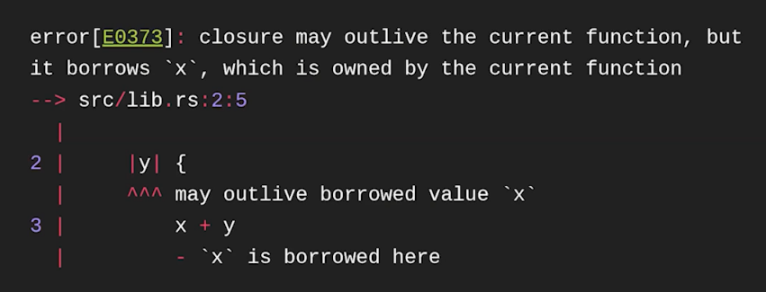

# Современное системное программирование на Rust
## Системное программирование 
Создание приложений, которые взаимодействуют не напрямую с пользователем, а друг с другом. Примеры:
* ОС
* СУБД
* Среды исполнения (JVM, CLR -- dotnet runtime)
* Браузеры (среда исполнения для веб-приложений, управление безопасностью и всякое такое)
## Языки системного программирования 
* Производительность -- важные задачи
* Безопасность -- высокие привилегии

|язык|плюсы |минусы|
|--|--|--|
|`С`|скорость, низкоуровневый контроль|ручное управление памятью, не эргономичен, UB*|

UB -- undefined behavior -- если сделали недопустимую для языка вещь, то поведение не определено. 

Один из классов UB -- memory unsafety. У кода неограниченный доступ к памяти всего процесса. Нужно внимательно читать код любой функции!

Когда прочитаем что-то больше, чем размер line -- он выделит новый участок памяти а старый освободит, т.к. мы передаем как аргумент указатель на указатель.

memcpy
```c
void *memcpy(void *dest, const void *src, size_t n);
```
Контракт: учатски памяти src и dest не должны пересекаться. До 2010 копировала слева направо. Для интела решили копировать справа налево. 


|язык|+|-|
|--|--|--|
|`С++`|RAII, эргономичнее (шаблоны, итераторы, лямбды, ООП)|memory unsafety, UB|
| Языки с рантаймом: `Java`, `C#`, `Go`, `Python` | * нет UB, * портируемость, * высокая скорость разработки | * нет низкоуровневого контроля, * менее предсказуемая производительность, * плохое interoperability (тяжело использовать в другом языке)
## Выбор между языками

# Почему Rust -- системный язык
## Производительность
* нет аллокаций. приходит толстый указатель (данные + длинна)
* нет вызовов функций (ну только немного для `for`)


то же, но zero-cost abstraction


zero-cost abstraction: data layout


при компиляции данные лежат плоско, несмотря на ссылки

!

## Безопасность
пока нет слова `unsafe` -- `UB` не будет. Но `unsafe` есть почти везде (даже в `push` вектора)


## safe abstraction
безопасная абстракция -- содержит в себе unsafe код, но используя ее нельзя получить UB
### vec


### Замыкаине 
здесь х захватят по ссылке



### join
два замыкания запускает параллельно в разных потоках
если писать в одну область памяти -- UB


обнаруживаем ошибку


# Почему абстракции безопасны? Методы верификации
* RustBelt -- формальная модель языка. Доказал safe Rust


Баг в раст - предоставление АПИ, с помощью которого можно получить UB, не написав unsafe. 

БЕЗОПАСНОСТЬ ГАРАНТИРУЕТСЯ НА УРОВНЕ ТИПА 

* +быстр как С/С++
* +доказуемо безопасен, чем С/С++
* +интегрируется с С и неплохо с С++


-------------------
1. Что такое  safe abstraction? Почему они безопасны?
2. Как лежат данные при компиляции?
3. Что такое замыкание?
4. Что такое join?
5. Какие достоинства и недостатки у С и С++?
6. Какие достоинства и недостатки у языков с Runtime?
7. В чем заключается производительность Rust?


