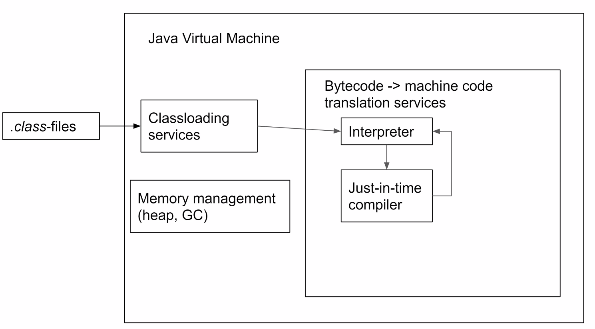
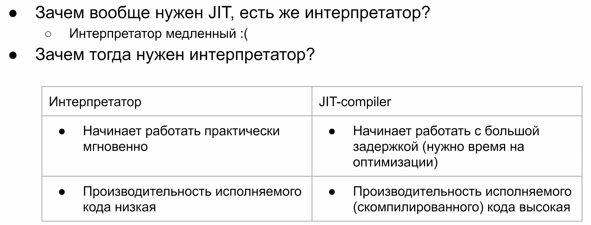
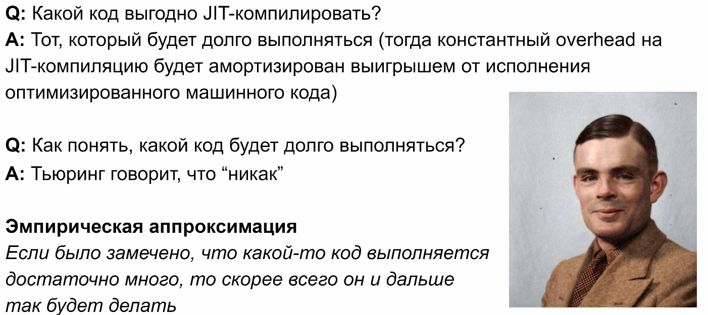
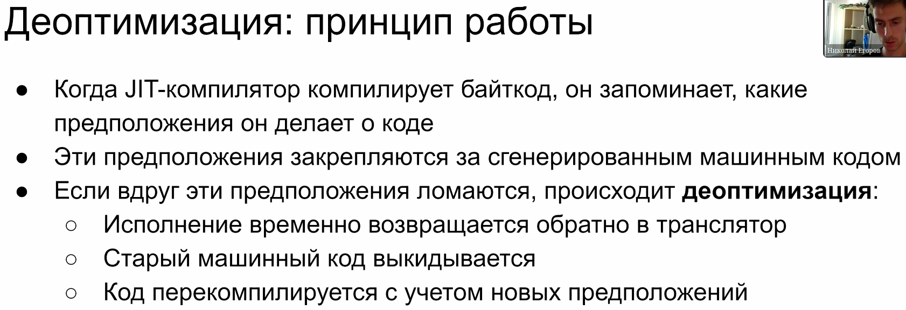
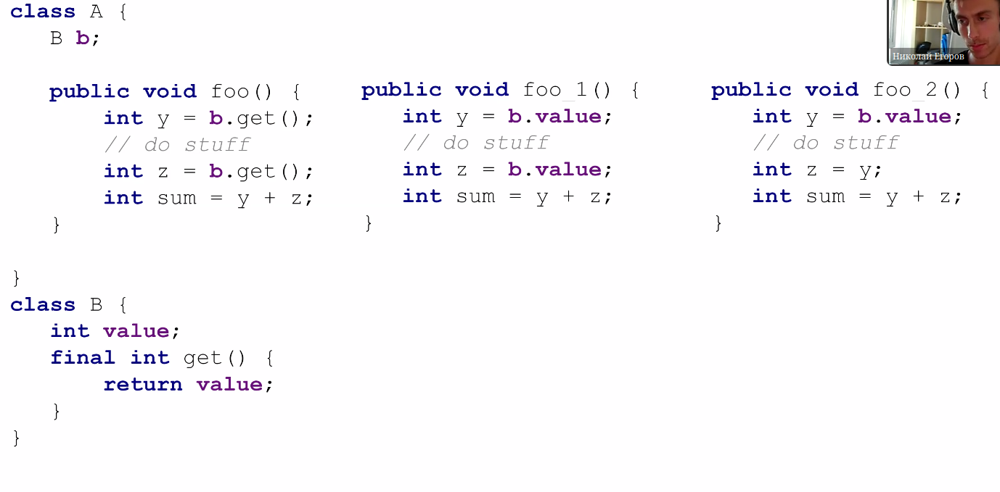

= JVM 

* *Загрузка классов*: верификация (проверка что есть секции с константами/декларациями, определяем FQN (fFully qualified name) - класс + пакет)
* Интерпретатор: интерпретирует, порождая код целевой платформы
** Медленный (кушает много процессорного времени) 
** Мир Java динамичный, перекомпилировать после каждого изменения -- дорого
* Memory management (heap, GC -- Garbage collector)

== JIT-компиляция 

Единица трансляции -- метод JVM (байт код! метод, который мапится на исходный файл и проч.). Компиляция запускается параллельно (конкурентно) с процессом интерпретации.

image::media/jit_how.png[]

== JIT -> Interpreter
Иногда предположения, оптимизирующие jit не выполняются. Тогда честно интерпретируем код.

image::media/optimized.png[]

Такое может произойти, если мы сделали inline оптимизацию static final поля. А кто-то его поменял через рефлексию. Или динамически выгрузил файл и загрузил другую реализацию.

image::media/reflection.png[]

image::media/how_fix.png[]

В скомпилированном коде всегда есть проверка, верна ли *гипотеза*, в соответствии с которой мы делали нашу оптимизацию. Гипотеза мб любая, не только с завязкой на runtime. 

Может даже основываться на работе jvm (алгоритм работы GC в зависимости от размера кучи, распределение потоков/ресурсов). Гипотеза может быть вообще любая, влияет все.

== Оптимизации

1. метод final -> можно его заинлайнить (справа)
2. если stuff не меняет y, то можно и не вводить z

== Как можно сломать компилятор Java (и Kotlin)? 
Чем плоха обработка исключений? Как работает таблица исключений?

Обработка исключений работает так, что блок finally вставляется в каждую из веток catch 

image::media/finally.png[]

А если идти обработчиком вглубь, то размер кода растет экспоненциально (или нет) (bar вызывается дважды в каждом фложенном finally!!!). 

image::media/finally_exp.png[]

Работа с исключением работает в интерпретаторе (мы прекращаем исполнение компилированного кода и возвращаемся в интерпретацию). Поэтому этот код не получится оптимизировать.

Вопросы:

* А почему всегда копируем finally, а не делаем jump? Есть ли технические причины для этого?
* Сохраняются ли оптимизации между запусками jvm? (нет, для работы с сетью вообще не правда)

* Актуальны ли статистики собранные в одном потоке для другого? (Да, если информация не ответственна за сборы ресурсов и мониторы. Т.е. если не обращений к shared памяти, т.к. фактически это однопоточный код).
* Как растет объем кода в finally (экспоненциально или линейно)? 