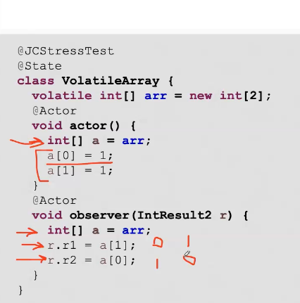
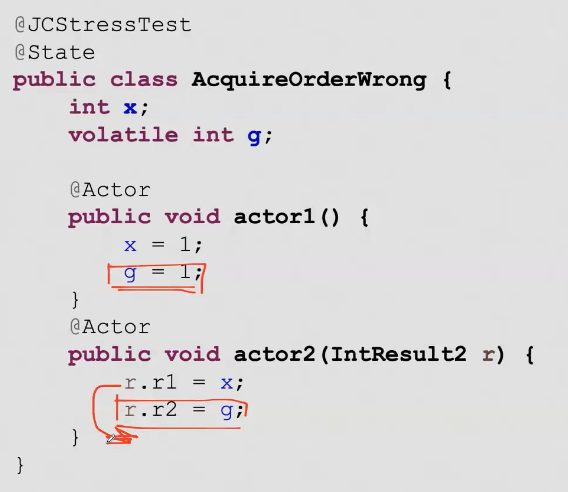
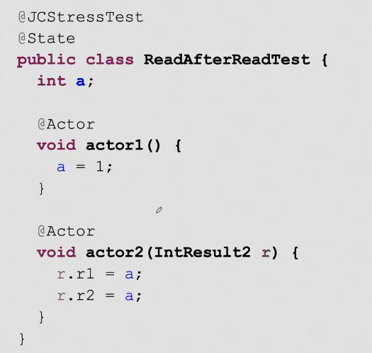
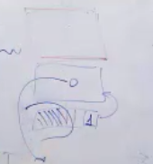
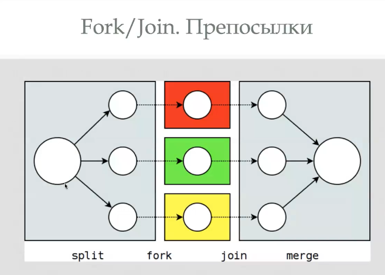
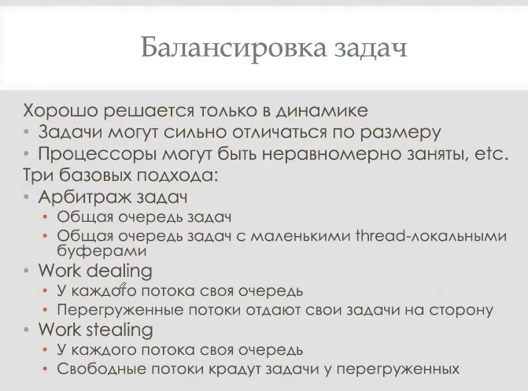
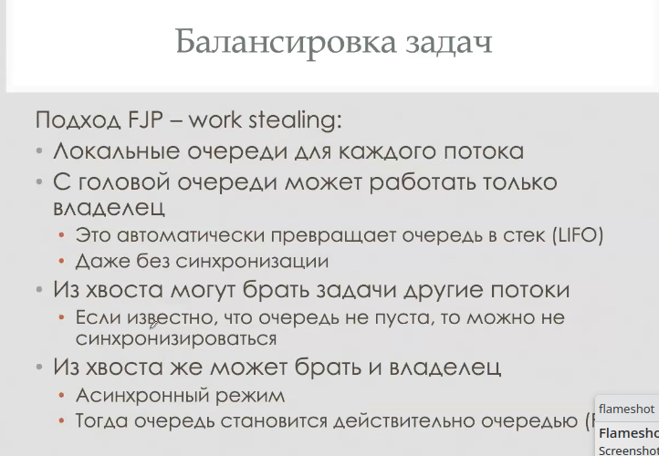

= Полу-синхронизация
Концепция: synchromized можно писать только у set  

Так между потоками появляется hb. Там кеши как-то аккуратно собираются и обновляются. Поэтому даже в get будут более свежие данные.

image::media/2023-11-15.png[]

Создание объекта это три команды

image::media/2023-11-14.png[]

что можно увидеть? 

-1 

0 

42

0 можно увидеть не на всех архитектурах. x86 гарантирует TSO на уровне процессора. А ARM нет.

Total string order пытается гарантировать атомарность работы конструктора. Как это сделатьсредствами Java? сделать конструктор критической секцией.

**volatile** поможет? Нет, т.к. в вызывающем коде мы только читаем и сохранять до него код бесмысленно.

 

Можно получить любые комбинации, т.к. чтение можно поменять местами 

1. Аллокация  памяти 
2. Вызов конструктора на ссылке 
3. Запись ссылки в переменную (это можно вернуть до вызове конструктора и по ссылке будет лежать 0)

image:2023-11-15T11-20-45-087Z.png[] 

В текущем коже может вылезти 0, но если в первом акторе сохранять временную переменную, а потом заносить в list, то все до нее будет hb. Во втором акторе первым происходит чтение и мы ничего выше него вынетси не можем.

В этом примере тоже бывает перестановка 

 

Тут бывает 1,0!!!! Никто не мешает переставлять чтение.

 

В памяти а = 0, в кеше 1, но кеш уже забился и еще не сбросился в память

 

Тут такой же пример: первый раз читаем из начала кеша и ссылка не 0, а потом кеш уезжает. Получаем NPE 

ПРАВИЛО

читаем из общей памяти только 1 раз. В примерах выше делают так же (1 раз читают list и массив)

Еще и final! При чтении не нужны блокировки, в конструкторе есть свой hb.

image:2023-11-15T11-29-34-740Z.png[] 

Можно сделать sharedRef volatile, но это ограничивает компилятор в reordering и снижает производительность.

== хитрый TSO
В конструкторе 4 поля присваиваются одному числу. Второй складывает поля.

TSO здесь не работает! Он не спасает на больших конструкторах и возможно любое значение 0, 1, 2, 3, 4.

image:2023-11-15T11-35-58-340Z.png[] 

Если сделать o volatile, то все починится.

оверхед от volatile ниже, чем от sync, если делать адекватное количество записи/чтение.

== Fork/Join
Обобщенный map/reduce

Разделяй и влавствуй. Для эффективности подзадачи

* независимы 
* одинаковые по типу 

image:2023-11-15T11-38-13-086Z.png[] 

split -- делим массив на подмассивы 

fork -- каждый сортируем отдельно. Создаем отдельный дочерний поток 

join -- дожидаемся дочерних потоков

merge -- сливаем результаты 

 

`-` дофигища потоков, страдаем от переключения контекста 

`-` много потоков, которые просто ждут своих детей 

Решение: 

image::2023-11-15T11-42-29-435Z.png[] 

ожидающий поток тоже выполняет задачи. Когда заканчивает либо собирает детей, либо берет новую задачу 

image:2023-11-15T11-42-48-629Z.png[] 

image::2023-11-15T11-43-09-935Z.png[] 

 

=== Нюансы

 

Как задачи попадают в пул к соседним потокам? 

* Арбитраж -- общая очередь задач. Это общий ресурс, он постоянно в блокировке кем-то. Чтобы это решить у каждого потока заводят еще маленькую очередь. Непонятно, как размер очереди регулировать, поэтому от этого подхода отказались 

* deal -- если у потока слишком много зада -- он их раздает другим потокам.

`-` - кто занимается раздачей? тот кто и так занят. не понятно, как балансировать

* stealing -- если потоку нечего делать -- они воруют это у занятых потоков.

 

С головой очереди работает только владелец, крадут из хвоста (там задачи больше).

Когда в очереди мало (это константа корелирует с количеством потоков) объектов -- хозяин берет из хвоста, чтобы наплодить больше одинаковых задач

=== новые задачи
как засовывать новые задачи? делают отдельно очередь новых задач...

image:2023-11-15T12-25-32-309Z.png[] 

image:2023-11-15T12-25-55-309Z.png[] 