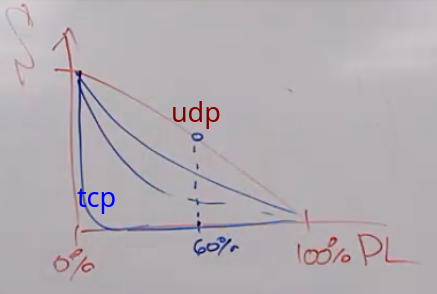

= Сеть 3 (29 ноября 2023)

==  Динамическая маршрутизация 
Цель: динамическое построение и поддержание таблицы маршрутизации.

Протоколы: OSPF, RIP

Де факто сеть -- не дерево, а граф. Путей может быть несколько. Нужны протоколы, по которым таблицы маршрутизаций будут корректно настраиваться без циклов.

=== Как настроить?
Вход: n связанных маршрутизаторов. У каких-то есть устройства, у каких-то выход в интернет.

image::media/2023-12-19-15-50-10.png[]

Это долгий процесс, длительность зависит от размера сети.

Каждые t времени кидает всем пакет со своей информацией (о своих соседях и т.д.). 
Запоминаем информацию о других устройствах в сети. И какие-то метрики о них.

1. Выбираем самый мощный маршрутизатор в сети (как -- зависит от протокола, пропускной способности, фирмы и т.д.)
2. Строим остовное дерево. Граф должен быть взвешенный. Веса -- это метрики.
3. Если мышь перегрызла провод или нарушилась какая-то метрика -- все по новой.

Живем так до тех пор, пока какой--то маршрутизатор не вырубит из сети или мышь не перегрызет кабель.

== ICMP  
Вспомним уровни: 

1. APP (приложения)
2. Transport : TCP/UDP (транспортный)
3. Network: ICMP(выше, чем ip!!), IP (сетевой)
4. Link (физический)

ICMP -- internet control message protocol

Возвращает сообщения об ошибке 

=== Структура ip сообщений 
Заголовок ip пакета описывается картинкой ниже

image::media/2023-11-29-17-13-52.png[]

* версия: 4 или 6
* размер пакета 
** не фиксирвоанный (данные могут быть переменного размера). 
** На каждом уровне есть MTU -- максимальный  размер, который можно передавать. То что сверху -- отбрасывается или разделяется. 
** Настраивается в рамках ОС.
** MTU может быть динамическим.
** На сетевом уровне 64 кБайт, фактически -- 1. Зачем разделять? Чем длиннее пакет -- тем выше вероятность ошибок. На уровне ip это несколько килобайт (обычно 1).

* id -- номер пакета по порядку. Зачем? 
** не путать 
** собирать обратно в нужном порядке 

* *id протокола*, которым будет обработано сообщение (тут храним icmp!! И обрабатывается на том же уровне. Содержание -- пакет, который не смогли доставить)

* ttl < 255 
** каждый раз, когда пакет проходит через маршрутизатор -- из него вычитается 1. 
** Зачем? Когда 0 -- можно дропнуть пакет.
** Можно следить за нами: если подключить пк к вайфаю телефона -- определяют это так.
** Флаги (3 бита) -- помогают маршрутизатору решать, как отправлять пакеты. Теперь не используются.
** Контрольная сумма ЗАГОЛОВКА -- у данных своя где-то внутри
** *Смещение* относительно начала сообщение, если оно было разбито на несколько маленьких.
** Можно делать тулзы 
***  *traceroute*
 Отправим пакет с ttl 1. Он дропнется на маршрутизаторе, но мы получим icmp. Из него мы может получить ip роутера, который стоит на расстоянии 1. Так можно проследить всю цепочку. Эта команда так делает
*** *tracert* 
 просит каждый маршрутизатор, через который проходит пакет вложить в него информацию про свой ip. 

image::media/2023-12-19-16-05-57.png[]

В ip пакете написан id протокола и мы ищем приложение, которое его обработает (tcp/udp/icpm).

ICMP внутри пакета ip!!! У него нет порта. Оно обрабатывается на сетевом же уровне.
ping -- это тоже icpm пакет

== TCP/UDP
UDP -- это почта России. Нужны охраннику парковки. Как правило, больше 1 кб не отправляют.
[]
TCP -- когда общаемся через нее устанавливаем соединение. Передаем дополнительно метаинформацию про утерянные пакеты, желаемую скорость и т.д.

Нужны чтобы отправлять много данных: после обрезкой MTU легко собрать в нужном порядке.

=== udp
Используется для потоковой передачи данных.

Когда данные приходят на порт -- мы складываем их в некоторый буфер, ассоциированный с ним. Если он переполнен, то при попытке дослать новых данных будет отпарвлен icmp пакет с сообщением "не смохла"

=== tcp 
Используется для передачи больших проектов (высока вероятность, что они будут доставлены).

при переполнении происходит хендшейк с одним портом и выделяется новый рандомный порт, с которого и происходит взаимодействие с клиентом. Но можно похакать систему, чтобы отвечать клиентам с одного порта. Но мы так делать не будем.

pl -package loss -- процент потерянных пакетов 

s -- скорость передачи данных

== VLAN/VPN
VPN -- притворяемся, что сидим в другом месте 

VLAN -- virtual lan: отделяем красных бухгалтеров от голубых программистов.

image::media/2023-12-19-16-23-15.png[]