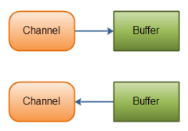
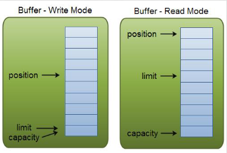
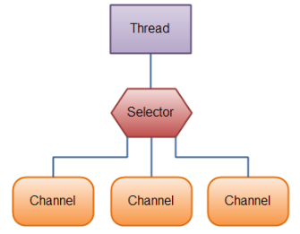

= NIO  
Все объекты создаются через статические методы.

== Channels 
В ОС IOStream' ы. В NIO каналы. Их отличия от стримов:

* двунаправленные: можно и читать, и писать 
* могут быть связаны не с байтовыми сущностями, а например с БД или сетевыми вещами 
* Массивы
** IOStream взаимодействуют с массивом байт. Если массив большой, то их нужно отправлять с offset'ом (помнить, какую часть массива отправили на предыдущих итерациях). 
** Каналы  всегда читают в буфер и пишут из буфера -- оберткой над массивом, блок памяти.
* Бывают блокирующие/неблокирующие, синхронные/асинхронные.



Основные реализации каналов в NIO:
* FileChannel -- читает данные из файлов и в файлы
* DatagramChannel -- передача данных по сети (UDP)
* SocketChannel -- передача данных по сети (TCP)
* ServerSocketChannel -- канал для приема входящих TCP соединений. На каждое новое соединение будет создан SocketChannel для общения с клиентом.

== Буфер 
Массив данных определенного типа (Byte, Char, float ...)

```java
ByteBuffer buf = ByteBuffer.allocate(48);
```

Имеет поля: 

* `capacity` -- длина массива.
* `position` -- текущая позиция в буфере (куда начнем записывать\где читать).
* `limit` -- куда максимально может дойти position



Есть два режима write (запись в буфер, чтение из потока) и read (чтение из буфера)

`flip` -- переводит режим из write в read 

`clear` -- выкидывает все что было и переводит в режим write 

`compact` -- выкидывает уже прочитанное (то что до position) и мы дописываем в конец недочитанного. Выполняется дольше, т.к. переносит данные.

```java
int bytesRead = inChannel.read(buf); //read into buffer.
```

`read` -- ДОПИСЫВАЕТ в конец буфера (т.е. ниже position). ЧИТАЕТ из канала в буфер. Возвращает количество прочитанных сообщений или -1 при ошибке или конце файла. Если буфер ассоциирован с сокетом, и в очереди два пакета, то сперва сюда считается конец старого сообщения, а потом новое с начала.

```java
buf.put(127)
```

`put` -- положить что-то в буфер ручками

`write` -- читаем из буфера, ПИШЕМ в канал.

```java 
//read from buffer into channel.
int bytesWritten = inChannel.write(buf);
```
=== Пример
```java
RandomAccessFile aFile = new RandomAccessFile("data/nio-data.txt", "rw");
FileChannel inChannel = aFile.getChannel();

ByteBuffer buf = ByteBuffer.allocate(48);

int bytesRead = inChannel.read(buf);

//до конца файла 
while (bytesRead != -1) {
    System.out.println("Read " + bytesRead);
    buf.flip();
    while(buf.hasRemaining()){
    System.out.print((char) buf.get());
}
buf.clear();
bytesRead = inChannel.read(buf);
}
aFile.close();
```
=== Mark 
С помощью данных операций можно пометить место в
буфере и потом к нему вернуться.

```java
buffer.mark();
…
//call buffer.get() a couple of times, e.g. during parsing.
…
buffer.reset(); //set position back to mark.
```

=== Массив буферов: Scatter / Gather
набор буферов, в которые читают/пишут по очереди 

* Scattering чтение из канала позволяет производить чтение в несколько буферов (сначала заполняем первый, потом второй и т.д.)

image::media/2023-12-19-18-35-13.png[]

* Gathering запись производить запись последовательно из нескольких буферов в канал

image::media/2023-12-19-18-35-30.png[]

Данные технологии очень полезны, если вам приходится работать с несколькими частями передаваемого сообщения (например, заголовок и тело сообщения).

Однако, для такого чтения требуется, чтобы части имели наперед заданный размер

== Selector 
Вспомним узкое место классической архитектуры. Хотелось бы потоки для работы с клиентами схлопнуть до двух: один бы принимал данные для всех клиентов, а другой отправлял. 

В блокирующей архитектуре это невозможно. Хотелось бы читать/отправлять данные только тем клиентам, которые "готовы к интересным (интересующим) действиям". 

На селектор можно подписать (метод register) определенное количество каналов и он сможет ответить какие клиенты готовы к взаимодействию.



=== Работа с selector 
Чтобы все это работало канал нужно переключить в неблокирующий режим 

`cannel.configureBlocking(false)`

Потому что если селектор работает в блокирующем режиме, то при проверке канала он блокируется.

```java 
// Создание селектора:
Selector selector = Selector.open();

// Регистрация каналов в селекторе
channel.configureBlocking(false);
SelectionKey key = channel.register(selector, SelectionKey.OP_READ)
```

У канала может быть сколько угодно селекторов.

register возвращает SelectionKey, который хранит: 

* The interest set -- набор свойств, которыми мы интересуемся.
** int interestSet = selectionKey.interestOps();
** boolean isInterestedInAccept = interestSet & SelectionKey.OP_ACCEPT;
* The ready set (подмножество interest, к выполнению которых готов канал)
* The Channel
* The Selector
* An attached object (optional)

Команда select -- выдает подписчиков select, которые готовы к интересным действиям. Она выдает не набор каналов, а число -- КО.

select -- блокирующая. ждет, пока хоть кто-то будет готов.

selectNow -- неблокирующая, ждет не больше чем timeOut

selectNow() -- неблокирующая, выдает результат сразу. Возможно пустой

 *блокирующая* -- не можем сделать -- блокируемся, пока не справимся.

 *неблокирующая* -- возвращает результат через НЕПРОДОЛЖИТЕЛЬНОЕ ВРЕМЯ (там есть какой-то таймаут, возможно не очень большой).

Все три метода возвращают число каналов готовых к «интересным» действиям.

Точнее сколько каналов стали готовыми, начиная с прошлого вызова методов select!

Т.е. если однажды мы вызвали select и получили 1 (т.е. один канал готов), после чего еще один канал стал готов, то вызвав еще раз select мы снова получим 1, не зависимо от того обработали ли мы первый канал или нет.


=== Пример

```java 
//вернул 5 -- количество НОВЫХ каналов, которые 
//готовы к интересным событиям
val x = selector.select(); 

//сет, куда попадут selection keys 5 готовым каналов
Set<SelectionKey> selectedKeys = selector.selectedKeys();

Iterator<SelectionKey> keyIterator = selectedKeys.iterator();

while(keyIterator.hasNext()) {
    SelectionKey key = keyIterator.next();
    if(key.isAcceptable()) {
    // a connection was accepted by a ServerSocketChannel.
    } else if (key.isConnectable()) {
    // a connection was established with a remote server.
    } else if (key.isReadable()) {
    // a channel is ready for reading
    } else if (key.isWritable()) {
    // a channel is ready for writing
    }
    //если не удалить ключ, то select  
    // будет ждать НОВЫХ
    keyIterator.remove();
}
```

Нашли готовность к `read`. А для какого клиента? Это можно хранить в `attachedObject`.