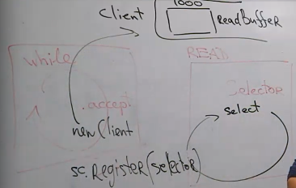
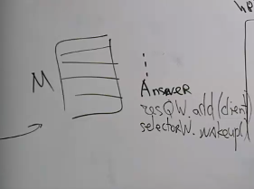

= Неблокирующий сервер

Поговорим о каналах, связанных с сетью

== SocketChannel

SocketChannel -- канал для соединения по TCP. Может быть получен двумя способами:

* Создан самостоятельно и привязан к какому-то серверу
* Получен на сервере при подключении нового клиента

Открытие канала (клиент?)

```java 
SocketChannel socketChannel = SocketChannel.open();
socketChannel.connect(new InetSocketAddress("http://aptu.ru", 80));
```

Закрытие

```java 
socketChannel.close();
```


=== Чтение
```java 
ByteBuffer buf = ByteBuffer.allocate(48);
int bytesRead = socketChannel.read(buf);
```

=== Запись: блокирующий режим
```java 
String newData = "New String to write to file..." + System.currentTimeMillis();
ByteBuffer buf = ByteBuffer.allocate(48);
buf.clear();

//кладем данные в буфер
buf.put(newData.getBytes());
//переводим в режим чтения
buf.flip();

//запись в канал из буфера
while(buf.hasRemaining()) {
    //за 1 операцию может не вывести все
    //если в системном буфере не хватает места
    channel.write(buf);
}
```

=== Неблокирующий режим (непродолжительное время)
```java 
socketChannel.configureBlocking(false);

//тоже неблокирующий 
socketChannel.connect(new InetSocketAddress("http://aptu.ru", 80));

while(! socketChannel.finishConnect() ){
    //wait, or do something else...
}
```

read и write могут завершится, ничего не записав/прочитав 

`write()`

 В неблокирующем режиме метод может закончиться и ничего не записать. Поэтому метод надо вызывать в цикле, пока не кончится буфер.

`read()`

 В этом режиме метод read может не прочитать ничего. Поэтому надо внимательно следить за количеством прочитанных байт. 
 
Когда read не прочитает ничего? Мы же готовы к чтению! Пришедшие данные лежать в kernel space. Мы хотим их использовать в user space. Перенос занимает какое-то время. Read немного подождет, но если операция затянется -- уйдет ни с чем.

== ServerSocketChannel
Принимает соединения и выдает обычный socketChannel для общения с клиентом.

Блокирующий -- обычный accept, возвращает socketChannel

```java
    ServerSocketChannel serverSocketChannel = ServerSocketChannel.open();
    while(true){
    SocketChannel socketChannel =
    serverSocketChannel.accept();
    //do something with socketChannel...
    }
    serverSocketChannel.close();
```

Неблокирующий -- то же самое, но результат accept мб null

```java 
ServerSocketChannel serverSocketChannel = ServerSocketChannel.open();
serverSocketChannel.socket().bind(new InetSocketAddress(9999));
serverSocketChannel.configureBlocking(false)
;
    while(true){
    SocketChannel socketChannel = serverSocketChannel.accept();
    //мб null!!!! так как не блокирующий 
    if(socketChannel != null){
        //do something with socketChannel...
    }
}
```

=== UDP 
То же самое, но каналы называются DatagramChannel

== Клиент-сервер: генерируем картинку
Клиент и сервер могут 

* ничего не знать друг о друге
* написаны на разных ЯП 
* один блокирующий, другой нет 

И это нормально. 

Когда говорим про архитектуру -- почти всегда про сервер, т.к. там узкое место.

Проблемы 

1. Подключение новых клиентов 
2. Чтение данных
3. Обработка запросов 
4. Отправка результатов клиентам 

=== Подключение клиентов (1 поток)
Никогда делайте accept клиентов в неблокирующем режиме!!

В бесконечном цикле блокирующе ждем клиентов и возвращаем SC -- socket channel 

image::media/2023-12-19-19-46-19.png[]

Это отдельный поток, но просыпается очень редко.

=== Чтение (1 поток)
Хотим неблокирующий ввод/вывод. Заводим selector, на которого подписано куча каналов-клиентов. Но только на чтение. 

Какой из select выбрать? Обычный, блокирующий, тупой как грабля, в глобальном цикле.

Получаем список каналов, готовых к чтению. Чтение и запись с селектором блокирующие!! 


Так делать нельзя: 

```java 
while(...){
    read ...
}
```

Потому что мы вручную сделали блокирующее чтение. Селектор нам не нужен. Поэтому нужно быть готовым к тому, что при чтении мы прочитаем лишь часть потоков.

Каждому клиенту ассоциируем буфер на чтение (туда записываем что прочитали с него). 

```java
if(readyMessage(client.readBuffer)){
    //читаем цельное сообщение из буфера
    Message m = ... 
    //возможное начало следующего сообщения 
    //смещаем в начало буфера
    client.readBuffer().compact()
}
```

`readyMessage` -- эту процедуру определяем сами. Например, договариваемся, что первым сообщением передается размер сообщения.

==== Передача клиентов в поток-селектор
Экземпляры клиентов создает первый поток, который делает `accept`.



Команда `register` блокирующая. Она ждет, пока закончится select (который видимо в бесконечном цикле крутится). При этом при старте работы селектор без клиентов уснул на века, а регистрирующий поток уснул в ожидании его.

`selector.wakeup()` -- выводит селектор из команды select. Кто-то делает для решения этой проблемы selectTimeout, но 

** низка вероятность попасть в период пробуждения
** если таймаут маленький, то поток просыпается без дела слишком часто

*Решение*

Потоки не должны решать проблемы друг друга. Поток селектора должен учитывать в своем цикле этап регистарции новых клиентов. А поток-ацептор кладет клиента в очередь потока-селектора и делает wakeup.

image::media/2023-12-19-20-11-41.png[]

=== Выполнение задач 
Добавляем таску клиента в пул.



У клиента очередь из буферов. Каждый из которых содержит возможно несколько решений клиентов.

Если у клиента два ответа сразу -- то будет две регистрации (и одна разрегистрация! он умный?)

Очередь ответов разделяемый ресурс.

=== Selector write 
Канал должен попадать в селектор на выход только когда готов что-то передать клиенту.

image::media/2023-12-19-20-15-57.png[]

Если мы все вывели -- канал нужно *РАЗРЕГИСТРИРОВАТЬ*. Иначе мы всегда будем просыпаться из-за каналов, которые мы уже вывели.

логика write 
```java
sc.write(client.answers.head())
//пытаемся вывести текущий ответ
if(!hasRemaining()){
    //пытаемся взять следующий ответ
    ...pop()
}
if(client.answers.isEmpty){
    //разрегистрируем канал
    selector.cancel(...)
}
```

=== Клиент сломался 
Отсоединился. Тогда операция с каналом бросает IO exception и селектор падает. Поэтому на read и write нужно аккуратно обрабатывать внезапную смерть клиента.
Обычно обрабатываем бизнес-логикой.

=== Проблема самой лучшей блокирующей архитектуры 

Решена

Если клиенты шлют много маленьких сообщений, то все ок.

Ломается, если клиенты отправляют данные не очень часто, но большими потоками. В этом случае блокирующая может быть эффективно.

Получеребрянная пуля, решающая эти проблемы: асинхронный ввод/вывод.

=== Недостатки 
Всё чтение в одном потоке, а значит на одном ядре. Поэтому выделяют несколько селекторов на чтение/запись. 

== Один селектор vs каждый на read/write
Почему второй вариант лучше?

* read-selector просыпается только когда приходят данные, а write-selector достаточно часто
* Если мы совмещаем ввод и вывод, то мы усугубляем проблему с лимитом на io 
* *масштабируемость*
** можно делать несколько селекторов на ввод или вывод
** вычисление можно выносить на другой комп (или кучу других компов)
** в процессе tcp handshake можно ретранслировать клиента подключиться к другому серверу
** можно работать с несколькими клиентами по одному порту (разрешая конфликт по ip)

СЕЛЕКТОР может работать с каналами только в неблокирующем режиме. Иначе сам селектор заблокируется.

