Малая сборка? Большая сборка?

https://opensource.com/article/22/7/garbage-collection-java

https://habr.com/ru/companies/otus/articles/553996/

https://ziginsider.github.io/Garbage_Collector_Java/

image::media/mem.png[]

== Поколения 
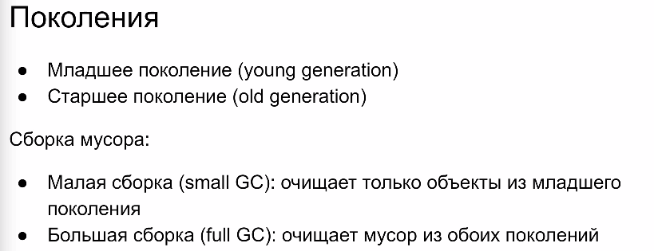

Мертвый объект -- не достижим ни из верхушек стека всех потоков, ни из объетов, на которые есть ссылка из объектов старого поколения 

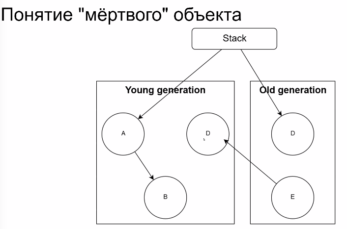

E, C мертвы. С точки зрения маленькой сборки -- C  -- это живой объект, а сточки зрения большой (полной) -- C и E -- мертвые объекты.

На самом деле, важно не кто мертв, а кто жив. Мертвые потом когда-нибудь соберут.

image::media/gc_needs.png[]

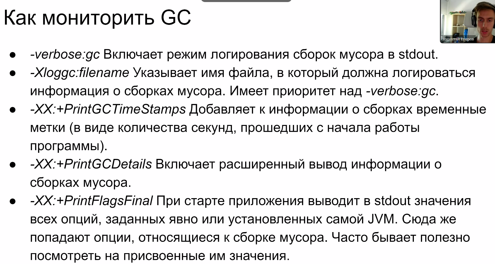

Профилирование 

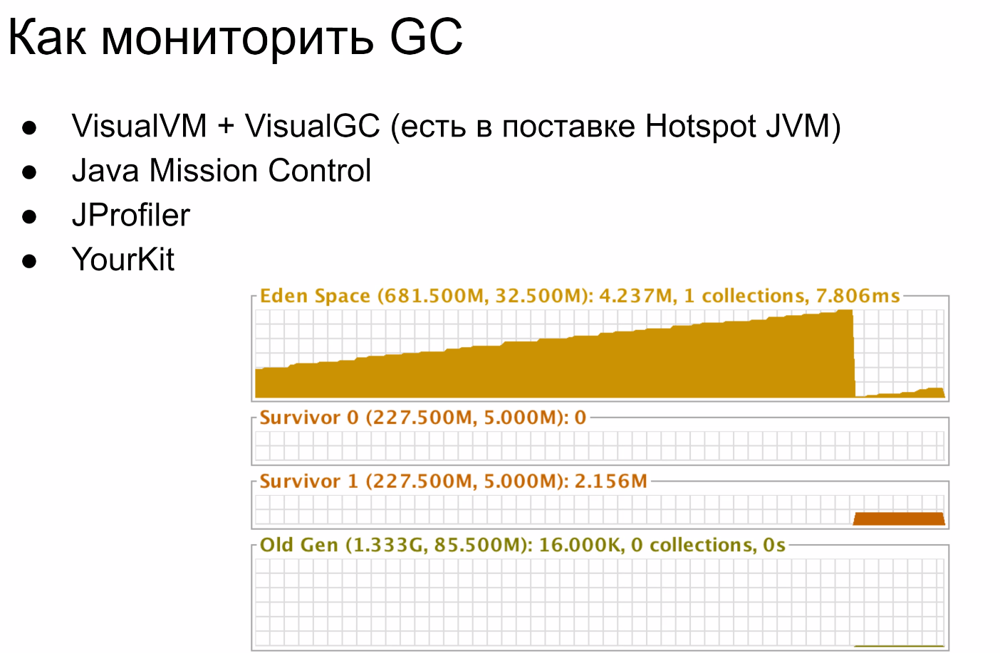

Алгоритмы GC

image::media/stand_gc.png[]

=== Serial GC 
Перемещает объекты физически. Прямо КОПИРУЕТ целиком.

S0, S1 -- "пожило", т.е. пережило сколько-то сборок мусора. Старшее поколение -- предполагаем, что это важные для программы объекты. Выделяем под них большую часть кучи.

image::media/s01.png[]

При заполнении eden останавливаем мир и перемещаем объекты в survival

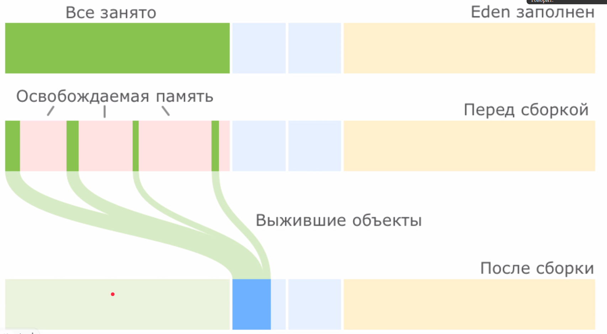

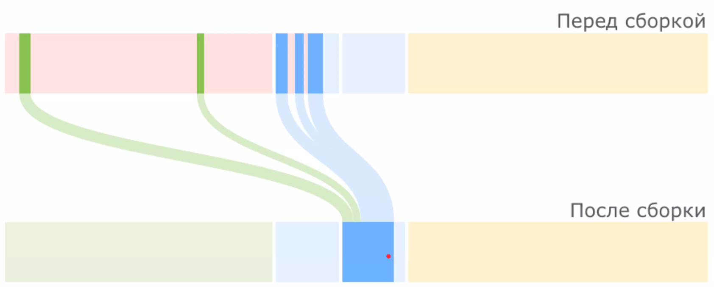

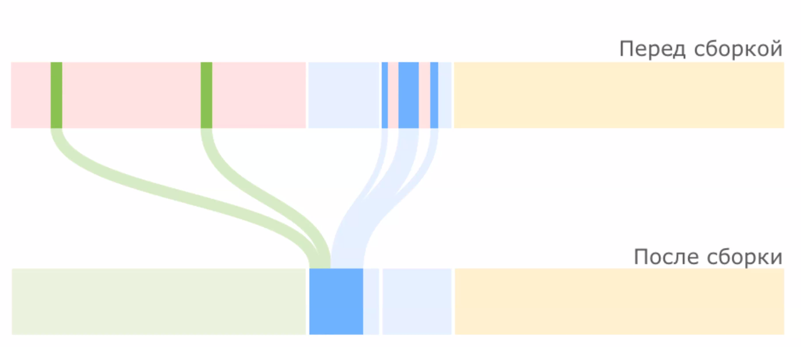

Что  делать, если survival заполниться? Можно оставить в eden. Можно считать старшим поколением.

image::media/ser_05.png[]

Ссылки из старших объектов учитываются в малой сборке, но сами объекты -- нет.

Эвристики 

image::media/accelerator.png[]

image::media/evr_mem.png[]

=== Parallel GC 
Однопоточно собираем мусор, многопоточно перемещаем. Области памяти можем заранее выделить под потоки, чтоб не работать с синхронизацией. Мир все равно стоит, просто перекладываем параллельно.

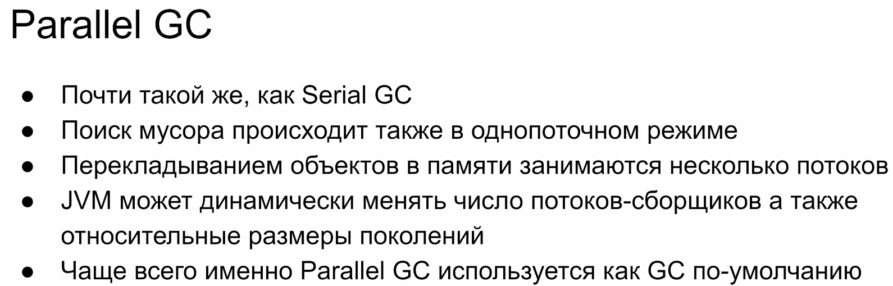

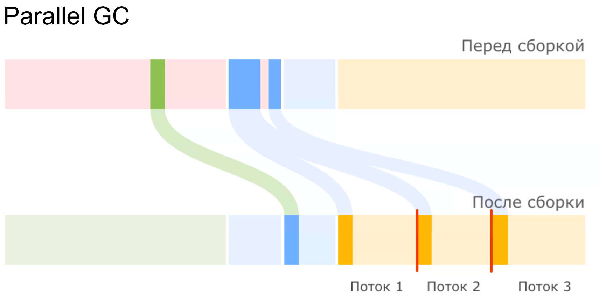

=== CMS (concurent mark sweep)
deprecated :(

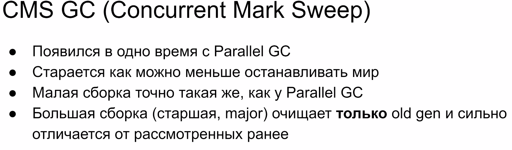

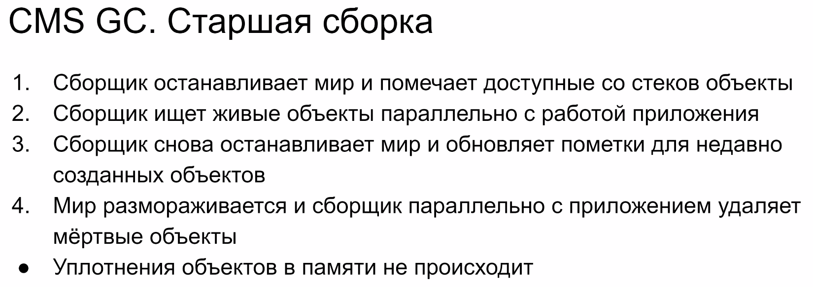

image::media/cms_03.png[]

csm_10

нет явной дефрагментации, поэтому нужен большой размер кучи

=== Garbage First 
Таргетим определенные сектора, а не большие регионы

image::media/idea.png[]

Малая сборка 

image::media/gf_00.png[]

Цикл пометки

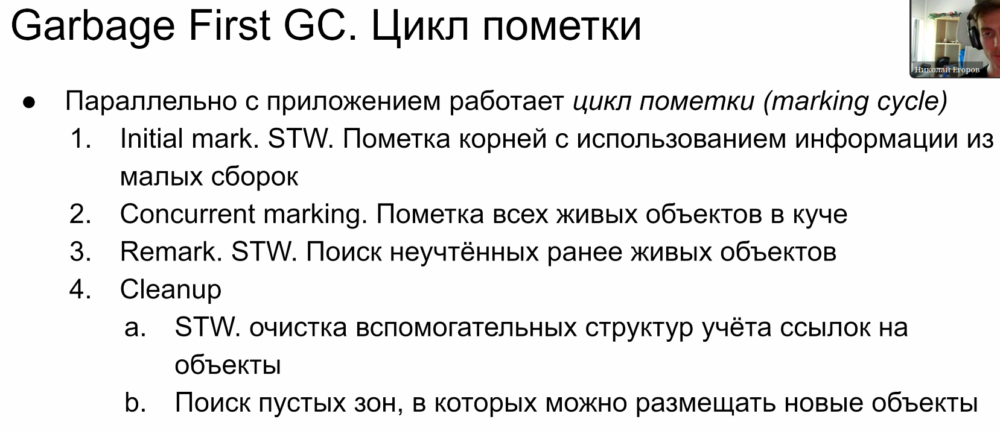

Смешанная сборка

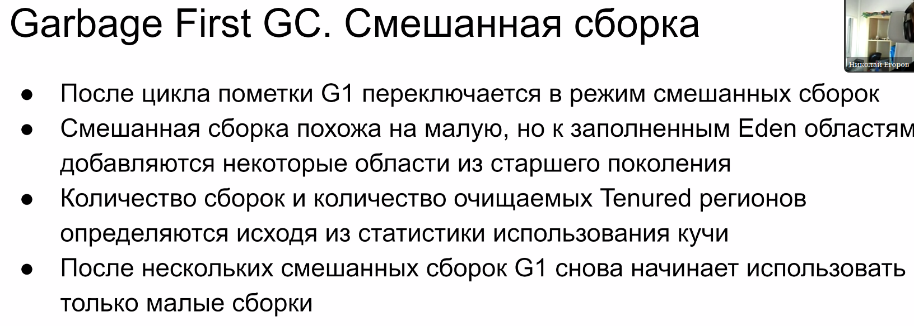

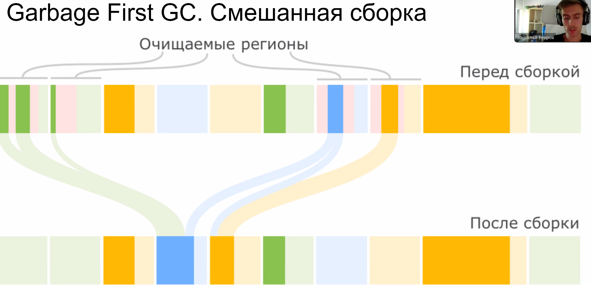

После смешанной сборки опять работаем только с циклами пометки.

Громадные регионы 

громадные объект не трогаем во время малой сборки.

image::media/gf_04.png[]

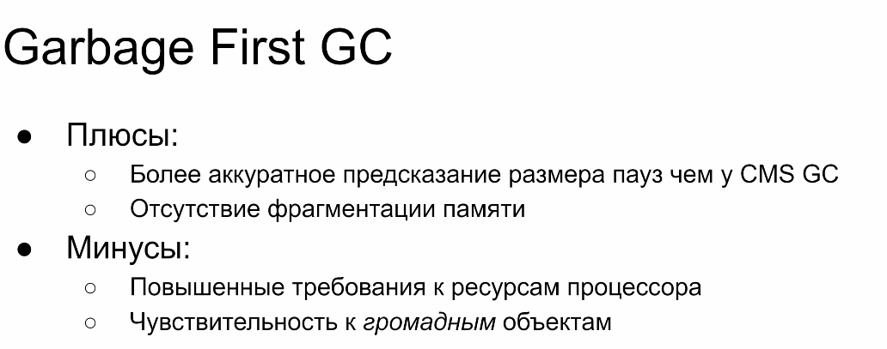

=== Z GC 
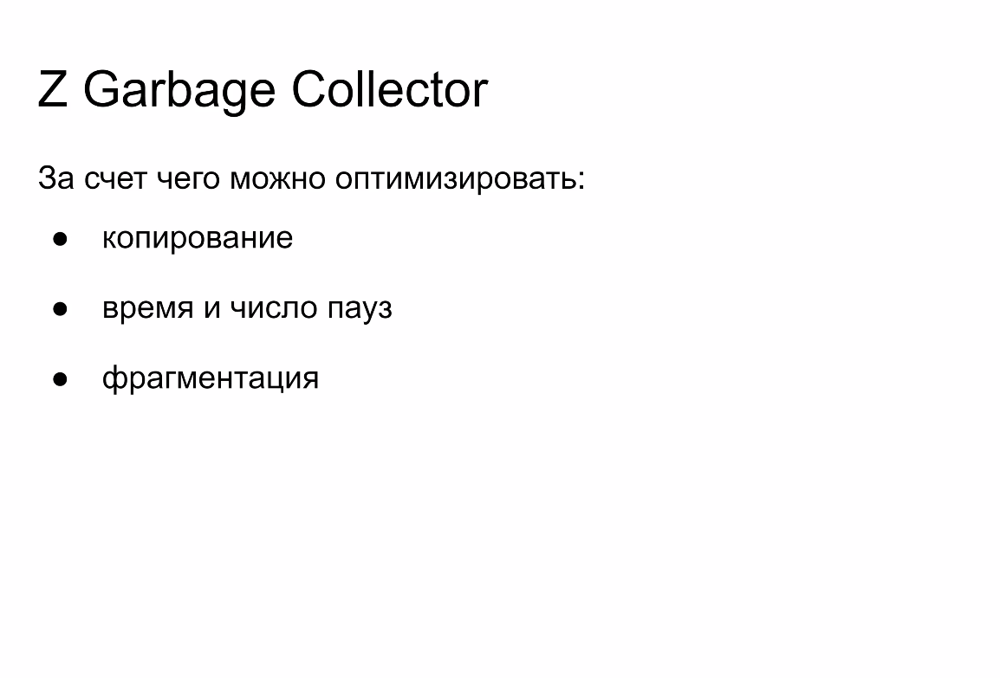

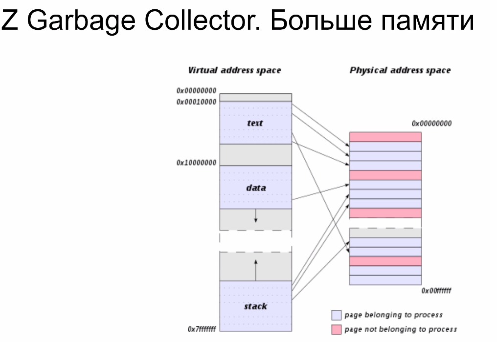

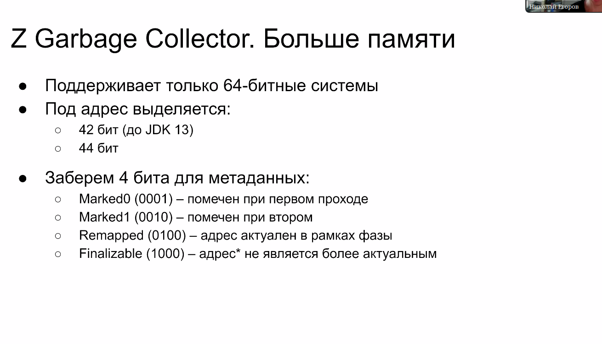

finalize -- доступен только из сборщика, не является больше живым. На один и тот же адрес мб несколько указателей разных типов

image::media/z_04.png[]