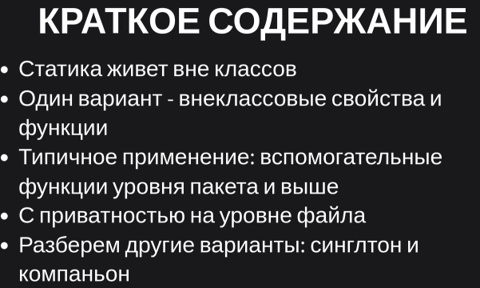
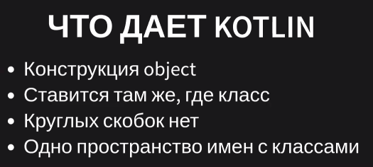
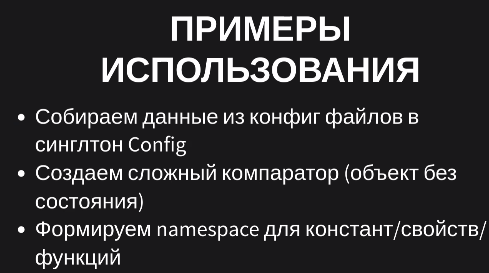
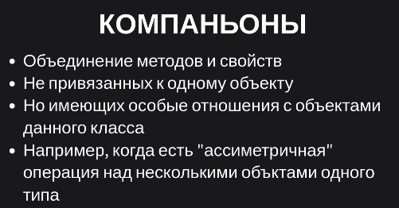
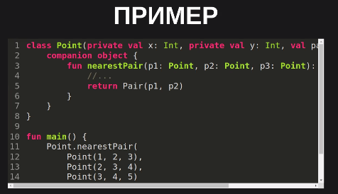
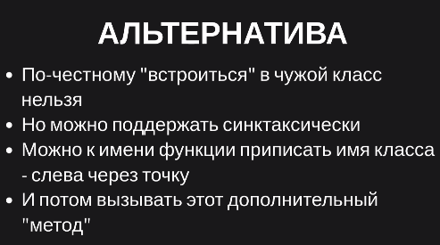
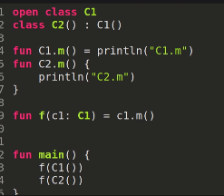
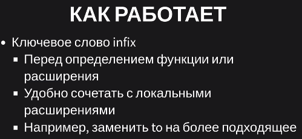
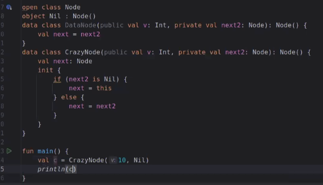

= Статика 
== на уровне файла 


== Синглтон 
Класс у которого только 1 объект. Например, `java.lang.Runtime` 

Почему не сделать все просто статическим? Чтобы не терять возможность наследоваться и переопределяться или создавать композиции.


У Kotlin есть встроенная конструкция для этого -- `object`. Параметров нет (как у любого Singleton). 



image::media/object2.png[]

image::media/object3.png[]

image::media/sample.png[]



== Companion 





Классы в Kotlin не могут иметь статических членов, ключевое слово static не входит в состав языка.

Можно пометить объект в классе ключевым словом companion вместе с другим ключевым словом object и обращаться к методам и свойствам объекта через имя содержащего его класса без явного указания имени объекта.


```kotlin
class Something{
	companion object {
		
		val age = 11
		
		fun bar() {
			println("Companion object called")
		}
	}
}

Something.bar() // Companion object called
println(Something.age)

```

Объект-компаньон имеет доступ ко всем членам класса и подходит для реализации шаблона "Фабрика".

== Extensions 

image::media/ext_motivation.png[]

Хотим (зачем-то) функциональный стиль, чтобы move точки создавал новый экземпляр.

"Добавим" метод в класс



image::media/ext3.png[]

image::media/ext4.png[]

Проблемы: 

* нет настоящего полиморфизма: если расширим предка и потомка методов с одним именем, то будет вызван метод класса, который был указан явно



Примитивные типы тоже можем расширять.

Можно делать инфиксные операторы. Например, `to` у map  

image::media/infix.png[]

Infix как сделать? 



Приоритет ниже сложения, но выше логических операций.

== Practice 

Грязный хак, чтобы посмотреть неинициализированное значение 

image::media/hack.png[]

Создать циклический список без варов 

