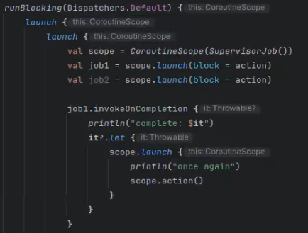
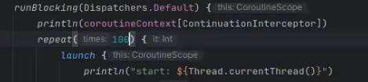
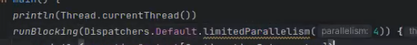
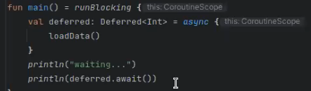

= Корутины

== Недостатки потоков 
* Чистые нити - недостаточно абстрактны
* Слишком дороги, чтобы бесконтрольно выделяться 
* Пулы добавляют сценарии для дедлоков
* Усложняется обработка ошибок
* Нарушается принцип single-responsibility: логика распараллеливания смешивается с бизнес-логикой

== Определение
Корутины - механизм кооперативной многозадачности

Кусок логики,предполагающий ожидание чего-либо

* Таймаута, 
* асинхронного ввода, 
* ответа на запрос, 
* завершения другой корутины

```kotlin 
import kotlinx.coroutines.*

fun main() = 
    //создает контекст (CoroutineScope) -- 
    // запускает первую корутину,
    // ожидает завершения
    runBlocking { 
        //job like a thread
        val job = launch { // launch a new coroutine and continue
            delay(1000L) // non-blocking delay for 1 second (default time unit is ms)
            println("World!") // print after delay
        }
    println("Hello") // main coroutine continues while a previous one is delayed
    //wait for job
    job.join()
    //cancel job if it in suspend mode
    job.cancel()
}
```
=== CoroutineScope 
Набор корутин. Закончит выполнение, когда закончатся все корутины внутри. По умолчанию создающая корутина в том же скопе, что и ее потомки. Но можно указать другой -- супервизор. И тогда упадет только дочерняя корутина, родительская выживет. 

Супервизор -- порождает корутины и отвечает за обработку исключительных ситуаций.

`scope.launch{...}`

* Continuation: один у одной корутины 
* Context (dispatcher как частный случай): один у нескольких корутин 
* Scope: набор корутин, связанных общей исполняемой задачей. Завершается, когда завершены все корутины скопа: один у нескольких корутин

==== Повторный запуск
можно сделать повторный запуск job, если она упала 



== Контекст: Диспетчеризация 
Контекст -- 

Диспетчер -- частный случай контекста, который управляет выполнением корутин на разных нитях. Диспетчера можно задать парамтером в runBlocking 


* по умолчанию -- 1 поток
* Dispatchers.Default -- потоки по количеству процессоров. Можно их ограничить 



* Dispatchers.IO -- растущий пул нитей для операций IO 

`coroutimeContext` -- мапа, к ней можно обратиться в корутинном коде (хранится как синглтон объект). Диспетчер -- частный случай контекста. 


* По ключу `job` хранит информацию о текущей задаче: ее тип.

* По ключу `ContinuationInterceptor` хранит информацио о способе исполнения корутины, диспетчеризации -- это указывается параметром в launch. по умолчанию EMPTY -- наследование способа диспетчеризации

Контекст можно расширять, например, если пишем свой диспетчер.

=== Suspend: Чем отличается delay от thread.sleep?

Часть сигнатуры функции. Такие функции нельзя вызывать в не `suspend` методах или не в`runBlocking`.
```kotlin 
//suspend значит что функция может передать управление как корутина
//то есть отпустим поток 
suspend fun afterCatchDelay(){
    println("before delay")
    delay(1)
    //we have cancelled flag on now, so must not print
    println("after delay")
}
//тут он не нужен -- Sleep держит поток
fun afterCatchSleep(){
    println("before delay")
    Thread.sleep(100)
    //with sleep -- print anyway
    println("after delay")
}
```

Delay -- отпускает поток, снимается с исполнения. Join  тоже suspend (зачем нам просто висеть на потоке и ждать)

Thread.sleep -- держит поток. 

launch -- не suspend функция, так как создание объекта потока не требует какой-то асинхронности


=== Exceptions 
```kotlin 
fun main() = runBlocking {
    val job = launch {
        //fail in same thread
        throw RuntimeException("Job exception")
    }
    
    job.join()
}

// Exception in thread "main" java.lang.RuntimeException: Job exception
```

Можем в основном потоке поймать исключение из порожденной корутины. Но при первом вызове suspend метода основного потока он тоже рухнет с cancellationException. 

```kotlin 
fun main() = runBlocking {
    val job = launch {
        delay(1000L)
        throw RuntimeException("Job exception")
    }
    try {
        delay(2000)
    } catch (t: Throwable) {
        println("GOT: " + t)
        println("IS CANCELLED: " + job.isCancelled)
        println("IS INTERRUPTED: " + Thread.interrupted())

        //out: 
        //GOT: BlockingCoroutine is cancelling
        // IS CANCELLED: true
        // IS INTERRUPTED: false
    }
    afterCatchSleep()
    //afterCatchDelay
}
suspend fun afterCatchDelay(){
    println("before delay")
    delay(1)
    //we have cancelled flag on now, so must not print
    println("after delay")

    // out:
    //
    // before delay
    // Exception in thread "main" java.lang.RuntimeException: Job exception
}
//не suspend!!
fun afterCatchSleep(){
    println("before delay")
    Thread.sleep(100)
    //with sleep -- print anyway
    println("after delay")

    // out:
    //
    // before delay
    // after delay
    // Exception in thread "main" java.lang.RuntimeException: Job exception
}
```

=== Состояния job 

image::media/2023-12-23-23-16-43.png[]

cancelling -- уже вызвали cancel, но еще не перешли в suspend метод

Методы job: 

* complete 

 Completes this job. The result is true if this job was completed as a result of this invocation and false otherwise (if it was already completed). Subsequent invocations of this function have no effect and always produce false.

* cancel 

=== Dispatchers 
При создании runBlocking можно задавать диспетчера (?)


При создании job можно задавать режим запуска. Например, ленивый (не начнет исполняться, пока не вызовем start явно (?))

```kotlin 
fun main() {
        runBlocking(Dispatchers.Default) {
        val job = launch(start=CoroutineStart.LAZY) {
        delay(2000)
    }
    println(job)
    println(job.isActive)
    job.start()
...
```

```kotlin
withContext(context){
    ...
}
```

Запустить корутину внутри другой с заданным контекстом 
=== Потоки-потомки
Через контекст можно смотреть запущенные job'ы. При этом рекурсивные потомки в списке не видны, только прямые.

```kotlin 
coroutineContext.job.children.toList()
```

`cancel` потока рекурсивно вызывается на всех потомках.

=== Continuation: Отложенные вычисление

Каждой корутине соответствует объект, реализующий интерфейс `Continuation`. Этот объект можно получить и "разбудить" через него корутину. Можно получить объект двумя способами 

* `` -- продолжает исполнение штатным образом 
* `` -- бросает исключение

==== Пример 
Хотим привязать continuation'у  обработчик -- Handler 


===== Общий алгоритм 
suspendCoroutine -- делает приготовления, после которых вызывает лямбду и передает туда continuation, соответствующий текущей корутине.

Ей нужно дать лямбду, в которую приедет continuation. Его нужно пристроить таким образом, чтобы в колбеке был вызван какой-то resume.

```kotlin
suspendCoroutine { continuation -> 
            //начинаем выполнять код лямбды линейно
            socket.connect(
                isa, continuation, Handler(this)
            )
            //после того как выполнили suspend эту корутину
            //она снова оживет, когда будет выполнен resume у ее continuation
        }
        ```

В примере мы пользуемся асинхронным сокетом. Его метод connect имеет 3 аргумента 

* адрес сокета 
* attachment -- `The object to attach to the I/O operation; can be null` -- наш Continuation 
* completionHandler --Callback, `The handler for consuming the result` -- CompletionHandler, наш Handler реализует этот интерфейс

=====  Handler

```kotlin 
class Handler<T>(private val socket: CoroutineSocket) 
    : CompletionHandler<T, Continuation<T>> {

        override fun completed(result: T, attachment: Continuation<T>) {
            socket.isConnected = true
            //продолжим выполнение с результатом
            attachment.resume(result)
        }

        override fun failed(exc: Throwable, attachment: Continuation<T>) {
            //продолжим выполнение, упав с исключением"
            attachment.resumeWithException(exc)
        }
    }
```


=== Deferred 

недостатки launch -- не возвращает значения. Для получения результата используют класс deferred (async -- запустить, await -- дождаться результата)

