= Clojure 
Развитие ФП пошло двумя путями 

1. ML-подобные -- строгая статическая типизация
2. Динамическая типизация Lisp/Scheme/Racket/(Scala?)

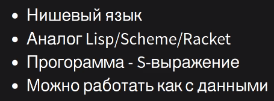

== База 
=== Типизация 
Типизировать вручную нельзя. Только в исключительных случаях 

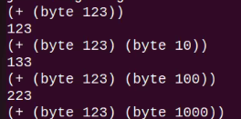

Если будет переполнения -- jvm падает. Чтобы это избежать используют операции со слезкой -- чтобы перейти в bigint (или один из параметров обычной операции сделать bigint)

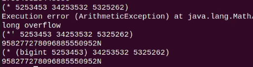

Есть функция type, которая покажет тип в jvm. Целые числа по умолчанию Long.

Есть такие методы 

```
(bigint "12345")
12345N
```

N -- значит bigint

У операторов тоже есть типы 

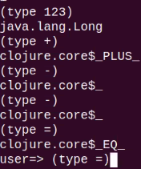

`bases` -- возвращает список базовых классов от типа 

image::media/2023-12-18-15-46-11.png[]

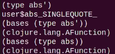

У стандартных штук тоже можно посмтореть всякое 

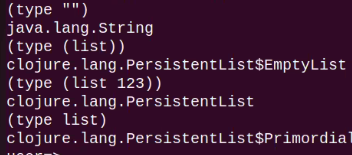

=== Вызов функций
Когда пишем что-то, первое слово интерпретируется как имя функции, последующие -- как аргументы.

```clj
println 2
```

если аргумент в скобках -- то аргументом будет результат интерпретации списка внутри скобок

```clj
println (+ 1 2)
```

==== Как передать список в качестве аргумента? 

* Просто передать: `println (1 2)`

 так нельзя, он считает что 1 -- имя функции 

* Вызвать функцию

```clojure
list: def x 123
println (list 1 2 x) 
out >> 1 2 123
```
* передать код без интерпретации 
```clj
(def x 123)
(println'(1 2 x)) 
out >> 1 2 x
```

взять слезку -- это как взять ссылку. Её потом можно разыменовать с помощью функции `eval`.

=== Имена 
иерархическая система имен, требует соответствие иерархии именам файлов

=== приоритеты 
Не нужны, все определяется скобками 

=== переопределение 
Можно локально в `namespace` переопределить любые операторы

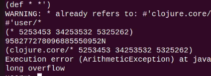

=== Приколы пограничных значений 
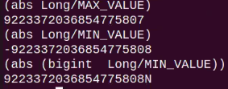

== Макросы 
В языках лиспового типа есть два типа подстановки: функция и макрос. С помощью макроса мы можем конструировать AST макросом, делая прямую подстановку кода.

Параметры для макроса передаются в квадратных скобках (но у if их нет). Значения в скобках не интерпретируются как выражения.

defn -- это макрос для создания функций, эквивалентно 

```clojure 
(def name (fn [params* ] exprs*))
```

Пример abs, который работает с `bigint`:

```
(defn abs' [n] (abs (bigint n)))
```

Хотим не превращать малые числа в bigint 

```
(defn abs' [n] 
    (abs 
        if  (= n Long/MIN_VALUE) 
            (bigint n) 
            (n)
    )
)
```

if -- это тоже макрос

=== Факториал

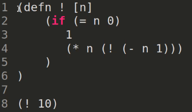 

=== Хвостовая рекурсия 

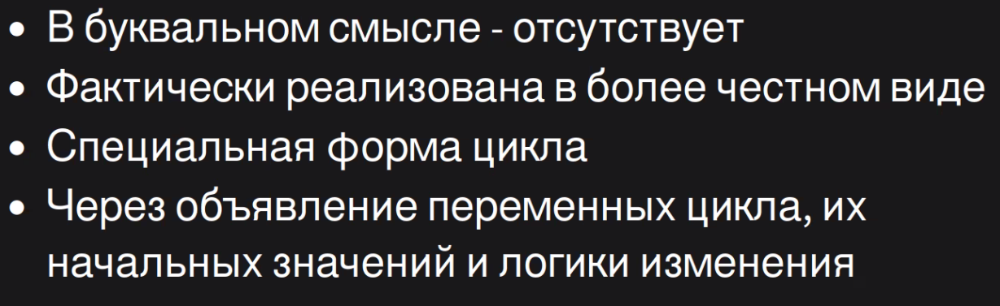

image::media/2023-12-18-15-52-31.png[]

=== if как функция 
не будет работать

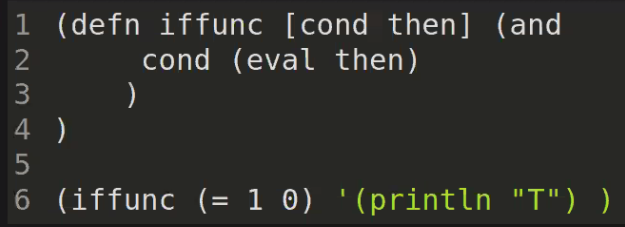

=== Переменное число параметров 
то что до амперсанда -- обязательно, после амперсанда пишем имя списка, в который попадут все остальные параметры 

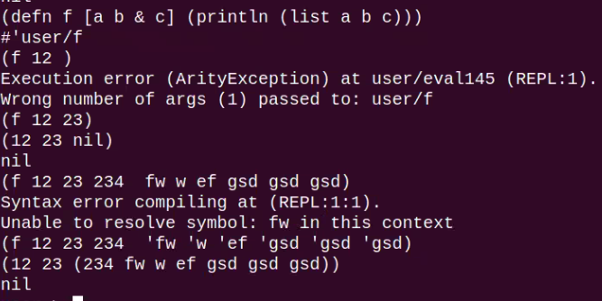

== Структуры данных

* ```(vector 1 2 3)```
* ```(set '(1 2 3))``` -- persistent hash set
* ```(sorted-set 4 3 2)``` -- persistent tree set
* ```(hash-map key value)``` -- persistent hash map
 
 Есть вспомогательный тип `Keyword` для ключа, его экземпляр объявляется через двоеточие :key. но в общем случае можно использовать для ключа любой тип.

* ```(defstruct point :x :y)``` 

(struct point) -- создать экземпляр (persistentStructMap), оба поля nil.
```clojure
(defstruct point :x :y)
(def v (struct point 2 3))
(get v :x)
```

* Список

list - литеральный конструктор

list* - наращивающий конструктор

`first` -- первый элемент, `rest` -- хвост 

`nil` не равен пустому списку! Но ```(first '(nil)) == (first '())```

empty? -- проверка на пустоту

== Продакшн 

=== РАБОТА С ФАЙЛАМИ
Своя обертка для JDK: clojure/io
Можно читать/писать целиком или по строчкам

*Пример*:

``` clojure 
(if (empty? *command-line-args*)
    (println "no args")
        (doseq [name *command-line-args*]
            (with-open [rdr (clojure.java.io/reader name)]
                (doseq [line (line-seq rdr)]
                    (println line)
            )
        )
    )
) 
```
