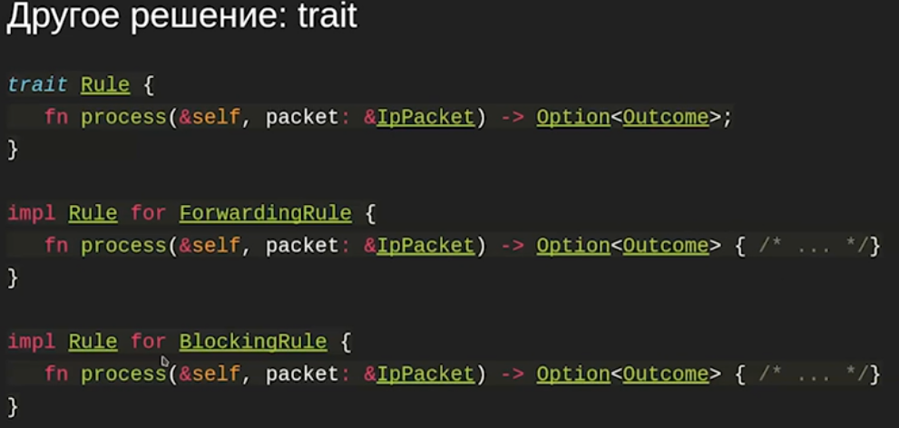
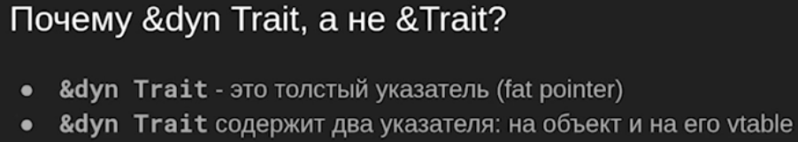
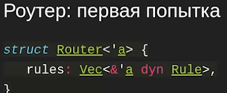

= Static & Dynamic Dispatch 

== Traits & Dynamic dispatch
Динамическая диспетчеризация -- конкретную реализацию trait знаем только в рантайме.

Есть наследование поведения (`trait`), нет наследования данных (делаем композицию)

Вариант 1: полиморфизм через `enum`:

+ничего не выделяем на куче, все лежит здесь 

+знаем все типы

-boilerplate 

-должны знать все типы, реализующие интерфейс, нельзя добавлять пользовательские расширения 

image::media/rule.png[]

=== Trait: НАСЛЕДОВАНИЕ ПОВЕДЕНИЯ



=== Dynamic dispatch

image::media/dyn.png[]

`&dyn Rule` -- просто какая-то имплементация `Rule`, `trait-object`.

Это нужно, чтобы мы различали толстый и тонкий указатели, т.к. трейты имеют еще и ссылку на таблицу виртуальных функций. Виртуальная таблица не зашивается в объект как в C++!



Объект `Rule` мы не можем создать! 



не заработает, т.к. непонятно, где `rule` лежат


=== Box

`Box` -- типа умный указатель. Владеющий указатель над данными, которые лежат на куче и мб динамический тип (т.е. мы не знаем, какой точно тип, но реализует `Trait`). Т.е. при выходе из Scope `Box` убивает свой объект!!!!!

`Box<dyn Rule>` всегда имеет ссылку на деструктор в таблице виртуальных функций, поэтому тут dyn без &

Создаст честный `ForwardingRule`, положит `Box<dyn Rule>` ссылку на него и ссылку на его таблицу виртуальных функций. Поэтому Box -- толстый указатель. 

image::media/box.png[]

Чем trait от interface отличается? Посмотрим позже.

В `trait` нет данных, только функции.

=== Реализация трейтов

Вы можете реализовать трейт Trait для типа T, если:

* Тип Т определён в вашем крейте
* Или трейт Trait определён в вашем крейте

Любо тип должен принадлежать проекту, либо трейт. Почему так? 


 Пусть библиотека foo реализует bar.trait для типа std.t. И библиотека foo2 делает то же самое. Тогда получим конфликт. Таким запретом решаем проблему коллизии.

Исключение: трейт From (об этом позже)

=== Использование методов трейта
Чтобы использовать методы трейта, надо, чтобы трейт был in scope. Это нужно для обратной совместимости.

В примере ниже trait -- это Read. Мы знаем тип объекта -- Fail и зовем это имплементацию Read.

```rust 
use std::io::Read;
use std::fs::File;

fn read_file(file: &mut File) {
    let mut s = String::new();
    let data = file.read_to_string(&mut s).unwrap();
}
```

Другой вариант - fully qualified syntax. Используют когда есть конфликт имен. 

```rust
use std::fs::File;
fn read_file(file: &mut File) {
    let mut s = String::new();
    let data = std::io::Read::read_to_string(
    file,
    &mut s
    ).unwrap();
}
```

=== Associated types
Тип элементов, которые возвращаются оператором. Нужно его указывать явно.

```Rust
trait Iterator {
type Item;
fn next(&mut self) -> Option<Self::Item>;
}
// Spoiler: не надо так делать.
fn foo(iter: &mut dyn Iterator<Item=i32>) {
// ...
}
```

Почему этот пример плох?

 С итератором лучше всегда использовать generic. 
 1. Т.к. если компиляторы статически знают, что будет вызвано --  делают умную оптимизацию.
 2. Не вся функциональность типов реализуется в динамическом контексте. Например, не можем использовать clone (не знаем, какой тип создавать, сколько места на стеке под него выделять).

==== Методы с реализацией по-умолчанию
Их можно конкретизировать для реализаций (для оптимизации). Реализуются через другие методы того же trait. Если хочется обращаться к каким-то полям, то можно сделать композицию.

Пример: size hint 

```Rust
trait Iterator {
type Item;
fn next(&mut self) -> Option<Self::Item>;
fn size_hint(&self) -> (usize, Option<usize>) {
(0, None)
}
}
```

В каких ситуациях этот метод возвращает что-то полезное?
 
 У вектора

=== Type bounds
Комбинация: '+' заставляет имплементировать оба трейта. Но он может иметь пустую реализацию. Зато задает новую семантику.

```Rust
trait Read {
fn read(&mut self, buf: &mut    [u8]) -> io::Result<usize>;
}
trait Write {
fn write(&mut self, buf: &[u8]) -> io::Result<usize>;
}
trait ReadWrite: Read + Write {}
```

* ? Правда ли, что любое trait который по отдельности реализует Read и Write реализует и ReadWrite?

 Нет! Это работает только в 1 сторону. 

=== Upcasting
Можно извлечь одну из имплементаций. Нужно определять во всех реализациях, но можно сделать blanket impl.

```rust
trait ReadWrite: Read + Write {
    fn as_mut_read(&mut self) -> &mut dyn Read;
    fn as_mut_write(&mut self) -> &mut dyn Write;
}
impl ReadWrite for File {
    fn as_mut_read(&mut self) -> &mut dyn Read { self };
    fn as_mut_write(&mut self) -> &mut dyn Write { self };
}
```

Почему компилятор не делает это автоматически? 

 Раздувается таблица виртуальных функций для сложный иерархий трейтов.

Почему не сделать просто приведение? 
 
 Это не просто приведение, а динамическое изменение размера vtable и layout объекта.

=== Итог: traits & dynamic dispatch
* Traits - примерный аналог интерфейсов в других языках
* В дин. контексте можно использовать &dyn Trait или Box<dyn Trait>
* Traits поддерживают type bounds (если прищуриться, это похоже на
наследование)
* Можно приводить реализации методов по-умолчанию
* У трейта могут быть ассоциированные типы
* Всегда сначала подумайте, не подойдёт ли вам enum (если знаем локально все типы и не хотим давать API для его расширения.) У них нет аллокаций на куче! 

== Generics & static dispatch

Недостатки динамической диспетчеризации

1. Т.к. если компиляторы статически знают, что будет вызвано --  делают умную оптимизацию.
2. Не вся функциональность типов реализуется в динамическом контексте. Например, не можем использовать clone (не знаем, какой тип создавать, сколько места на стеке под него выделять).

* ? Скомпилируется ли этот код?

```Rust 
trait ToString {
fn to_string(&self) -> String;
}
fn foo(flag: bool) -> impl ToString {
if flag {
123
} else {
"foo"
}
}
```

 Нет. Функция должна во всех if возвращать один и то же тип!!! В остальном код валиден.

=== impl в return
Зачем? Писать честный возвращаемый тип сложно, он не читабельный.

fn positive_neighbors(
x: i32,
y: i32,
) -> impl Iterator<Item = (i32, i32)> {
[(0, 1), (0, -1), (1, 0), (-1, 0)]
.iter()
.map(move |(dx, dy)| (x + dx, y + dy))
.filter(|(x, y)| *x >= 0 && *y >= 0)
}

Где живет массив? 

 В сегменте данных программы. Чтобы работать с нестатическим массивом - можно передать владение им итератору (into_iter)

=== Generics: full syntax
Более общий синтаксис, используют в более сложных случаях (когда опа параметра одного типа)
```rust
fn sum<T: Iterator<Item=i32>>(iter: T) -> i32 { /* ... */ }
fn sum<T>(iter: T) -> i32
where
T: Iterator<Item = i32>,
{ /* ... */ }
```
```rust

```

* ? Скомпилируется ли этот код?

fn take_generic<T>(obj: T) {
take_int(obj);
}
fn take_int(obj: i32) {}
fn main() {
take_generic(12i32);
}

 в с++ да, код генерируется только для типов, имплементации с которыми были (generic слабо типизирован). В rust -- код генерируется 1 раз для наиболее общего типа (generic сильно типизирован). а он не передается как аргумент int. 

==== Сочетание трейтов
fn foo(obj: &mut impl Read + Write) { /* ... */ }
fn foo<T: Read + Write>(obj: &mut T) { /* ... */ }

==== Ограничения на ассоциированные типы
fn iter_to_string<T>(iter: T) -> Vec<String>
where
T: Iterator,
T::Item: ToString,
{
iter.map(|s| s.to_string()).collect()
}

==== Условный impl
impl<T> Option<T> {
fn unwrap() -> T { /* ... */}
}
trait Default {
fn default() -> Self;
}
impl<T: Default> Option<T> {
fn unwrap_or_default () -> T { /* ... */}
}

=== Blanket impls
Для всех типов Т, которые реализуют трейт Read

trait ReadBytesExt {
fn read_u8(&mut self) -> io::Result<u8>;
fn read_i8(&mut self) -> io::Result<i8>;
// ...
}
impl<T: Read> ReadBytesExt for T {
    fn read_u8(&mut self) -> io::Result<u8> { /* ... */ }
// ...
}

=== swap
fn swap<T>(x: &mut T, y: &mut T) { /* ... */ }
let mut first = b"hello, world!";
let mut second = b"foo, bar";
swap(&mut first as &mut [u8], second as &mut [u8]);

Скастуем ссылки на массив на ссылку на слайс. Массивы бы не скомпилировались, т.к. они разного размера. Сигнатура функции своп меняем местами не указатели, а честно перекладывает данные. Со слайсом размер известен только в runtime и он может быть разный. 

=== Sized 
знаем ли мы размер типа в compile time. по умолчанию должен быт реализован для типов. тобы принимать типы, для которых оно неизвестно (трейты, например) `?Sized`. Это ограничивает то, что можно делать с типом (теперь нельзя хранить на стеке, например).

По-умолчанию, в дженериках все типы Sized.

trait MyTrait { /* ... */ }
fn my_fn<T: MyTrait + ?Sized>(obj: &T) { /* ... */ }
fn foo(obj: &dyn MyTrait) {
my_fn(obj);
}


Итог: generics & static dispatch
* Дженерики существенно быстрее, чем &dyn Trait
* Дженерики более выразительны, чем &dyn Trait
* Если можно использовать static dispatch, лучше использовать его

Где лучше использоват динамическую? 
* когда хотим хранить данные разных типов, но из одной коллекции
* когда хотим быструю компиляцию

== 2. Трейты std.

1. PartialEq (eq, ne). 
2. PartalOrd (partial_cmp -> Oprional<Ordering>) 
3. Ord (cmp -> Ordering), ссылается на PartialOrd
4. Hash, вызывает Hasher -- реализует hash функцию
5. AsRef -- может принимать даннвые и из кучи и из сешмента данных
6. То же, что AsRef, но требует равенства результата имплементаций Eq, Hash. Это полезно в контексте работы в контейнерах. Это требуется от программиста, компилятор не проверяется. Поэтому hashset может странно себя вести.
7. debug -- форматирование для debug. Можно просто определить для структуры `#derive(Debug) struct Foo{..}`. Если оно не реализовано, то мы получим ошмбку компиляции (потому что println! макрос!!! И все валидации делает в compile time).
8. display -- красивое представление, нужно реализовывать руками.
9. From<T> -- на типе foo позвать from и передать тип T. Автоматически делается бланкетная реализация для трейта Into<T>
