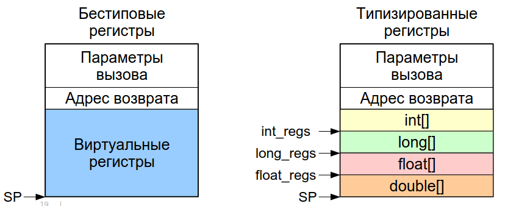
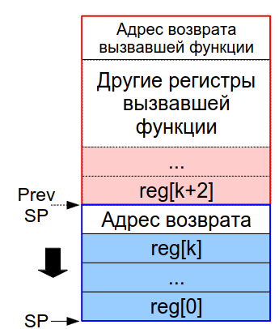
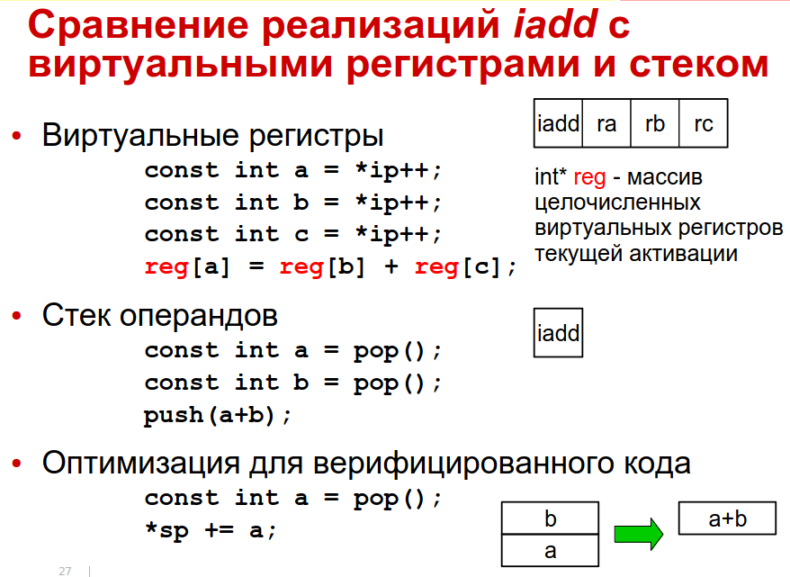

:toc:
:lang: ru-RU
:source-highlighter: rouge

= Представление виртуальных инструкций. Передача параметров инструкциям.

https://bachisheo.github.io/23-fall/vm[Главная]

== Представление виртуальных инструкций. 
=== #Токен# 
** Целое число, однозначно идентифицирующее
инструкцию и, возможно, все или некоторые из ее
операндов
** Остальные операнды могут быть закодированы в
потоке инструкций вслед за токеном
** Токены не зависимы от аппаратуры и размещения
кода в памяти
** Пример: байтовые коды Smalltalk VM или JVM

=== #Адрес подпрограммы#
** Единственная инструкция — вызов подпрограммы,
подразумеваемая по умолчанию
** С другой стороны, расширяемый набор инструкций,
представленных адресами их реализаций
** Пример: шитый код Forth-машины

Bell, J.K., Threaded code, Communications of the ACM
vol 16, nr 6 (Jun) 1973, pp.370-372

Чтобы взять адрес подпрограммы -- нужно взять специальную инструкцию и передать ей в качестве аргумента другую функцию

== Передача параметров инструкциям.

Какие параметры бывают?

* #Неявные# на вершине стека операндов 

 например, сложение. Ее параметры где-то на стеке, в самой функции не указаны

* в #виртуальных регистрах#
** явные (указываем виртуальный регистр явно)
** неявные (инструкция перехода модифицирует адрес следующий инструкции, мы не указываем какой именно регистр)
* #Непосредственные# операнды
** Значения разных типов, в т.ч. структурных
** Номера регистров (при явной передаче параметров в регистрах)
** Позиции меток в коде
** Ссылки на объекты и их элементы (например, класс или поле объекта)
** Внешние символические ссылки (когда вызываем функцию из стандартной библиотеки)

=== *#Явная# передача в #виртуальных# регистрах*

При компиляции для функции вычисляется количетсво нужных ей виртуальных регистров

на картинке -- секции активации функции/рамкой стека/записью активации (создается командой prologue). Они могут быть типизированные ил бестиповые 

Сколько регистров нужно? Чтобы хватило для всех локалов (мб переиспользовано разными локалами)

Что делать, если регистров недостаточно? Номер регистра ограничен шириной отведенного для него битового поля инструкции. Возможные решения 

* запретить порождать такой код
* расширить поля номеров регистров 
* завести префикс ширины таких полей
* использовать кодировку переменной длины
* использовать деление по типам (регситры более экономично расходуются)

Инициализация регистров 

1. Не инициализированно ничего, кроме параметров вызова
2. Скопировать заданные виртулаьные регистры вызывающей в вызываемую
3. При возврате скопировать результат в заданный регистр вызываемой функции

==== *Оптимизация*: индексация параметров вызова
Подходит для бестиповых регистров, когда секция вызывающей функции лежит сразу за вызываемой и известны регистры вызывающей, где находятся параметры.

Регистры вызывающей функции индексируем как регистры вызываемой.

`-` В сравнении с стековой передачей инструкции длиннее -> порождаемый код длиннее (хотя инструкций меньше)

`-` сложнее код компилятора в VM 

* минимизируем число виртуальных регистров 
* следим за живостью регистров (верификация, сборка мусора, рефлексия (какие переменные инициализированы)) -- хранятся в сжатых регистрах где-то в метаданных.
** в стеке мертвые значения просто снимаются со стека, здесь -- хранятся в таблице.

`+` это может упростить распределение регистров в динамическом компиляторе

=== *#Неявная# передача через #стек операндов#*
Нужно следить за глубиной стека, требуем чтобы она была легко вычислима (и идентична в разных потоках управления). 
 
Считаем нужную для выполнения функции глубину стека, при входе в функцию -- проверяем, хватит ли места на стеке. Если нет -- верификатор падает с ошибкой.

`+` упрощается набор виртуальных инструкций (простые спенциализированные инструкции для работы со стеком) 

`+` упрощается интерпретатор и компилятор

=== Сравнение сгенерированного кода

image::media/compare_vregs_and_stack.png[]

Через регистры -- 3 инструкции, использовали 3 виртуальных регистра. Если каждый из них занимает байт в записи вызова, то потратили 10 байтов.

Через стек -- 6 инструкций, 9 байтов. Если начальные значения уже на стеке, то получим 4 инструкции и 5 байтов.

=== Сравнение интерпретаторов

Спарва -- вид операции, слева -- код интерпретатора
