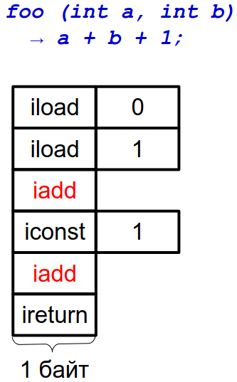
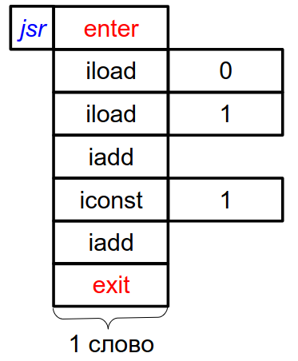
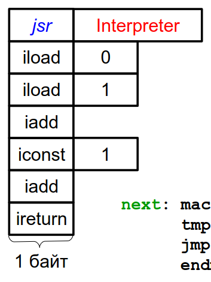
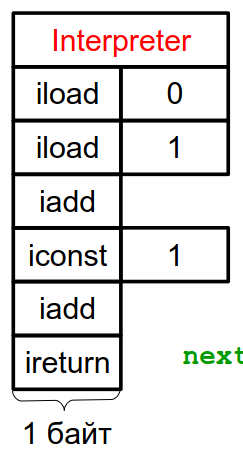

:toc:
:lang: ru-RU
:source-highlighter: rouge

= Виды линейных кодов.

https://bachisheo.github.io/23-fall/vm[Главная]

== Байтовый код
Код представляется токенами размера 1 байт (??)

*Пример байтового кода*
 


 0 - адрес переменной а, 1 - b 

Ниже его интерпретатор на С. В цикле считаем следующий байт, в зависимости от его значения -- выбираем номер следующей инструкции. Логика функции в теле case.

*Интерпретатор байтового кода на С*

```C 
void Interpreter (void) {
    const byte* ip;
    ...
    for (;;) {
        switch (*ip++) {
        ...
        case iadd: {
            const int a = pop();
            const int b = pop();
            push(a+b);
            break;
        }
    ...
        }
    }
}
```
*Интерпретатор байтового кода на assembler*

На asm можно явно выразить некоторые вещи. Например, задать #явный# или #неявный# цикл

*Интерпретатор байтового кода с #явным# циклом*

```asm
InterpreterLoop:
    ; мб 1 инструкция
    tmp = *ip++;
    jmp BytecodeTable[BytesInWord * tmp];
    ...
L_iadd:
    pop tmp1;
    pop tmp2;
    tmp1 += tmp2;
    push tmp1;
    ; ЯВНО переходим на начало цикла
    ; как и все другие инстуркции
    jmp InterpreterLoop;
    ...
BytecodeTable: .word ..., L_iadd, ...
```

Здесь `ip`, `tmp`, `tmp1`, `tmp2` — машинные регистры,
причем tmp может совпадать с `tmp1` или `tmp2`.

`BytecodeTable` -- по токену инструкции хранит адрес ее начала.

`BytesInWord * tmp` -- в машинном слове 2 байта, приводим типы (зачем??)

*Интерпретатор байтового кода с неявным циклом*

Заводим макрос next, который делает то же самое, что декодер процессора (??): выбирает очередной байт из потока инструкций и отдает управление на таблицу интерпретатора.

```asm
next:   macro()
        tmp = *ip++;
        jmp BytecodeTable[BytesInWord * tmp];
        endm

Interpreter:
        next();
...
L_iadd:
        pop tmp1;
        pop tmp2;
        tmp1 += tmp2;
        push tmp1;
        ; здесь подставится код макроса!!!
        next();
...
BytecodeTable: .word ..., L_iadd, ...
```

*Какой интерпретатор эффективнее?*

В случае с явным циклом у нас есть безусловный переход на `InterpreterLoop`, где происходит косвенный переход по какой-то табличке.

К неявного цикла нет безусловного перехода в конце, на этом могут сэкономиться такты процессора (но не обязательно ??). 

Также с точки зрения *предсказателя переходов*, при неявном цикле для каждой инструкции свое место, где происходит переход по табличке. Предсказатель хранит ассоциацию между местом перехода и тем, куда программа дальше пошла. В случае с явным циклом переходы будут практически не предсказуемы. 

С неявным циклом можно предугадывать идиоматические последовательности, когда за одной инструкцией чаще всего идет другая конкретная.

== Шитый код
Код -- последовательность адресов подпрограмм

Происходит постоянный переход от кода программы к реализации инструкций. Если представить это линией, то они словно сшиты. Поэтому код #шитый#.

Выделяют три вида шитого кода 

* Подпрограммный
* Прямой
* Косвенный

Может быть несколько реализаций интерпретатора,главное чтобы каждому enter соответствовал exit того же интерпретатора (как ПСП).

=== #Подпрограммный# шитый код
image::media/threaded_code.png[]

`jsr` — машинная инструкция вызова подпрограммы, от процессора `pdp`. У  `intel` -- `call`.

`ret` — машинная инструкция возврата из подпрограммы

iload, iret -- метки реализаций подпрограмм  

*интерпретатор* 

Цикл интерпретатора отсутствует.

```asm
.code
...
iadd:   pop(tmp1);
        pop(tmp2);
        tmp1 += tmp2;
        push(tmp1);
        ;вернуться в исполнение кода 
        ; на следующий jsr 
        ret
```

`iadd` — метка в коде

`tmp1`, `tmp2` — регистры процессора

`pop`, `push` — макросы операций со стеком операндов. Одноименные инструкции использовать нельзя, так как аппаратный стек работает с адресами возвратов, а `pop`, `push` с передачей операндов. Поэтому реализуем макросы!!

Скорость: не так медленно, так как процессор умеет предсказывать ret. И это в любом случае быстрее, чем в ручную искать адрес след операции через табличку. 

`+` Быстрее байтового 

`+` Количество инструкций не ограничено (в отличии от байтового)

`-` эффективен, когда адрес подпрограммы не очень длинный (иначе дорого хранить) и абсолютный (иначе приходится выполнять арифметические операции)

Где используется: postscript (pdf), forth

=== #Прямой# шитый код 
Получается из подпрограммного: у каждого адреса подпрограммы был префикс (за исключением exit). Отказываемся от и избыточного `jsr`.



`iload`, `iadd` -- адреса, метки на начало реализации

Первая инструкция -- `jsr`, где происходит вход в интерпретатор (`enter`), затем перечень операций после которых -- выход из интерпретатора (инструкция `exit`)

enter / exit — вход в / выход из интерпретатора *данного фрагмента кода*. Адреса метод в коде интерпретатора.

Интерпретатор состоит из трех меток: `enter`, `next`, `exit` и уложен в 7 машинных инструкций!!

*Интерпретатор #прямого# шитого кода*

```asm
next:   macro()
        ; чтение слова -- адреса инструкции
        tmp = *ip++;
        jmp tmp;
        endm
        
enter:  rpush(ip);
        pop ip;
        next();

        ;cнимаем старый адрес интерпретации
exit:   rpop(ip);
        next();

iadd:   pop tmp1;
        pop tmp2;
        tmp1 += tmp2;
        push tmp1;
        next();
```

pop, push — машинные инструкции

rpop, rpush — макросы операций со стеком возвратов

++ — инкремент на размер слова

jsr реализуем вручную: в enter кладем на стек возвратов текущий адрес интерпретации (ip), снимаем с аппаратного стека текущий адрес интерпретации (там лежит адрес iload 0), который выполняется в next. 

Выполнение в next -- читаем адрес следующей инструкции *ip++ и выполняем ее.

=== #Косвенный# шитый код 
Единственный вид шитого кода, который не содержит машинных инструкций (в прямом jsr)! 

image::media/indirect_threaded_code.png[]

Dewar, R.B.K., Indirect threaded code.
Communications of the ACM, June 1975, pp.330-331


*Косвенный шитый код Интерпретатор*

```asm
next:   macro()
        tmp = [ip++];
        jmp [tmp];
        endm

enter:  rpush(ip);
        ; в tmp храним адрес текущего enter из кода!!!
        ; двигаем его на машинное слово и получаем адрес 
        ; следующей инструкции (iload)
        ip = ++tmp;
        next();

exit:   rpop(ip);
        next();

iadd:   .word @iadd
; фиктивная метка реализации
@iadd:  pop tmp1;
        pop tmp2;
        tmp1 += tmp2;
        push tmp1;
        next();
```

Используется дополнительный регистр tmp с побочным эффектом (сперва там лежит адрес текущего enter)

В начале каждой инструкции должен лежать адрес следующей за ней реализации инструкции

`-` интерпретатор сложнее -- дополнительная косвенность, загружаем адрес из памяти, вводим фиктивные метки -- работает медленнее прямого кода
  
`+` нет никаких машинных инструкций, абсолютно независимый от платформы. Можно делать фиксы чтобы поправить адреса

== Токен-шитый код
Гибрид байтового и шитого кода

Полезен, когда нужно выполнить переход между скомпилированным и интерпретируемым кодом.

===  #Прямой# токен-шитый код
Байтовый код встроен в прямой шитый как вариант интерпретации. Инструкция вызова передает управление на
начало кода вызываемой функции.

Нормальный байтовый код, перед которым написан jsr на интерпретатор 

Байтовый код остается таким же медленным, но можно сочетать разные интерпретаторы в рамках одной программы



```asm 
Interpreter:
        ; сохраняет адрес возврата
        rpush(ip);
        ; снимает с аппаратного стека адрес 
        ; первой инструкции (iload 0)
        pop ip;
        next();
L_iadd:
        pop tmp1;
        pop tmp2;
        tmp1 += tmp2;
        push tmp1;
        next();

next:   macro()
        tmp = *ip++;
        jmp BytecodeTable[BytesInWord*tmp]
        endm
```

 ?? когда будет происходить rpop

=== #Косвенный# токен-шитый код
Инструкция вызова загружает адрес начала кода вызываемой
функции в регистр tmp и передает управление по хранящемуся
там адресу интерпретатора

```asm
Interpreter:
rpush(ip);
ip = tmp + BytesInWord;
next();
L_iadd:
pop tmp1;
pop tmp2;
tmp1 += tmp2;
push tmp1;
next();
next: macro()
tmp = *ip++;
jmp BytecodeTable[BytesInWord*tmp]
endm
```

