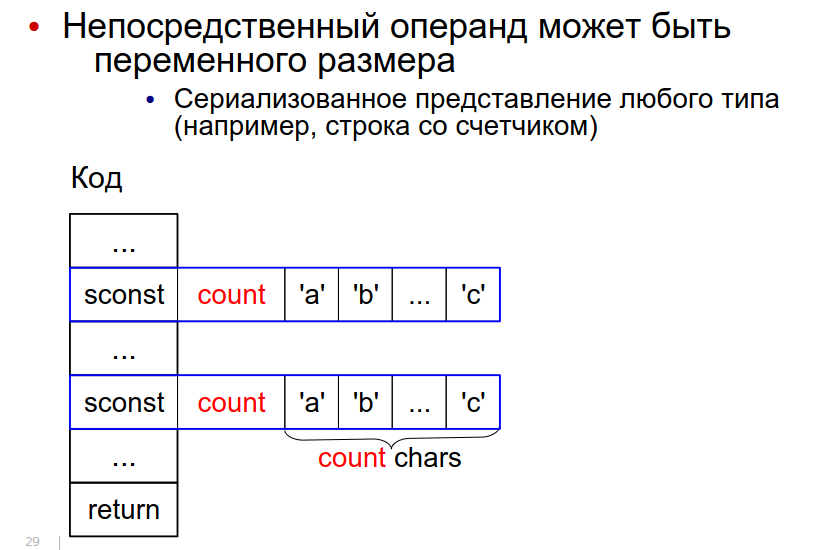
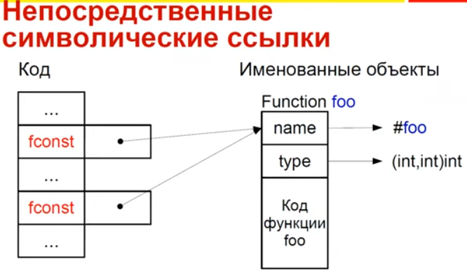

:toc:
:lang: ru-RU
:source-highlighter: rouge

= Непосредственные операнды. Кодирование. Литеральный пул. 

https://bachisheo.github.io/23-fall/vm[Главная]

== *#Непосредственные операнды инструкций#*
Это операнды следующих типов:

* Значения разных типов, в т.ч. структурных
* Номера регистров (при явной передаче параметров в регистрах)
* Позиции меток в коде

 Как ссылаться на позицию в исполняемом коде? На адрес
или на смещение относительно инструкции (смещения обычно короткие). В любом случае -- машиннозависимо

* Ссылки на объекты и их элементы (например, класс или поле объекта)
* Внешние https://bachisheo.github.io/23-fall/vm/#_символические_ссылки[символические ссылки]

Могут храниться 

* в битовых полях инструкций (не работает в шитом коде)
* в потоке инструкций за адресом инструкции

Если оператор более, чем байтовый -- конвертер располагает их в правильном порядке. Нужно думать о выравнивании.

Как хранить операнд переменного размера? 

* В адресе со стетчиком



`-` копируем константы полностью -> замедляем интерпретатор

* Литеральный пул (о нем ниже)

== Литеральный пул

Свяжем с кодом область памяти для размещения констант

`+` Десериализация констант может производиться один
раз во время линковки

`+` можно использовать одни и те же константы из разных функций -> экономим память и время процессора (чтобы не копировать). Его же можно использовать для анализа кода (классы каких объектов используются и т.д.)

image::media/literal_pool.png[]

== Символические ссылки
#Символические ссылки# -- ссылки на уникально именованные объекты (глобальные переменные, классы, методы). В общем случае не константные. Могут перемещаться в памяти.

#Разрешение ссылки# -- поиск объекта по имени. Разрешение можно сделать с помощью рефлексии (если она есть). Разрешение может давать разные результаты (ленивое разрешение).

#Линковщик# разрешает ссылки -- заменяет символическое имя на адрес найденного объекта.

Может представляться непостредтсвенным оперндом (определяется инструкцией), что  усложеняет сборку мусора. 

Или в отдельной части литерального пула (при этом она не константа, может изменяться при перемещении объектов в памяти). 

Нужно делать манипуляции, чтобы отличать их от обычных констант:

* хранить в отдельной области
* ставить тег для различия имени объекта и его адреса
* имеют отличных от других ссылок диапазон значений
* разрешать до выполнения кода

*Пример: непосредственная ссылка на функцию*


Пока ссылка не разрешена -- в поле лежит адрес строки, которая идентифицирует функцию (здесь -- #foo). Сначала все ссылки ссылаются на эту строку. После того, как мы разрешили -- они все указывают на адрес функции.

*Пример: символические ссылки в литеральном пуле*

image::media/sym_linc_literal_pool.png[]
 
Храним адреса объектов в литеральном пуле. Ссылки из кода ссылаются на дескриптор объекта в литеральном пуле. Дескриптор сперва ссылается не на функцию, а на ее имя. Если при обращении поняли, что ссылаемся на имя -- пытаемся разрешить его.

== Кодирование непосредственных операндов
Оптимизация для байтового кода.
Числовые операнды распределены неравномерно, маленькие значения встречаются гораздо чаще. Отведем для него меньше места. 

Как быть с большими данными? 

* байткоды с разной шириной операндов (- количество операндов ограничено)
* байткод-префикс ширины операндов (расширяет ВСЕ операнды, это минус) -- используется в JVM (байткод wide)
* *кодировка переменной длинны* (медленное декодирование)

=== *#Кодировка переменной длинны#* 
(Unsigned) Little Endian Base 128 (LED128), используется в 
DWARF 

Старший бит -- признак продолжения в следующем байте 
 
*Код декодирования*

```cpp
uint64_t ULEB128_decode (const uint8_t* p) {
uint64_t value = 0;
for (uint shift = 0;; shift += 7) {
    const uint64_t next_byte = *p++;
    value |= (next_byte & 0x7F) << shift;
        if (!(next_byte >> 7)) return value;
    }
}
```
