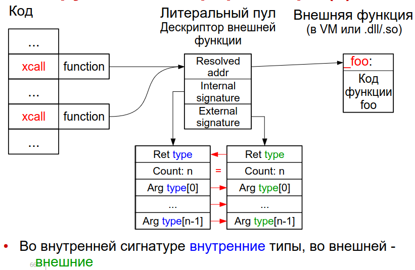

:toc:
:lang: ru-RU
:source-highlighter: rouge
= 1.7 Нативный интерфейс виртуальной машины: Вызов библиотечных функций

https://bachisheo.github.io/23-fall/vm[Главная]

Раздел нативный интерфейс виртуальной машины включает несколько разделов, но в билеты вошли только https://bachisheo.github.io/23-fall/vm/107[доступ к данным]. Однако, остальные доступны по ссылкам ниже.

* https://bachisheo.github.io/23-fall/vm/107/lib[Нативный интерфейс VM: Вызов библиотечных функций]

== Отступление: типизация 
Ошибки могут обнаружены динамически и статически. Если среди них есть типовые ошибки -- язык типизированный. Они бывают со статическим, динамическим и смешанным контролем типов.

У динамически типизированных и бестиповых языков с классами много общего

* Объект принадлежит классу
* Это отношение неизменно
* Класс определяет семантику операций над объектом

В таких языках значения часто хранят в fixnum. В трех младших байтах у адресов нули (т.к. адреса выровнены), а у других объектов -- там хранится тэг-тип.

image::media/fixnum.png[]

== Внешние функции
Например, чтение из файла или форматный вывод. Как правило, написаны на другом языке, и мы не хотим или не можем их конвертировать в наш (чтение данных, ввод
/вывод, неизвестный тип)

Для вызова нужно договориться о соглашении о связях:

* Как и в каком порядке передаются параметры,
кто их снимает со стека
* Кто и какие регистры процессора сохраняет
* Бросает ли исключения, как и какие
* Форматирование имени (name mangling)

И об использовании стека: направление роста, проверка переполнения, устройство секции

=== Адаптация вызова
* вычислить id вызываемой функции 
* преобразовать параметры
* сохранить регистры 
* мб переключить на нативный стек 
* нативный вызов 
* ловля исключений 
* преобразование результата или исключение 
* мб обратное переключение стека 
* восстановление регистров

Как реализовать адаптацию вызова? 

* Отдельная инструкция интерпретатора (можно вызвать любую функцию, но работает медленно)
* Нативный адаптер для каждой внешней функции (пишем на каком-то другом языке. тяжело переходить на наш язык. не верифицируем)
* Адаптеры на ограниченном низкоуровневом расширении языка (верифицируемо, нужно расширить верификатор)

Подробнее о них 

=== Отдельная инструкция интерпретатора
универсальная адаптация -- определяется параметром функции -- дескриптором внешней функции (лежит в литеральном пуле, хранит имя и сигнатуру)

Параметры лежат на стеке. Интерпретатор преобразует их последовательно, позиционно. Преобразования определяется парой типов -- внутренним (значение) и внешним (аргумент).

В динамически типизированном языке и у объектов каждое значение знает свой тип . 

В статически типизированном -- вычисляется по  внешнему типу аргумента (примитивные типы не знают своего типа, определяется по сигнатуре).

После вычисления интерпретатор преобразует из внешнего типа во внутренний. Преобразование типов зашито в интерпретатор -> не все функции можно вызвать.

*Пример* 

image::media/interpreter_func.png[] 

В коде есть вызов внешней функции. В литеральном пуле -- ее дескриптор. Сначала там было имя этой функции, затем адрес и внешняя сигнатура. Перед вызовов интерпретатор идет по сигнатуре, берет соответствующий ей параметр и делает преобразование типов. Делает вызов, извлекает из сигнатуры внешний тип результата и делает обратное преобразование.

=== Преобразование типов
иногда в С байт передается как int. В ВМ может не быть явного преобразования. А также может зависеть от разрядности.  Можно задать внутреннюю сигнатуру (с которой хотим вызывать) явно 

*Пример: явная сигнатура*

Теперь преобразуем по парам типов.

*Проблемы преобразования типов*

* разная битовая ширина 
(long и double в fixnum)

*  у структур поля в том же порядке и стем же смещением
* строки у всех представляются по разному 
* ссылки могут быть перемещены вызываемой функцией в куче 

Можно передавать простые массивы и ссылки при следующих условиях: 

* код не может перемещать значения в куче
* нативно одно поточная VM
* отсутствие callback'ов
* запрет на отведение памяти из внешней функции при помощи сервисных функций VM