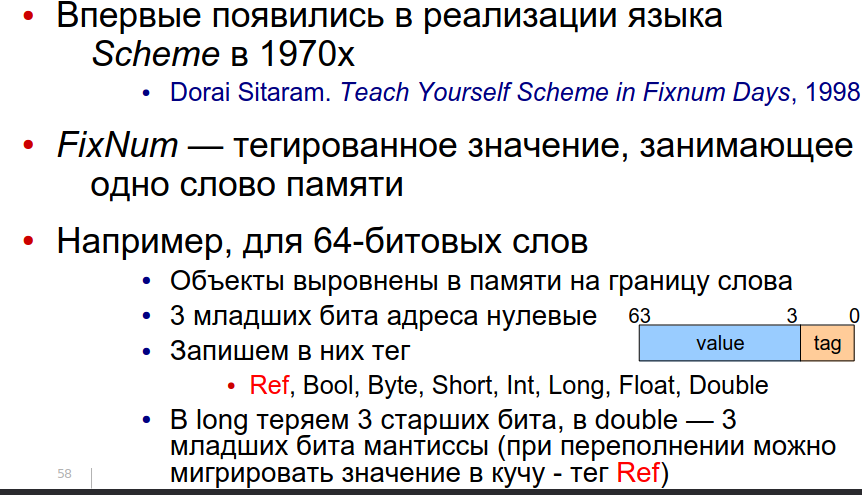

= 1.7 Нативный интерфейс виртуальной машины. Доступ к данным.

== Отступление: типизация 
Ошибки могут обнаружены динамически и статически. Если среди них есть типовые ошибки -- язык типизирвоанный. Они бывают со статическим, дминамическим и смешанным контролем типов.

У динамически типизированных и бестиповых языков с классами много общего

* Объект принадлежит классу
* Это отношение неизменно
* Класс определяет семантику операций над объектом

В таких языках значения часто хранят в fixnum. В трех младших байтах у адресов нули (т.к. адреса выровнены), а у других объектов -- там хранится тэг-тип.

== Внешние функции
Например, чтение из файла или форматный вывод. Как правило, написаны на другом языке, и мы не хотим или не можем их конвертировать в наш (чтение данных, ввод
/вывод, неизветсный тип)

Для вызова нужно договориться о соглашении о связях:

* Как и в каком порядке передаются параметры,
кто их снимает со стека
* Кто и какие регистры процессора сохраняет
* Бросает ли исключения, как и какие
* Форматирование имени (name mangling)

И об использовании стека: направление роста, проверка переполнения, устройство секции

=== Адаптация вызова
* вычислить id вызываемой функции 
* преобразовать параметры
* сохранить регистры 
* мб переключить на нативный стек 
* нативный вызов 
* ловля исключений 
* преобразование результата или исключение 
* мб обратное переключение стека 
* восстановление регистров

Как реализовать адаптацию вызова? 

* Отдельная инструкция интерпретатора (можноо вызвать любую функцию, но работает медленно)
* Нативный адаптер для каждой внешней функции (пишем на каком-то другом языке. тяжело переходить на наш язык. не верифицируем)
* Адаптеры на ограниченном низкоуровневом расширении языка (верифицируемо, нужно расширить верификатор)