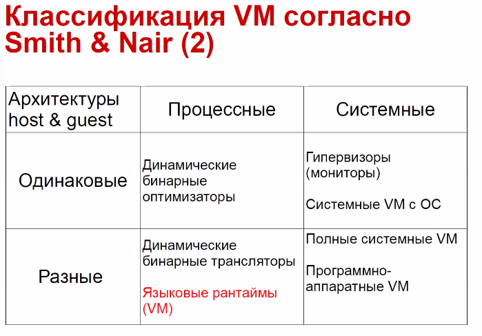
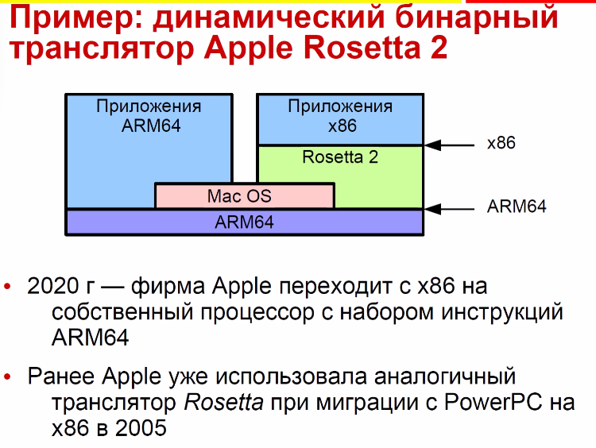
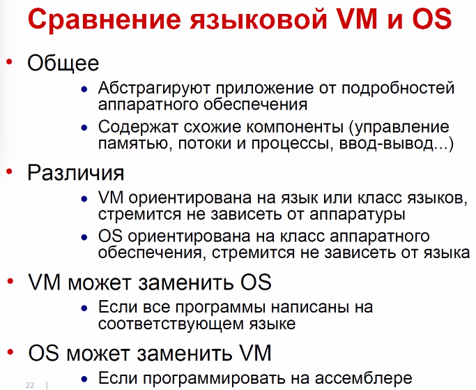
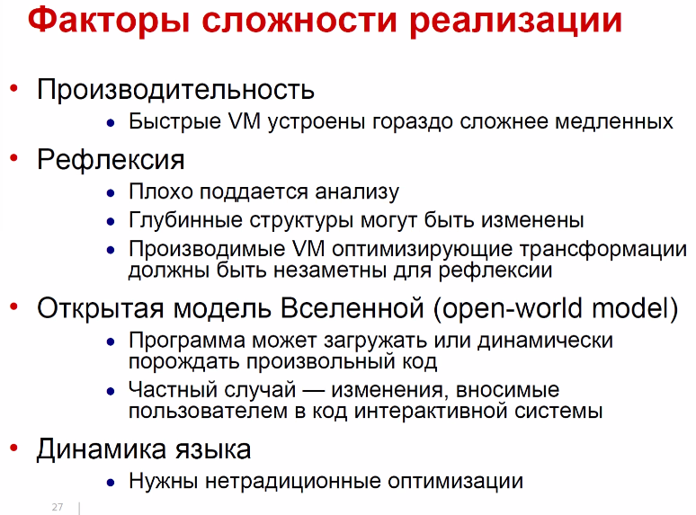
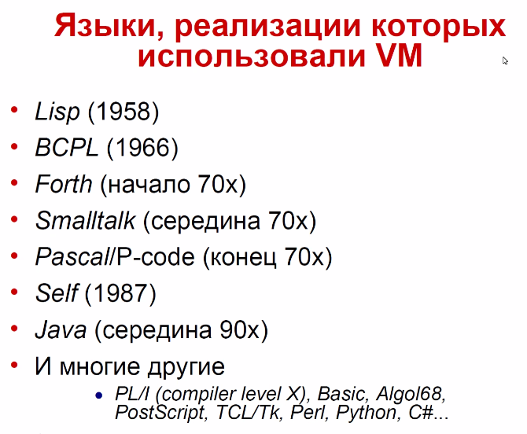

# Ведение в ВМ
Абстрактная вычислительная машина, не зависящая от аппаратного обеспечения и ОС

Реализация VM — программный или программно-аппаратный симулятор VM,
работающий на реальной аппаратуре, обычно поверх существующей ОС

В идеале программа, скомпилированная в код VM, исполняется всюду, где имеется реализация этой VM

Уровень абстракции, разделяющий языково- и машинно-зависимые фазы трансляции
● Компилятор языка в код VM
● Симулятор (интерпретатор) VM
● Или компилятор из виртуального кода в реальный

## VM определяет
* Свой набор инструкций (обычно упрощенный, мб совпадать с набором какого-то процессора)
* Абстрактный процессор (проще физическогоб выше уровнем)
* Высокоуровневая (т.е. работаем с объектами) система памяти 
* Интерфейс взаимодействия с нативными библиотеками и ОС + перифирия
* Интерфейсы взаимодействия с инструментами (отладчиками, профиляторами)

## Общая 
хост - на нем исполняется VM (аппаратура или вм)
гость - исполняется на VM

ISA - instruction set atchitecture -- набор инструкций взаимодействия --скрывает архитектурные особенности за набором команд.

## Классификация ВМ
* Процессная реализует двоичный интерфейс приложения. вреди инструкций есть привелегированные -- используются только процессором, но не приложением. Доступ к функциям ОС не имеет (VBox, JVM)
* system VM -- использует все инструкции, на нем можно запустить чистую ОС без пропатченных (QUEMU)

Динамический бинарный оптимизатор -- у процессора мб ревизии, особенности. При записке в динамике одни инструкции меняются на другие и получается оптимизированное приложение.

Динамические бинарные трансляторы -- rosetta2 (можем запускать приложение одного процессора на другом).

Полные системные ВМ (полная программная(?) эмуляция процессора).

Программно-аппаратные системные ВМ (пример ниже обанкротился из-за повышенного энергопотребления).

Гипервизор (монитор) -- системная с одинаковым интерфейсом (набором инструкций) гостя и хоста.

Языковая виртуальная машина (языковые рантаймы).

## Сравнение языковой VM и OS

vm370 -- os, которая работала как VM для assembler

Верификация -- совства системы: соответсвие типов, размера стека.

*кросс компиляция - вм исполянет генератор виртуального кода, порождает код: текст, бинарные объекты, исполняемый код.

*раскрутка - кросс компиляция для кода самой вм. так можно переносить ВМ с одной платформы на другую.

Масштабируемость -- все отданные вм ресурсы должны быть использованы с пользой.

*низколатентная сборка мусора -- для работы требует небольших пауз. 

*метаданные - описывает объект, но не влияет на поведение

*заголовок объектов - хеш-код, ссылка на замок, сслыка на клас и т.д. это в отличии от метаданных влияет на исполнение

вм работает на аппаратуре
хотим ее же но на другом процессоре
у нас есть аппаратура, ассемблер и вм. 
Можно переписать руками на ассмеблере или С. Не все можно выразить на языке С (н-р, двунаправленный объект, мультиметоды (диспатчеризируется не по получателю, а по набору аргументов(?))).

А можно написать ее на другом языке, который породит текст на ассемблере.

`Раскрутка` - на том же процессоре, но с критическими изменениями (на работающей вм это сделать нельзя). пишем программу, которая порождает для этой же архитектуры новую версию вм. Можно написать эту программу 1 раз и потом использовать. Грубо говоря, это автоматизация написания кода на ассемблере.

Кросс-компиляция - трансляция на другой процессор

Обычно эти файлы - большие и состоят из констант.

Рефлексия - по имени хотим породить конкретный объект. хотим получить поле с каким-то именем из этого объекта.

Рефлексия -- хотим по программе ходить не по порядку, а по именам. Такой доступ не поддает

ЗАКОНЧИЛИ НА 29 СТРАНИЦЕ

разница во времени +10 часов