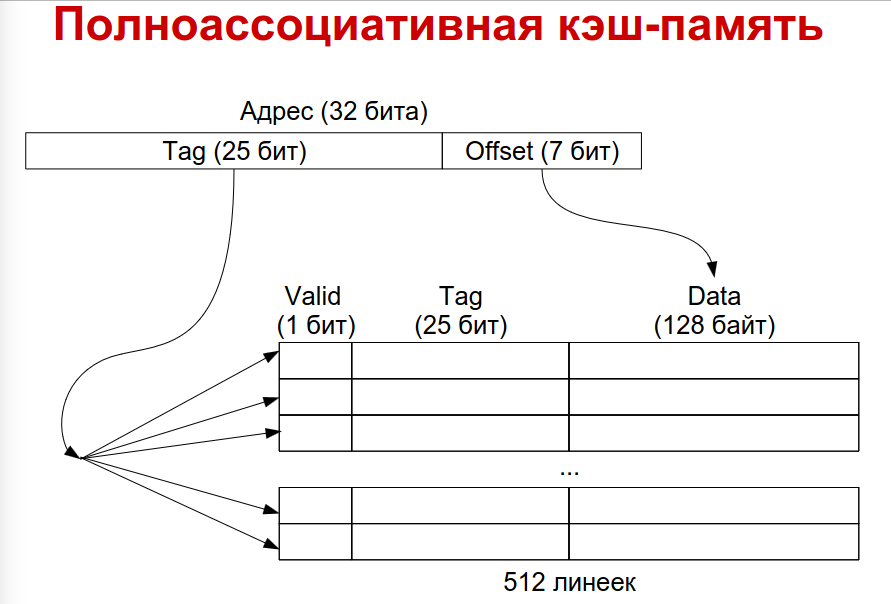

= Особенности современных вычислительных машин

== 6 

 SoC -- system on chip

1. Энергонезависимая память^ Флэш, магнитно-резистентная?

2. Как кешировние связано с локальностью (Какой)?

3. burst-режим SDRAM?

ОБращение к памяти -- это и попалания, и промахи

4. Как от кеширование меняется выполнение в среднем? В худшем? Почему?

5. Что такое стратегии чтения? Записи?

Слово попало в линейку кеша:

writeback -- когда пишем в кеш запись блока откладываем либо до переполнения кеша, либо до явного вызова. Размер запроса большой 

writethrough -- каждый раз инициируем запись. Размер блока маленький

Разница в том, какого размера запросы и как часто случаются 

allocate-on-write -- что делать, если слово не в кеше. Читает линейку кеша, а потом нужное слово из него

subblock placement (делим линейку на равные части, общий тег, индивидуальные биты валидности -- считан ли кусок блока. можно подгружать поочереди, поэтому быстрее). Тег общий -- поэтому количество компараторов снижается.

== Стратегии размещения ==
Стратегии размещения: какие линейки кеша могут хранить данный блок.

Прямое отображение: Можно вычислить по адресу блока номер линейки 

Полная ассоциативность -- блок может храниться в любой линейке. 

Модульная ассоциативность -- чтобы загрузить блок, выбрасываем одну из линеек набора

image::media/2023-10-04.png[]

Размер линейки -- 128 байт. Объем числа (количество линеек) зафиксировано. Старшие 16 бит -- это тег. Тег - часть адреса данных. Сравниваем по тегу. (чтобы проверть, наш ли блок сейчас загружен)

индекс -- это просто просто кусок адреса памяти!!!

По индексу определяем компаратор, а птом сраниваем тег, чтобы проврить нужный ли участок памяти загружен

А как вычисляется индекс?? 

Валидность тега -- считан и актуален ли он. Сравниаем тег адреса (это что ищем) с тегом линейки. Мы знаем ее индекс!

Сравнивает тег одновременно со всеми адресами.

=== групповая ассоциативность 

image::media/group.png[]

Знаем индекс группы, сравниваем всего 8 раз в тег в рамках нужной группы.

Код читает редко, но последовательно.

Таблицы страниц (?) модифицируются редко, а используются часть

Как чинить когерентность -- прнудительно записываем данные 

там где ююи сбросить  -- это про кеш кода

tlb trans

Какие преимущества (3) и недостатки (2) трансляции адреса физической памяти в физический?

Множественное отображение -- загрузили 1 раз, но в программе в одном пространстве на эту память могут ссылаться разные объекты с разными правами доступа, например.

== Страничная адресация 
отличается от сегментной размером адресуемого размера (фиксированный и переменный соответсвенно)

отображение физического програмтрва в логическое в рамках процесса

логическое адресное програство процесса линейно.

6. Что происходит при запрещенном виде доступа?
7. Зачем нужна аппаратная поддержак страничной адресации (8)?

В Linux просто адреса, в Windows -- handle

== Параллелизм
8. Что такое параллелизм инструкций? 

9. Как разрещается конфликты? Кто их определяет? `stall` - Делает пузырек из nope, пока конфликт не разрешится, `hazard` -- конфликт не определен. Их оопределяет процессор, но это дорого вычислительно. Поэтому UB, например, может просто подвиснуть. Поэтому эта логика мб переносится на компилятор.

10. Какие есть варианты архитектуры (3)? суперскалярные, vliw, Epic

11. Суперскалярные какие бывают? Статические (модет только подождать, пока конфликт разрешится), динамические (может переставлять код местами), спекулятивные (динамические, до развлетвления пересчитывают наперед все и буферизуют. Когда становится понятно -- куда идем, отбрасываем не актуальные)

12. VLIW? В инструкциях программируются компоненты процессора. Конфликты обнаруживает и предотвращает компилятор. При обработке асинхронных прерываний компилятор не знает, в каком состоянии процессор. Поэтому до и после обработки добавляют пачку nope, чтобы привести к ожиданию состояний. Долго. Чтобы решать это иногда добавляют контроллер прерываний.

13. EPIC? компилятор обнаруживает конфликты и чатсично разрешает их сам, а сотальные передает на обработку процессору.

12. Какие бывают предсказания переходов? 
статическое явное (флажок predicted-as-taken), статическое неявное (идете назад -- наверно цикл, будет повтор. скорее выполняется. Вперед -- наоборот)
Динамические (статистика по инструкции и предшествующим ей), динамические спеуклятивные (буферизуем все результаты до ветвления, много побочных эффектов)

== Гетерогенность 
13. Что такое микроархитектура проуессора? 

== Вопросы
6. Аппаратное прерывание. Его стоимость высока.
7. Зачем нужна аппаратная поддержак страничной адресации (8)?

CPU-Z и проч есть утилитки, где можно это посмтореть. Есть функции ОС, которые показывают то же самое.

