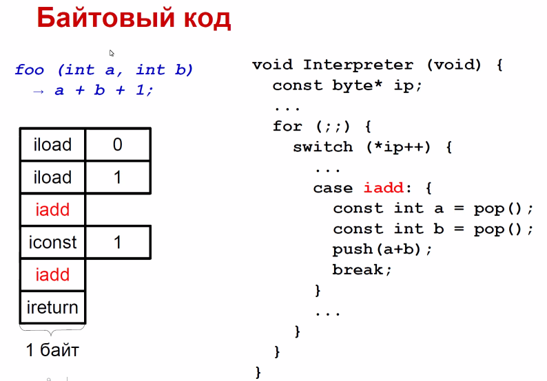
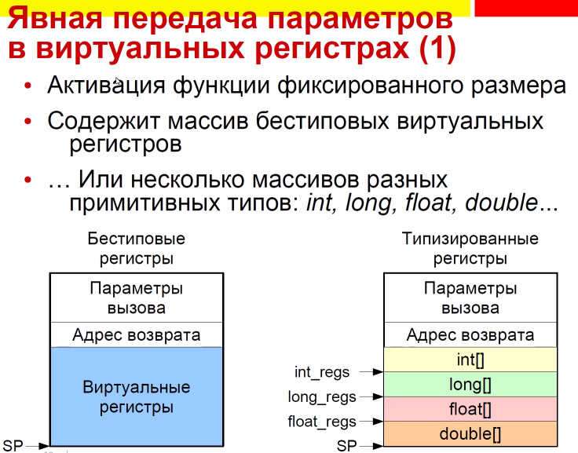
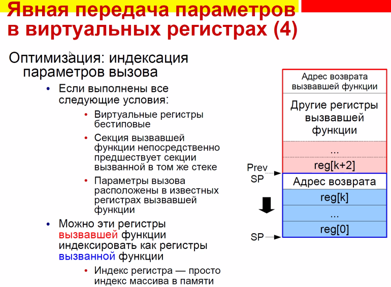
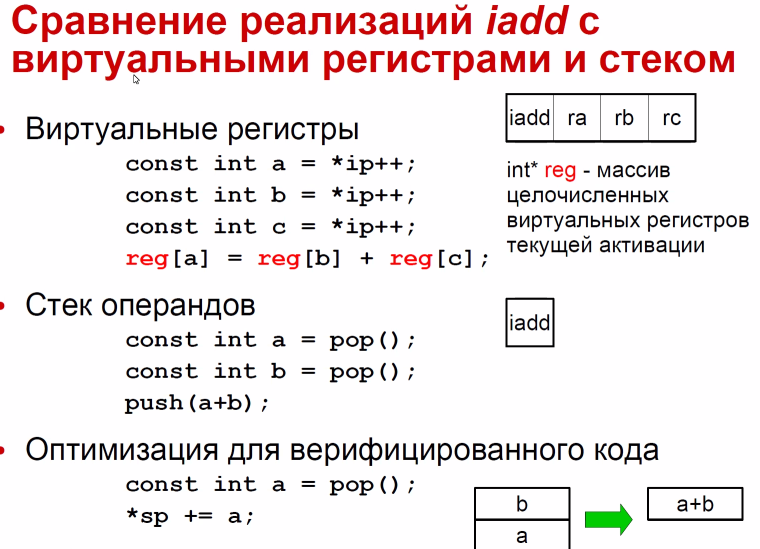

= interpretor

== byte code
байтовый код -- последовательность токенов, которая задает интерпретатору, что делать. один токен -- один байт (в примере ниже ip -- просто указатель на токен)

=== с явным циклом
с явным циклом, т.к. каждая инстуркция заканчивается переходои на интерпретатор 

image::media/asm.png[]

есть безусловный переход на то же самое место, что может кушать такты процессора 

предсказателю тут попроще

=== с неявным циклом 
image::media/asm_2.png[]

=== о предсказателе
когда заходим в таблицу делаем неявный переходы. Предсказать куда мы пойдем не получится

интерпретатор с неявным циклом позволяет запоминать какие-то идиоматические последовательности, когда это можно предсказать 

если ресурсов не хватает, то процессор будет просто выбрасывать предсказания

== Подпрограммный шитый код
 используется в postscript -- pdf

jsr (pdp)== call (intell) - инстукция вызовов подрограммы

шитый код -- последовательность адресов подпрограмм, который интерпретатор просто вызывает. если нарисовать передачу управления, то как будто подпрограммы будут сшиты нитками-петельками.

здесь iload и iret -- не байты, а адреса подпрограмм. все заканчивается ret'ом 

* +быстрее байтового кода
* +набор виртуальных инструкций расширяемый
* -хороша, если адрес подпрограммы не очень длинный.
* -адрес инструкций относительный, нужно делать доп арифметику
image::media/aaa.png[]
== прямой шитый код
получается из подпрограммного манипуляциями

у каждого адреса подпрограммы был префикс

перехды jsr и ret симулируются в интерпретаторе. 

кладем адрес следующей инструкции на стек, вызываем с нимь next 

тут есть одна машинная инструкция jsr!!!!

=== косвенный шитый код 
используем доп регистр 

когжа нехт считает следующее словао -- сохраняет его в решистре 

симулируем jsr , извлекая адрес 

image::media/ccc.png[]

* -медленнее прямого (более сложный интерпретатор, дополнительная косвенность при переходах (почти везде))
* +нет машинных инструкций, можно запускать хоть где

=== прямой точкен-шитый код 

интерпретатор байтового кода (работать удобнее, но медленный)

тут явно вызываем интерпертатор. в рамках одной программы можно вызывать разные интерпретаторы

=== косенный токен-шитый код 
то же самое, но без jsr

знать об этих вариантах кода полезно, если мы хотим перейти от интерпретируемой реализации функции к скомпилированной. В шитом коде он естественный, в байтовом нужно попрыгать.

== Передача прараметров инструкциям 
* *неявные* (на стеке операндов)
* *явные* (указываем виртуальный регистр, с которым инструкция работает) и неявные в виртуальных регистрах (неявные -- когда используям ip, например?)
* *непосредственные операнды* 

=== явная передача в виртуальных регистрах
для фукнции определяется функцией активации количество нужных ей программных регистров. могут быть типизированные (массивы примитывных типов) и бестиповые (общая область памяти)

`sp` -- указатель на секцию активации (где эти виртуальные регистры хранятся)

Рамка стека -- функция активации -- стековый фрейм -- пролог функции -- когда вызвали функцию в стеке уже лежат аргументы и адреса возврата.

* число регистров должно быть достаточно для размещения всех локалов (локальных переменных, могут быть использованы повторно)
* если виртуальных регистров недостаточно (например, код порождается):
** деление регистров по типам более экономно
** аааа
** при возврате функция кладет результат выполнения в заданных при вызове регистр 

почему использования типизированных стеков более экономично использует индексы в явной передаче?

операнды закодированы как индексы регистров. если регистры разных типов, то этот индекс -- пара из массива и индекса в нем
==== оптимизация: индексация параметров вызова
переиспользуем память: работаем как бы с виртуальными регистрами, но переиспользуем одну и ту же память

== неявная через стек 
* хотим всегда знать глубину стека (*операндов*!!!). Если в одном случае if мы кладем значение в стек, а в другом нет -- то мы такой код запрещаем.
* просто проверяем переполнение при входе в функцию

+инстуркции проще(в каком-то смысле подход risc)

+в компиляторе не нужно делать оптимизацию для регистров

+интерпретатор гораздо проще!

== сравнение
image::media/comp.png[]

== сравнение реализаций виртуальных функций 

если код не верифицированный, нужно обрабатывать исчерпаемость стека (проверять, что pop b не исчерпает стек, если верифицированный -- не нужно, мы и так уверены в коде)

== непосредственный операнды инстуркций
как передаются?

* битовые поля самой инструкции (извлекаем по маске)
* выбора из потока инструкций с помощью виртулаьного регистра ip (просто смещаемся по коду и разыменовываем)
* если операнды более чем байтовые, то их размеры и выравнивание должен привести в порядок не интерпретатор, а конвертер из распространяемого кода в исполняемый 

+может быть любого размера

почему так обычно не делается? 
* долго и дорого делать копии констант

заведем пул констант. обращаемся по адресам или смещениям. это зависит от аппаратуры, поэтому их бы выставлять на последнем этапе

+можно его использовать, чтобы проверять используемые/неис