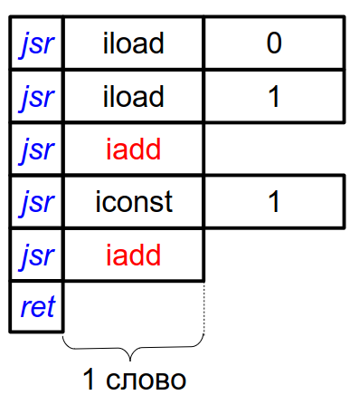
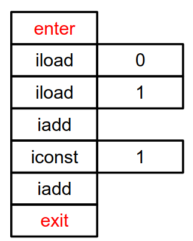
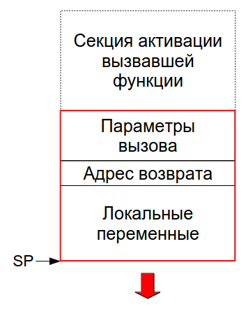
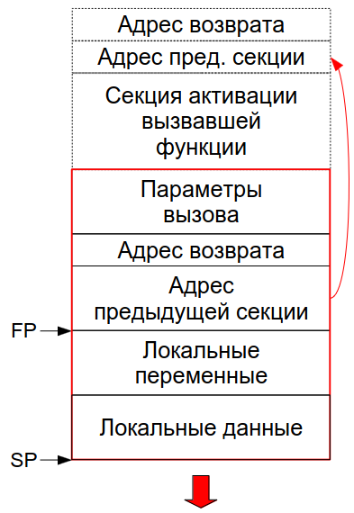

:toc:
:lang: ru-RU
:source-highlighter: rouge
:stem: asciimath

= Ответы к экзамену по с/к "Виртуальные машины", 2023-2024


Интерпретация

1. https://bachisheo.github.io/23-fall/vm_101[Интерпретация. Виды интерпретаторов. Компоненты итеративного интерпретатора.]
2. https://bachisheo.github.io/23-fall/vm_102[Представление виртуальных инструкций. Передача параметров инструкциям.]


=== 1.3. Виды линейных кодов.
==== Байтовый код
Код представляется токенами размера 1 байт (??)

*Пример байтового кода*
 
image::media/bytecode.png[]

 0 - адрес переменной а, 1 - b 

Ниже его интерпретатор на С. В цикле считаем следующий байт, в зависимости от его значения -- выбираем номер следующей инструкции. Логика функции в теле case.

*Интерпретатор байтового кода на С*

```C 
void Interpreter (void) {
    const byte* ip;
    ...
    for (;;) {
        switch (*ip++) {
        ...
        case iadd: {
            const int a = pop();
            const int b = pop();
            push(a+b);
            break;
        }
    ...
        }
    }
}
```
*Интерпретатор байтового кода на assembler*

На asm можно явно выразить некоторые вещи. Например, задать #явный# или #неявный# цикл

*Интерпретатор байтового кода с #явным# циклом*

```asm
InterpreterLoop:
    ; мб 1 инструкция
    tmp = *ip++;
    jmp BytecodeTable[BytesInWord * tmp];
    ...
L_iadd:
    pop tmp1;
    pop tmp2;
    tmp1 += tmp2;
    push tmp1;
    ; ЯВНО переходим на начало цикла
    ; как и все другие инстуркции
    jmp InterpreterLoop;
    ...
BytecodeTable: .word ..., L_iadd, ...
```

Здесь `ip`, `tmp`, `tmp1`, `tmp2` — машинные регистры,
причем tmp может совпадать с `tmp1` или `tmp2`.

`BytecodeTable` -- по токену инструкции хранит адрес ее начала.

`BytesInWord * tmp` -- в машинном слове 2 байта, приводим типы (зачем??)

*Интерпретатор байтового кода с неявным циклом*

Заводим макрос next, который делает то же самое, что декодер процессора (??): выбирает очередной байт из потока инструкций и отдает управление на таблицу интерпретатора.

```asm
next:   macro()
        tmp = *ip++;
        jmp BytecodeTable[BytesInWord * tmp];
        endm

Interpreter:
        next();
...
L_iadd:
        pop tmp1;
        pop tmp2;
        tmp1 += tmp2;
        push tmp1;
        ; здесь подставится код макроса!!!
        next();
...
BytecodeTable: .word ..., L_iadd, ...
```

*Какой интерпретатор эффективнее?*

В случае с явным циклом у нас есть безусловный переход на `InterpreterLoop`, где происходит косвенный переход по какой-то табличке.

К неявного цикла нет безусловного перехода в конце, на этом могут сэкономиться такты процессора (но не обязательно ??). 

Также с точки зрения *предсказателя переходов*, при неявном цикле для каждой инструкции свое место, где происходит переход по табличке. Предсказатель хранит ассоциацию между местом перехода и тем, куда программа дальше пошла. В случае с явным циклом переходы будут практически не предсказуемы. 

С неявным циклом можно предугадывать идиоматические последовательности, когда за одной инструкцией чаще всего идет другая конкретная.

==== Шитый код
Код -- последовательность адресов подпрограмм

Происходит постоянный переход от кода программы к реализации инструкций. Если представить это линией, то они словно сшиты. Поэтому код #шитый#.

Выделяют три вида шитого кода 

* Подпрограммный
* Прямой
* Косвенный

Может быть несколько реализаций интерпретатора,главное чтобы каждому enter соответствовал exit того же интерпретатора (как ПСП).

===== #Подпрограммный# шитый код


`jsr` — машинная инструкция вызова подпрограммы, от процессора `pdp`. У  `intel` -- `call`.

`ret` — машинная инструкция возврата из подпрограммы

iload, iret -- метки реализаций подпрограмм  

*интерпретатор* 

Цикл интерпретатора отсутствует.

```asm
.code
...
iadd:   pop(tmp1);
        pop(tmp2);
        tmp1 += tmp2;
        push(tmp1);
        ;вернуться в исполнение кода 
        ; на следующий jsr 
        ret
```

`iadd` — метка в коде

`tmp1`, `tmp2` — регистры процессора

`pop`, `push` — макросы операций со стеком операндов. Одноименные инструкции использовать нельзя, так как аппаратный стек работает с адресами возвратов, а `pop`, `push` с передачей операндов. Поэтому реализуем макросы!!

Скорость: не так медленно, так как процессор умеет предсказывать ret. И это в любом случае быстрее, чем в ручную искать адрес след операции через табличку. 

`+` Быстрее байтового 

`+` Количество инструкций не ограничено (в отличии от байтового)

`-` эффективен, когда адрес подпрограммы не очень длинный (иначе дорого хранить) и абсолютный (иначе приходится выполнять арифметические операции)

Где используется: postscript (pdf), forth

===== #Прямой# шитый код 
Получается из подпрограммного: у каждого адреса подпрограммы был префикс (за исключением exit). Отказываемся от и избыточного `jsr`.

image::media/right_thread.png[]

`iload`, `iadd` -- адреса, метки на начало реализации

Первая инструкция -- `jsr`, где происходит вход в интерпретатор (`enter`), затем перечень операций после которых -- выход из интерпретатора (инструкция `exit`)

enter / exit — вход в / выход из интерпретатора *данного фрагмента кода*. Адреса метод в коде интерпретатора.

Интерпретатор состоит из трех меток: `enter`, `next`, `exit` и уложен в 7 машинных инструкций!!

*Интерпретатор #прямого# шитого кода*

```asm
next:   macro()
        ; чтение слова -- адреса инструкции
        tmp = *ip++;
        jmp tmp;
        endm
        
enter:  rpush(ip);
        pop ip;
        next();

        ;cнимаем старый адрес интерпретации
exit:   rpop(ip);
        next();

iadd:   pop tmp1;
        pop tmp2;
        tmp1 += tmp2;
        push tmp1;
        next();
```

pop, push — машинные инструкции

rpop, rpush — макросы операций со стеком возвратов

++ — инкремент на размер слова

jsr реализуем вручную: в enter кладем на стек возвратов текущий адрес интерпретации (ip), снимаем с аппаратного стека текущий адрес интерпретации (там лежит адрес iload 0), который выполняется в next. 

Выполнение в next -- читаем адрес следующей инструкции *ip++ и выполняем ее.

===== #Косвенный# шитый код 
Единственный вид шитого кода, который не содержит машинных инструкций (в прямом jsr)! 



Dewar, R.B.K., Indirect threaded code.
Communications of the ACM, June 1975, pp.330-331


*Косвенный шитый код Интерпретатор*

```asm
next:   macro()
        tmp = [ip++];
        jmp [tmp];
        endm

enter:  rpush(ip);
        ; в tmp храним адрес текущего enter из кода!!!
        ; двигаем его на машинное слово и получаем адрес 
        ; следующей инструкции (iload)
        ip = ++tmp;
        next();

exit:   rpop(ip);
        next();

iadd:   .word @iadd
; фиктивная метка реализации
@iadd:  pop tmp1;
        pop tmp2;
        tmp1 += tmp2;
        push tmp1;
        next();
```

Используется дополнительный регистр tmp с побочным эффектом (сперва там лежит адрес текущего enter)

В начале каждой инструкции должен лежать адрес следующей за ней реализации инструкции

`-` интерпретатор сложнее -- дополнительная косвенность, загружаем адрес из памяти, вводим фиктивные метки -- работает медленнее прямого кода
  
`+` нет никаких машинных инструкций, абсолютно независимый от платформы. Можно делать фиксы чтобы поправить адреса

==== Токен-шитый код
Гибрид байтового и шитого кода

Полезен, когда нужно выполнить переход между скомпилированным и интерпретируемым кодом.

=====  #Прямой# токен-шитый код
Байтовый код встроен в прямой шитый как вариант интерпретации. Инструкция вызова передает управление на
начало кода вызываемой функции.

Нормальный байтовый код, перед которым написан jsr на интерпретатор 

Байтовый код остается таким же медленным, но можно сочетать разные интерпретаторы в рамках одной программы

image::media/direct_ttc.png[]

```asm 
Interpreter:
        ; сохраняет адрес возврата
        rpush(ip);
        ; снимает с аппаратного стека адрес 
        ; первой инструкции (iload 0)
        pop ip;
        next();
L_iadd:
        pop tmp1;
        pop tmp2;
        tmp1 += tmp2;
        push tmp1;
        next();

next:   macro()
        tmp = *ip++;
        jmp BytecodeTable[BytesInWord*tmp]
        endm
```

 ?? когда будет происходить rpop

===== #Косвенный# токен-шитый код
Инструкция вызова загружает адрес начала кода вызываемой
функции в регистр tmp и передает управление по хранящемуся
там адресу интерпретатора

```asm
Interpreter:
rpush(ip);
ip = tmp + BytesInWord;
next();
L_iadd:
pop tmp1;
pop tmp2;
tmp1 += tmp2;
push tmp1;
next();
next: macro()
tmp = *ip++;
jmp BytecodeTable[BytesInWord*tmp]
endm
```

image::media/indirect_ttc.png[]

=== 1.4. Непосредственные операнды. Кодирование. Литеральный пул. (32)

==== *#Непосредственные операнды инструкций#*
Это операнды следующих типов:

* Значения разных типов, в т.ч. структурных
* Номера регистров (при явной передаче параметров в регистрах)
* Позиции меток в коде

 Как ссылаться на позицию в исполняемом коде? На адрес
или на смещение относительно инструкции (смещения обычно короткие). В любом случае -- машиннозависимо

* Ссылки на объекты и их элементы (например, класс или поле объекта)
* Внешние https://bachisheo.github.io/23-fall/vm/#_символические_ссылки[символические ссылки]

Могут храниться 

* в битовых полях инструкций (не работает в шитом коде)
* в потоке инструкций за адресом инструкции

Если оператор более, чем байтовый -- конвертер располагает их в правильном порядке. Нужно думать о выравнивании.

Как хранить операнд переменного размера? 

* В адресе со стетчиком

image::media/operand.png[]

`-` копируем константы полностью -> замедляем интерпретатор

* Литеральный пул (о нем ниже)

==== Литеральный пул

Свяжем с кодом область памяти для размещения констант

`+` Десериализация констант может производиться один
раз во время линковки

`+` можно использовать одни и те же константы из разных функций -> экономим память и время процессора (чтобы не копировать). Его же можно использовать для анализа кода (классы каких объектов используются и т.д.)

image::media/literal_pool.png[]

==== Символические ссылки
#Символические ссылки# -- ссылки на уникально именованные объекты (глобальные переменные, классы, методы). В общем случае не константные. Могут перемещаться в памяти.

#Разрешение ссылки# -- поиск объекта по имени. Разрешение можно сделать с помощью рефлексии (если она есть). Разрешение может давать разные результаты (ленивое разрешение).

#Линковщик# разрешает ссылки -- заменяет символическое имя на адрес найденного объекта.

Может представляться непостредтсвенным оперндом (определяется инструкцией), что  усложеняет сборку мусора. 

Или в отдельной части литерального пула (при этом она не константа, может изменяться при перемещении объектов в памяти). 

Нужно делать манипуляции, чтобы отличать их от обычных констант:

* хранить в отдельной области
* ставить тег для различия имени объекта и его адреса
* имеют отличных от других ссылок диапазон значений
* разрешать до выполнения кода

*Пример: непосредственная ссылка на функцию*
image::media/sym_linc_func.png[]

Пока ссылка не разрешена -- в поле лежит адрес строки, которая идентифицирует функцию (здесь -- #foo). Сначала все ссылки ссылаются на эту строку. После того, как мы разрешили -- они все указывают на адрес функции.

*Пример: символические ссылки в литеральном пуле*

image::media/sym_linc_literal_pool.png[]
 
Храним адреса объектов в литеральном пуле. Ссылки из кода ссылаются на дескриптор объекта в литеральном пуле. Дескриптор сперва ссылается не на функцию, а на ее имя. Если при обращении поняли, что ссылаемся на имя -- пытаемся разрешить его.

==== Кодирование непосредственных операндов
Оптимизация для байтового кода.
Числовые операнды распределены неравномерно, маленькие значения встречаются гораздо чаще. Отведем для него меньше места. 

Как быть с большими данными? 

* байткоды с разной шириной операндов (- количество операндов ограничено)
* байткод-префикс ширины операндов (расширяет ВСЕ операнды, это минус) -- используется в JVM (байткод wide)
* *кодировка переменной длинны* (медленное декодирование)

===== *#Кодировка переменной длинны#* 
(Unsigned) Little Endian Base 128 (LED128), используется в 
DWARF 

Старший бит -- признак продолжения в следующем байте 
 
*Код декодирования*

```cpp
uint64_t ULEB128_decode (const uint8_t* p) {
uint64_t value = 0;
for (uint shift = 0;; shift += 7) {
    const uint64_t next_byte = *p++;
    value |= (next_byte & 0x7F) << shift;
        if (!(next_byte >> 7)) return value;
    }
}
```

=== 1.5. Записи активации. Секции стека вызовов.

====  Записи активации
Более широкий класс, чем секция стека. Не обязаны хранится на стеке

Может быть фиксированной длинны (аппетит) или переменной (alloc? динамическое выделение памяти, стек операндов (кего размер меняется))

У разных функций могут быть разного формата в рамках одной ВМ.

*Секции фиксированного размера*



Секция активации кладет на стек параметры вызова, при вызове на стек кладется адрес возврата. Затем попадаем в #пролог# функции, который перемещает нас на секцию:

```cpp 
//prologue
//увеличиваем размер стека (растет к 0)
SP -= LocalSize(foo);
```

При выходе из функции мы отнимает от стека аппетит функции, удаляя рамку. 

```cpp 
//epilogue
SP += LocalSize(foo);
```

* Адресация параметров и локальных переменных `reg = [SP+offset];`

*Секции стека переменного размера*



Особенность -- дополнительно храним FP -- регистр начала текущей секции стека (frame pointer, у intel -- bp -- base pointer)

Секция активации кладет в стек параметры вызова, вызывает функцию. Переходим в пролог, который сохраняет предыдущий FP (он оказывается за адресом возврата):

```cpp
//prologue
push(FP);
//запоминаем адрес текущего стека как fp
FP = SP;
//увеличиваем размер стека на начальный размер секции активации
SP -= LocalSize(foo);
```
При выходе восстанавливаем все FP

```cpp
//epilogue
SP = FP;
FP = pop();
```

Получаем #динамичекскую цепочку# -- односвязный список секций стека. 

Бывает #статическая цепочка# -- нужна для языков с блочной вложенностью (вложенные функции, из одной функции получаем доступ к переменным в другой функции).

* Адресация параметров

`reg = [FP+offset];`

* Адресация локальных переменных

`reg = [FP-offset];`
* Отведение локальной памяти

`alloca(size);`

*Примеры: стек вызова и запись активации*

[cols="1,2,2"]
|===
|VM
|Стек вызова
|Запись активации

|Smalltalk 
|нет (вызовы не LIFO)
|Объекты в куче 

|Forth 
|все операнды 
|только адрес возврата, поэтому хранят в стеке 

|Java
|свой у каждого потока
|создается при каждом вызове, сбрасывается при возврате. Содержит аргументы, место локальных переменных, место для стека операндов, служебные данные
|===

=== 1.6. Организация стека вызовов

=== 1.7. Нативный интерфейс виртуальной машины. Доступ к данным.
=== 1.8. Кэширование вершины стека операндов.
=== 1.9. Оптимизации при преобразовании распространяемого кода в исполняемый. Специализация инструкций по непосредственным операндам. Замена идиом на супер-инструкции.
=== 1.10. Оптимизации при преобразовании распространяемого кода в исполняемый. Макроподстановка вызовов простых функций.
=== 1.11. Оптимизации кода интерпретатором. Quickening. Специализация инструкций по инвариантам состояния.
=== 1.12. Макроподстановка вызовов простых функций в интерпретаторе.
=== 1.13. Сокрытие переписывания кода интерпретатором.


== Компиляция
=== 2.1. Компиляция статическая, динамическая и комбинированная.
=== 2.2. Варианты динамической компиляции. Динамическая адаптивная компиляция.
=== 2.3. Синхронная, асинхронная и параллельная динамическая компиляция. Консистентность порожденного кода.
=== 2.4. Планирование асинхронных компиляций.
=== 2.5. Динамическое профилирование и предсказание активности интерпретируемого и скомпилированного кода.
=== 2.6. Организация переходов между интерпретируемым и скомпилированным вариантами кода с сохранением состояния (On-Stack Replacement)
=== 2.7. Выбор оптимизаций для динамического компилятора.
=== 2.8. Девиртуализация вызовов.
=== 2.9. Защищенные и незащищенные спекулятивные преобразования.
=== 2.10. Спекулятивная девиртуализация вызовов.
=== 2.11. Локализация объектов.
=== 2.12. Макроподстановка объектов.
=== 2.13. Способы быстрого эвристического  распределения регистров.
=== 2.14. Распределение регистров методом линейного сканирования.
=== 2.15. Однопроходная компиляция путем абстрактной интерпретации. Ветвление и слияние потоков управления.
=== 2.16. Оптимизации однопроходного динамического компилятора.
