# что такое веб сервер
Хранить интернет постранично (html) тяжело, поэтому мы собираем странички  по запросу.

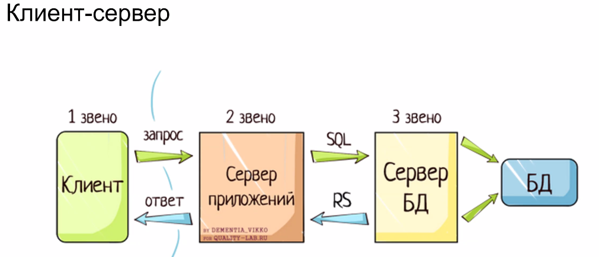

## Типичный сценарий веб-приложения 
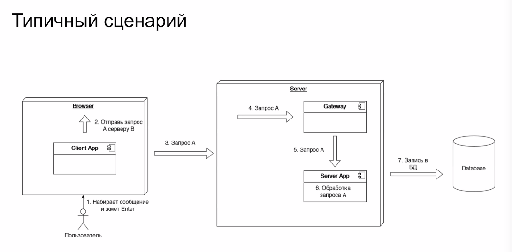

* сервер - железка с gateway (вебсервером)
* вебсервер(gateway) - приложение, которое умеет слушать какой-то порт и принимать запросы. Передает запрос в приложение (server app)
* server app

Раньше приложение поднималось по запросу и ложилось после ответа. С питоном это не работает, т.к. долго

## Проблемы 
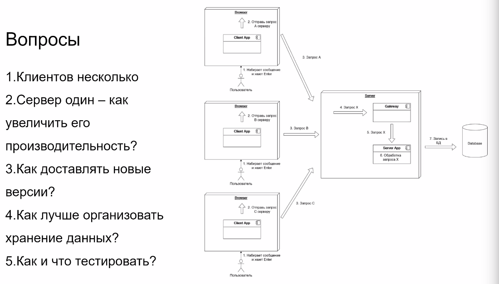

## План лекций
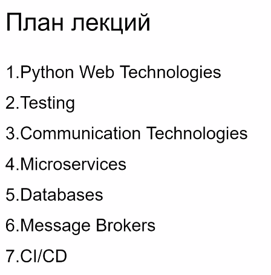

WSGI(визги) -- web server gateway interface

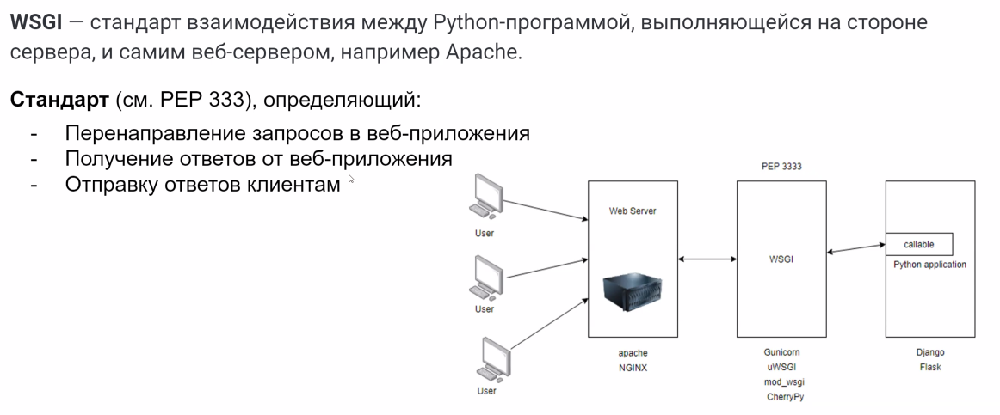

Тут 2 сервера: 
* первый на с++/java (`web server`) может стучаться в python, может сам какую-то статику отдавать. Принимает множество запросов и адресует их куда-то.
* второй -- python с wsgi(например, `gunicorn`, `waitress`), который может дергать питоновские функции. поднят всегда и просто дергает функции по запросу.
* приоложение с `WSGI` дает удобный интерфейс для взаимодейтсивя (н-р, `Django`)

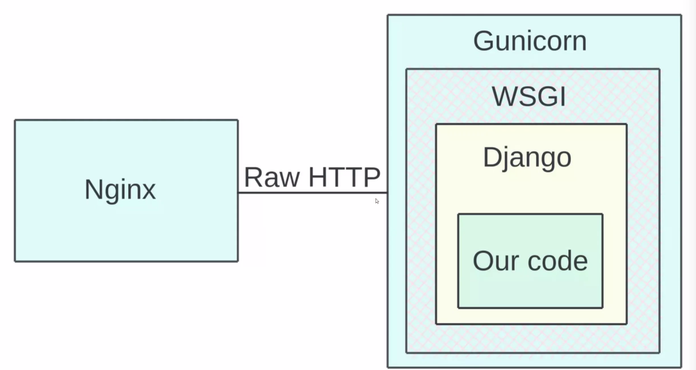

## Application
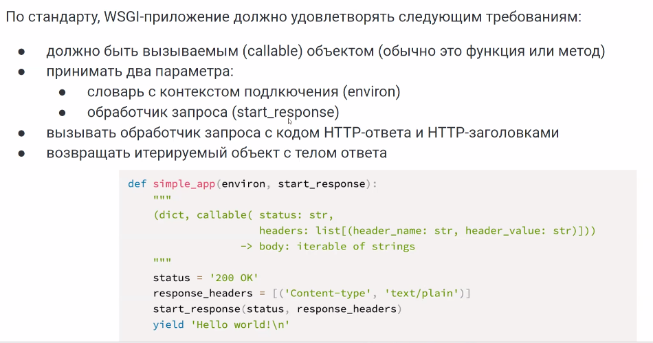

## Example
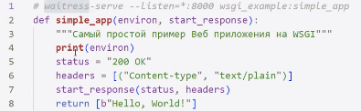

1. Возвращать нужно itrable объект (чтобы можно было большие объекты загружать по кусочкам)

2. env хранит
* строку запроса   для ../doc?id=145 будет id=145
* информацию о приложении
* legacy cgi (common gateway interface)
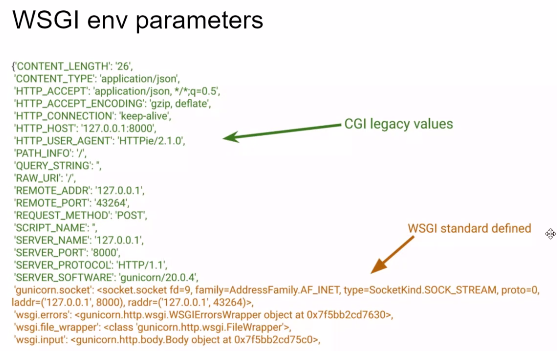
Django парсит эти данные автоматически и дает нам интерфейс. 

## Server/Gateway
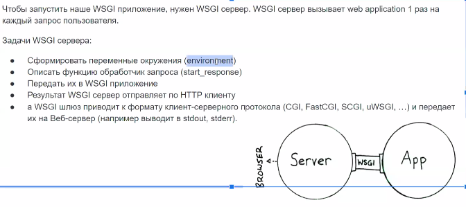

## Middleware
работает на одной железке с приложением

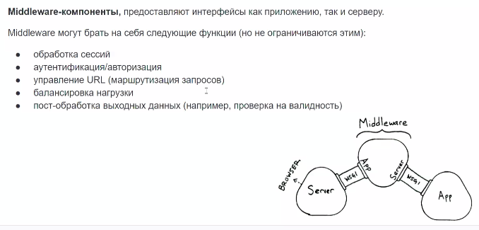

Декоратор над приложением 

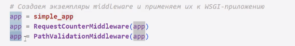

Например, для подсчета количества подключений 

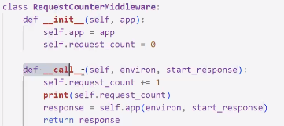

Или для проверки пути

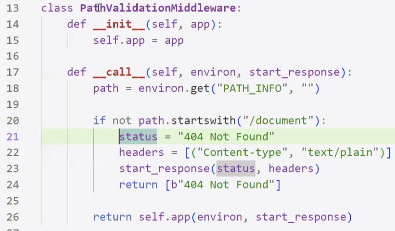

При вызове нужно явно указывать приложение вызываемо 

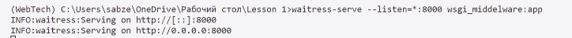

WSGI-сервера

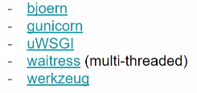

WSGI App frameworks

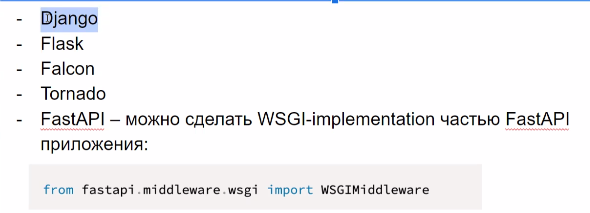

Аналоги для других языков

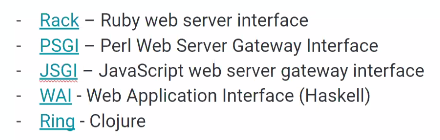

# ASGI -- asynchronous server gateway interface

У питона есть GIL (Global Interpreter Lock - глобальная блокировка интерпретатора), который запрещает двум потокам одновременно работать.

(слева gil, справа async io)

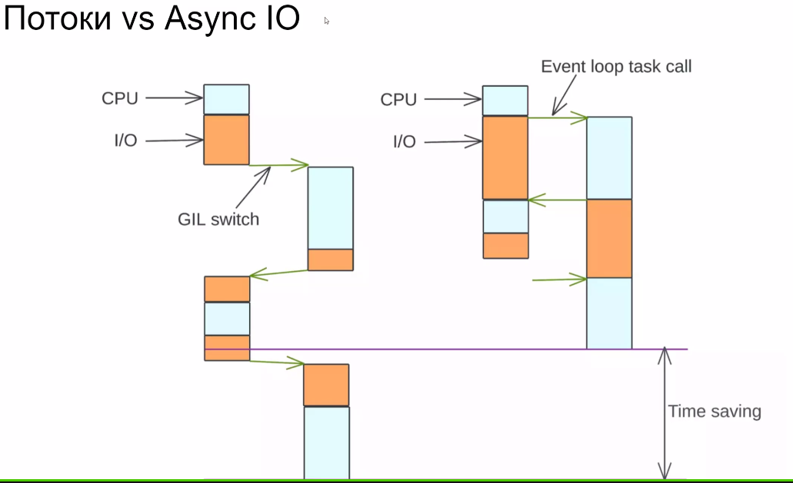

Во время io нагрузки Async передает управление программе, которая может что-то посчитать. 

Отличия от WSGI

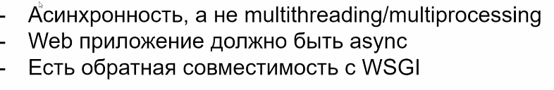

Event loop
у нас есть список задач cpu или IO. Event loop распределяет задачи, перебрасывая их, пока идет ожидание чего-то там.

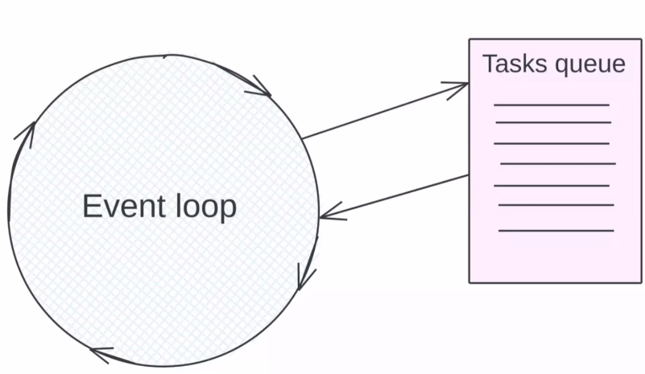

## Схема работы 
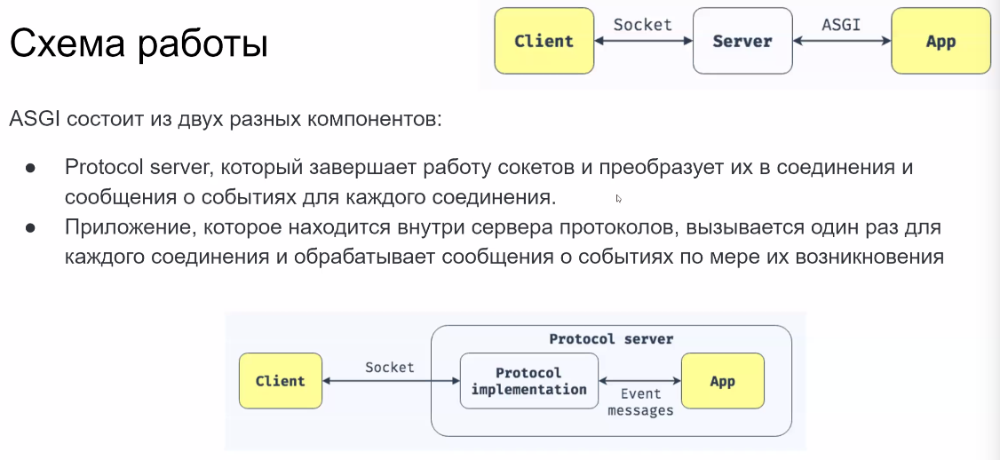

HTTP - один раз отправили информацию и получили ответ

Socket -- непрерывный процесс обменна информации, т.е. устанавливается подключение

## Application
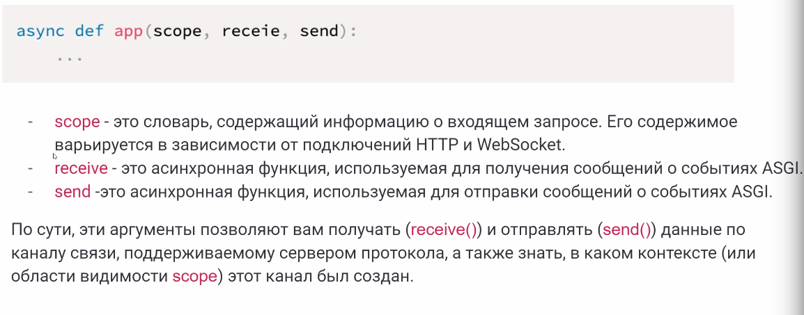

пример 

в scope тело не передается, т.к. оно мб бесконечным (при сокете. например). вместо этого устанавливается флаг more_body в receive. Если мы будем ждать чего-то о receive, то переключаем процесс

информация отправляется дважды: сперва заголовок и всякое такое (потому что оно маленькое) а затем body

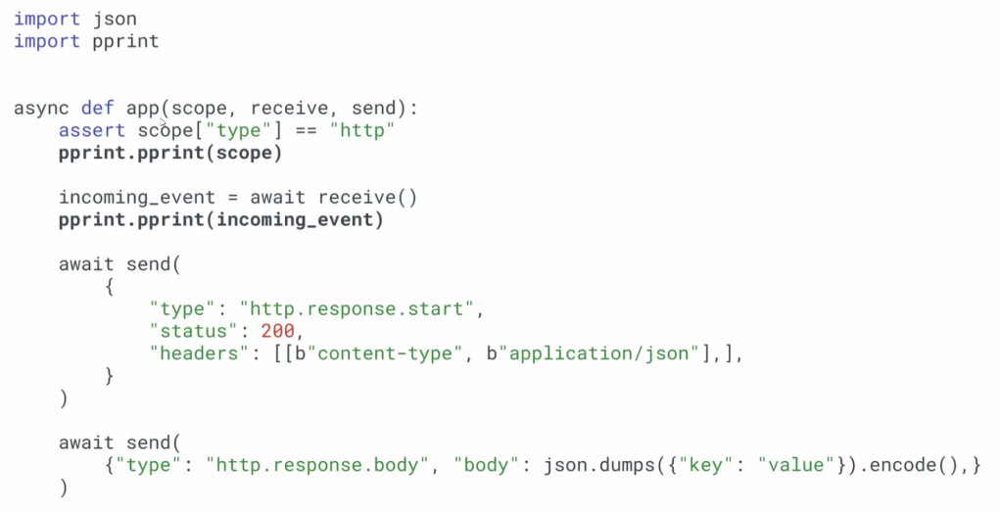

## scope = env

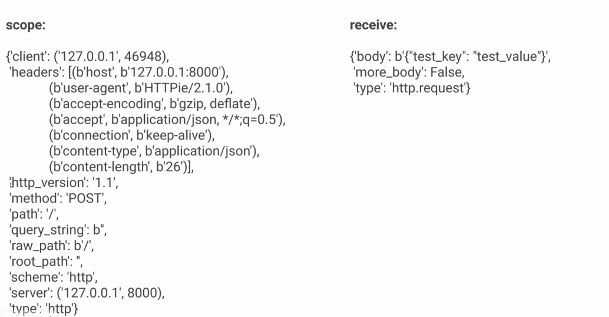

Каждое сообщение отправляет и принимает тип ивента

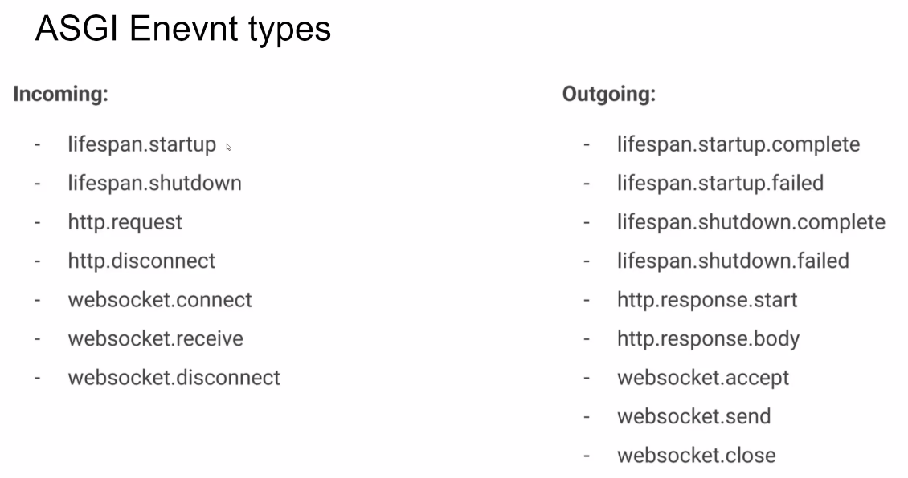

Frameworks

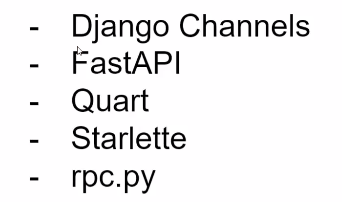

# Frameworks
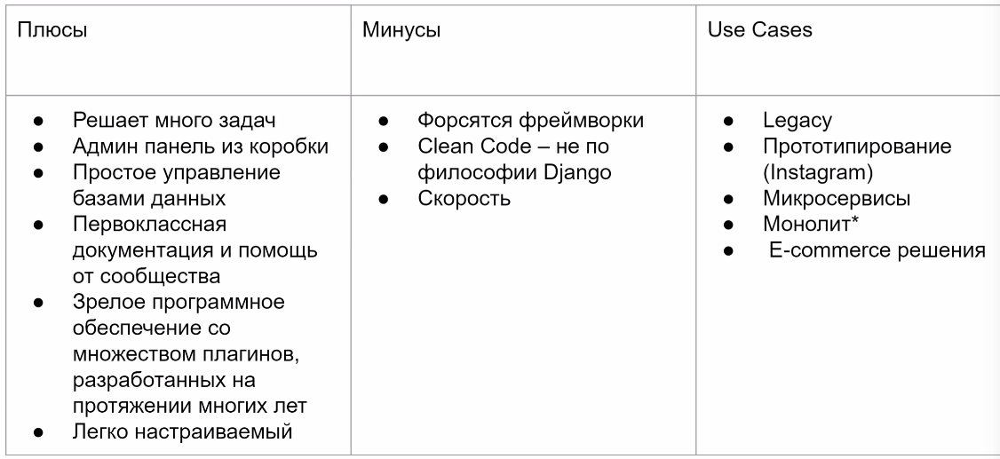

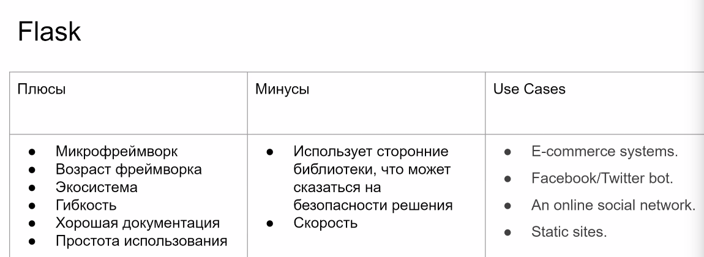

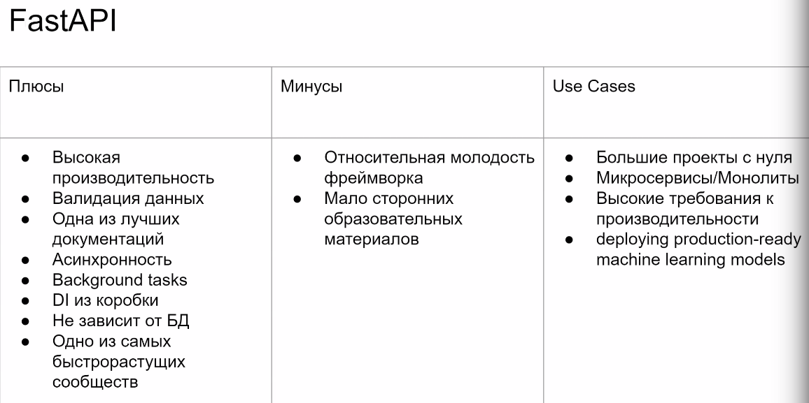